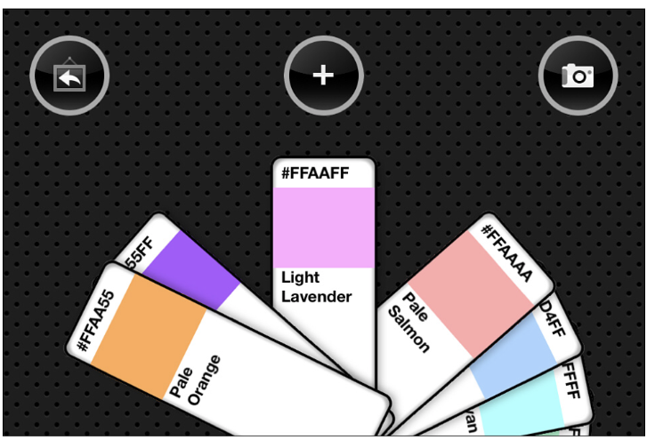
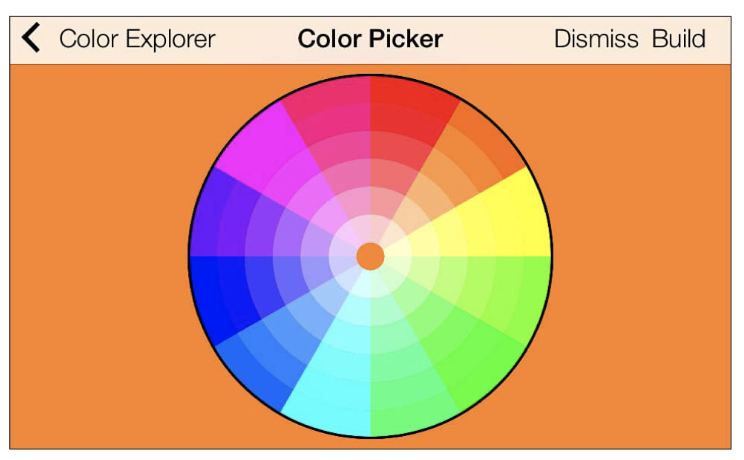
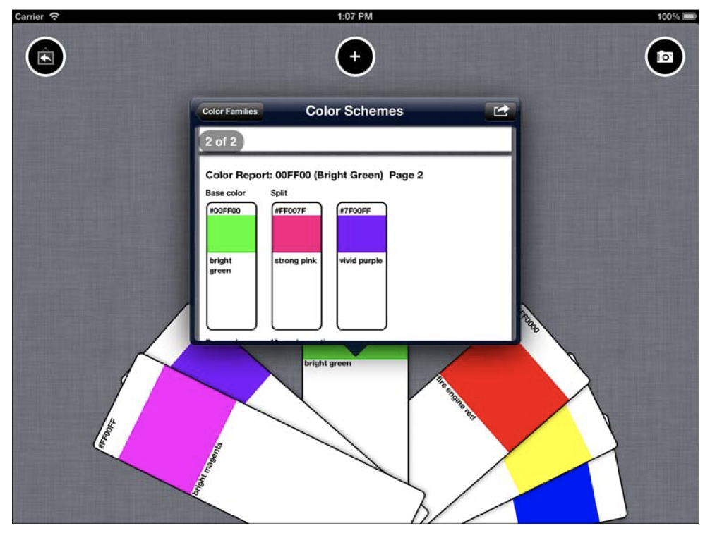

# 绘制上下文

绘制上下文是指在你的应用上通过一个虚拟的画布进行绘制。在本章，你需要复习iOS绘图的核心技术。深入理解上下文，才能知道如创建和绘制他们。通过学习UIKit，Core Graphics 和 Quartz中的绘图基础，使用上下文来创建图片，文档和子视图。
### 框架
iOS绘图程序主要基于UIKit和QuartzCore框架，它由新颖的Objective-C界面（UIKit提供）和老旧一些的C语言方法和核心基础类（QuartzCore）组成。两者共同完整了你的代码。这里有一个例子分别展示了UIKit绘制和Quartz绘制：
```
//Draw a rounded rectangle in UIKit
UIBezierPath *bezierPath = [UIBezierPath bezierPathWithRoundedRect:inset cornerRadius:12];
[bezierPath stroke];

//Fill an ellipse in Quartz
CGContextFillEllipseInRect(context, rect);
```
QuertzCore框架通常被称作Quartz或者Quartz 2D。后者是苹果官方命名，因为它原本是2D图形的API。他最初命名在苹果的开发者文档“Quartz 2D Programming Guide”。

这个框架实际涉及到的地方比Quartz 2D这个名字暗示的要广。QuartzCore引用混合和使用很多其他图片特征。比如说，Quartz API包括了动画， 贴片，以及Core Image 过滤（尽管Core Image有它自己完整的框架）

对于iOS开发者来说，Quartz往往比它的内部名字Core Graphics更加出名。本书使用Quartz或者Core Graphics都是表示一个意思。大多数以CG开头的C语言API都是指的Core Graphics。从几何（CGRect和CGPoint）到对象（CGColorRef，CGImageRef和CGDataProviderRef）。Quartz提供了极其广袤的绘图技术。

Quartz和他的前辈已经很好的被使用了很长一段时间，可以一直追溯到20世纪80年代，在Display PostScript在NeXTStep操作系统中加强了图像时。然而，Core Graphics方法仍然持续在绘图开发中日复一日的发挥着重要的作用。尽管更新的程序替代了一些常用任务，但他们并未被完全取代掉。准备好在未来同这些框架一起工作吧。
### 何时绘制？
尽管iOS绘图对于开发者来说是完全一样的任务， 但任务本身可能不尽相同。大部分绘制会限制在特定的场地，有四个直接对图像有意义的部分使用极其相似的脚本（注：这句可能翻译有问题）：创建子视图，构造图片，创建PDF以及构造核心图像。

#### 创建子视图

每一个UIKit视图实际上都是一个空白的画布。你可以完全地自定义一个视图通过绘制一些你想要在应用中表达的内容。你可以通过一个很特别的方法 -drawRect：来完成。 该方法允许你通过一些UIKit和Quartz Drawing代码来自定义视图的外貌。



图1-1 展示了一个自定义的颜色选择器。他包括了一组选择视图，每一个视图都是UIView通过drawRect：绘制的子视图。这些视图绘制了圆角，文本信息和一个色块。

除非你重用于一个子类，否者默认drawRect：是什么都不干的。子类想要通过UIKit和Core Graphics代码来创建控价外貌需要重用drawRect：方法，它添加了绘制请求来实现子类。简单的视图比如只更新背景颜色或是通过其他方法改变类容而非绘制的不应该重写drawRect：。同样地，OpenGL ES视图也不以此为绘图的接入点。

drawRect：方法有一个近亲-drawRect：forViewPrintFormatter：允许你子类化的绘制类容和展示不同（注：可能翻译有误）。

#### 构造图片

并不是每个图片一开始都是一张PNG或者一张JPEG。在iOS中，你可以绘制一个UIKit图片上下文，再把他转换为一个UIImage实例。这可以帮助你创建一张新图片，或是处理一些已存在的图片。

图1-2展示了一个代码创建的颜色选择轮盘，这个图片通过一系列的贝塞尔曲线圆弧绘制到一个UIKit图像的上下文中创建。处理的结果图片被添加到了一个标准的图片视图中，绘制允许你创建一个自定义的图片，而不用事先保存在文件目录中。
以代码为基础的绘制是一个很重要的折衷的办法。尽管你需要跟多的时间来创建图片（并不需要很大量的代码，而且是可以测量的），但是你可以得到一个很小的程序包，因为有很少的资源文件。你的图片也更加灵活——仅需改变创建他们的代码即可。




#### 创建PDF

和创建图片类似的方法也支持PDF的创建，你可以绘制在一个UIKit PDF上下文中，不需要直接发送到文件或是数据。它可以帮助你在应用中创建PDF上下文并分享，存储或是展示他们，就像图1-3那样。
PDF提供一个高度的可分割的，系统独立标准封装了一个完成的文档描述。这个文档你在iOS中创建的会和你在其他电脑看到的或多或少地一样。操作系统的颜色管理系统也许会影响到颜色的展示
图1-3展示了一个在Popover的视图中多页PDF




#### 构造核心图像
当你碰触到现在UIKit的性能极限，你可能需要转而向标准的Quartz求助。Core Graphics一直处于领先地位，它的绘制能力在OS X已经高效使用了近十年了。任何在UIKit中不能马上调节的特征，都机会可以通过Quartz实现。
Core Graphics上下文的绘制组件提供了灵活有力的绘图解决方案——哪怕那不如它的兄弟UIKit那样简单。Core Graphics 使用核心基础风格的C语言基础的对象并且需要手动管理内存。
比如说，你也许想要一字节一字节地处理图像。这个任务在UIKit好像不能很好的完成，但是使用Core Graphics的位图上下文却能够很好的被解决。图1-4展示了一个例子解释了为什么需要使用一些Quartz的特性。在这个例子中，左侧的RGB图像通过Core Graphics转换成了一个灰度图像。
得到的灰度图是通过Quartz的CGImageRef（以CG开头Ref结尾的类型是指，指向对象的指针）转换成UIImage实例（imageWithCGImage：），再通过图片视图展示出来的。


### 上下文 Contexts

所有的iOS绘图操作都是从一个上下文开始的。从概念上来说，上下文非常类似于一页空纸或是一张空的画布。它们展示iOS绘图的目的地。它们囊括了所有绘图界质状态所包含的信息——比如说，无论画布旋转或是位移，画布上绘制何种颜色，你可以绘制在图片上的点的细节程度都是如此的（注：可能有误，这句好难啊🤯）
在iOS中，你主要会和两种上下文打交道：位图上下文和PDF上下文。Core Image框架海提供了第三种上下文类型，用来处理图片进程任务而非绘图。

#### 位图上下文

位图上下文基本上是矩形数据数组。数据的大小取决于图片的每一个元素（或像素）展示何种类型的颜色。Device RGB——就像图1-4的左侧图片——需要用到3或4字节每个像素。透明图象需要4个字节，不透明图象3个字节。
为了优化存储，不透明位图不需理会透明值。透明图象多了一个alpha值。这个值存储在实际颜色和亮度中一个很特别的字节里。他反应了每个像素的透明度。颜色信息在Device RGB图片中存于3个字节中，分别对应了红，绿，蓝的数值。
Device Gray 图像——如图1-4右侧所示——需要用到1或2字节每个像素。其中，亮度信息占一个字节，还有一个是透明度的可选字节。

#### PDF上下文

从开发者的角度来看，PDF上下文和位图上下文的运行方式相似。你通过相同的指令和方法绘制它们。你设置颜色，绘制形状和文本就像你在绘制一个视图或图像一样。然而，它们还是有不同的地方的。
PDF上下文在他的“后备存储”中包括了矢量数据，用来描述绘制在一个分辨率无关的方法中。位图是光栅化的（注：也可以叫点阵化），它使用像素数组来存储和绘制数据。
PDF上下文也可以多于一页。你设置一个边界矩形，限定默认尺寸和每一页的位置。一个空矩形（CGRectZero）默认是一个标准的A（字母）页——8.5x11英尺，或是612x792点（第二章回详细讨论点和像素的区别）。

