# 绘制上下文

绘制上下文是指在你的应用上通过一个虚拟的画布进行绘制。在本章，你需要复习iOS绘图的核心技术。深入理解上下文，才能知道如创建和绘制他们。通过学习UIKit，Core Graphics 和 Quartz中的绘图基础，使用上下文来创建图片，文档和子视图。
### 框架
iOS绘图程序主要基于UIKit和QuartzCore框架，它由新颖的Objective-C界面（UIKit提供）和老旧一些的C语言方法和核心基础类（QuartzCore）组成。两者共同完整了你的代码。这里有一个例子分别展示了UIKit绘制和Quartz绘制：
```
//Draw a rounded rectangle in UIKit
UIBezierPath *bezierPath = [UIBezierPath bezierPathWithRoundedRect:inset cornerRadius:12];
[bezierPath stroke];

//Fill an ellipse in Quartz
CGContextFillEllipseInRect(context, rect);
```
QuertzCore框架通常被称作Quartz或者Quartz 2D。后者是苹果官方命名，因为它原本是2D图形的API。他最初命名在苹果的开发者文档“Quartz 2D Programming Guide”。

这个框架实际涉及到的地方比Quartz 2D这个名字暗示的要广。QuartzCore引用混合和使用很多其他图片特征。比如说，Quartz API包括了动画， 贴片，以及Core Image 过滤（尽管Core Image有它自己完整的框架）

对于iOS开发者来说，Quartz往往比它的内部名字Core Graphics更加出名。本书使用Quartz或者Core Graphics都是表示一个意思。大多数以CG开头的C语言API都是指的Core Graphics。从几何（CGRect和CGPoint）到对象（CGColorRef，CGImageRef和CGDataProviderRef）。Quartz提供了极其广袤的绘图技术。

Quartz和他的前辈已经很好的被使用了很长一段时间，可以一直追溯到20世纪80年代，在Display PostScript在NeXTStep操作系统中加强了图像时。然而，Core Graphics方法仍然持续在绘图开发中日复一日的发挥着重要的作用。尽管更新的程序替代了一些常用任务，但他们并未被完全取代掉。准备好在未来同这些框架一起工作吧。
### 何时绘制？
尽管iOS绘图对于开发者来说是完全一样的任务， 但任务本身可能不尽相同。大部分绘制会限制在特定的场地，有四个直接对图像有意义的部分使用极其相似的脚本（注：这句可能翻译有问题）：创建子视图，构造图片，创建PDF以及构造核心图像。

#### 创建子视图

每一个UIKit视图实际上都是一个空白的画布。你可以完全地自定义一个视图通过绘制一些你想要在应用中表达的内容。你可以通过一个很特别的方法 -drawRect：来完成。 该方法允许你通过一些UIKit和Quartz Drawing代码来自定义视图的外貌。


图1-1 展示了一个自定义的颜色选择器。他包括了一组选择视图，每一个视图都是UIView通过drawRect：绘制的子视图。这些视图绘制了圆角，文本信息和一个色块。

除非你重用于一个子类，否者默认drawRect：是什么都不干的。子类想要通过UIKit和Core Graphics代码来创建控价外貌需要重用drawRect：方法，它添加了绘制请求来实现子类。简单的视图比如只更新背景颜色或是通过其他方法改变类容而非绘制的不应该重写drawRect：。同样地，OpenGL ES视图也不以此为绘图的接入点。

drawRect：方法有一个近亲-drawRect：forViewPrintFormatter：允许你子类化的绘制类容和展示不同（注：可能翻译有误）。

#### 构造图片

并不是每个图片一开始都是一张PNG或者一张JPEG。在iOS中，你可以绘制一个UIKit图片上下文，再把他转换为一个UIImage实例。这可以帮助你创建一张新图片，或是处理一些已存在的图片。

图1-2展示了一个代码创建的颜色选择轮盘，这个图片通过一系列的贝塞尔曲线圆弧绘制到一个UIKit图像的上下文中创建。处理的结果图片被添加到了一个标准的图片视图中，绘制允许你创建一个自定义的图片，而不用事先保存在文件目录中。
以代码为基础的绘制是一个很重要的折衷的办法。尽管你需要跟多的时间来创建图片（并不需要很大量的代码，而且是可以测量的），但是你可以得到一个很小的程序包，因为有很少的资源文件。你的图片也更加灵活——仅需改变创建他们的代码即可。


#### 创建PDF

和创建图片类似的方法也支持PDF的创建，你可以绘制在一个UIKit PDF上下文中，不需要直接发送到文件或是数据。它可以帮助你在应用中创建PDF上下文并分享，存储或是展示他们，就像图1-3那样。
PDF提供一个高度的可分割的，系统独立标准封装了一个完成的文档描述。这个文档你在iOS中创建的会和你在其他电脑看到的或多或少地一样。操作系统的颜色管理系统也许会影响到颜色的展示
图1-3展示了一个在Popover的视图中多页PDF


#### 构造核心图像
当你碰触到现在UIKit的性能极限，你可能需要转而向标准的Quartz求助。Core Graphics一直处于领先地位，它的绘制能力在OS X已经高效使用了近十年了。任何在UIKit中不能马上调节的特征，都机会可以通过Quartz实现。
Core Graphics上下文的绘制组件提供了灵活有力的绘图解决方案——哪怕那不如它的兄弟UIKit那样简单。Core Graphics 使用核心基础风格的C语言基础的对象并且需要手动管理内存。
比如说，你也许想要一字节一字节地处理图像。这个任务在UIKit好像不能很好的完成，但是使用Core Graphics的位图上下文却能够很好的被解决。图1-4展示了一个例子解释了为什么需要使用一些Quartz的特性。在这个例子中，左侧的RGB图像通过Core Graphics转换成了一个灰度图像。
得到的灰度图是通过Quartz的CGImageRef（以CG开头Ref结尾的类型是指，指向对象的指针）转换成UIImage实例（imageWithCGImage：），再通过图片视图展示出来的。


### 上下文 Contexts

所有的iOS绘图操作都是从一个上下文开始的。从概念上来说，上下文非常类似于一页空纸或是一张空的画布。它们展示iOS绘图的目的地。它们囊括了所有绘图界质状态所包含的信息——比如说，无论画布旋转或是位移，画布上绘制何种颜色，你可以绘制在图片上的点的细节程度都是如此的（注：可能有误，这句好难啊🤯）
在iOS中，你主要会和两种上下文打交道：位图上下文和PDF上下文。Core Image框架海提供了第三种上下文类型，用来处理图片进程任务而非绘图。

#### 位图上下文

位图上下文基本上是矩形数据数组。数据的大小取决于图片的每一个元素（或像素）展示何种类型的颜色。Device RGB——就像图1-4的左侧图片——需要用到3或4字节每个像素。透明图象需要4个字节，不透明图象3个字节。
为了优化存储，不透明位图不需理会透明值。透明图象多了一个alpha值。这个值存储在实际颜色和亮度中一个很特别的字节里。他反应了每个像素的透明度。颜色信息在Device RGB图片中存于3个字节中，分别对应了红，绿，蓝的数值。
Device Gray 图像——如图1-4右侧所示——需要用到1或2字节每个像素。其中，亮度信息占一个字节，还有一个是透明度的可选字节。

#### PDF上下文

从开发者的角度来看，PDF上下文和位图上下文的运行方式相似。你通过相同的指令和方法绘制它们。你设置颜色，绘制形状和文本就像你在绘制一个视图或图像一样。然而，它们还是有不同的地方的。
PDF上下文在他的“后备存储”中包括了矢量数据，用来描述绘制在一个分辨率无关的方法中。位图是光栅化的（注：也可以叫点阵化），它使用像素数组来存储和绘制数据。
PDF上下文也可以多于一页。你设置一个边界矩形，限定默认尺寸和每一页的位置。一个空矩形（CGRectZero）默认是一个标准的A（字母）页——8.5x11英尺，或是612x792点（第二章回详细讨论点和像素的区别）。
PDF内部是由向量指令集储存的。他提供了在位图绘制中看不到的与分辨率无关的解决方案。苹果在文档中写道，“PDF文件是天生与分辨率无关的——它们绘制的尺寸可以增加或减少却不需要额外的牺牲图片的细节。用户感知位图图像的质量是通过视图可见部分的分辨率来决定的。”
总的来说，位图上下文和PDF上下文还是大致相似的。区别仅在于目的地（文件和数据的展示）和当你需要翻页时体现。
除了位图上下文和PDF上下文，你也可能会遇到核心图形上下文。

#### Core Image上下文

Core Image框架帮助你快速的处理图片。它提供相关代码来进行数码图片的处理和电脑维护图片资源。有了它，你可以处理滤镜，链型滤镜，进行特征检测（人脸识别），分析图片自适应。
Core Image上下文把Core Image对象和Quartz 2D以及OpenGL紧密联系在一起。得利于移动端图片处理中心（GPU）的发展，核心图形上下文整合了Core Video的像素缓冲区。Core Image使用它自己的颜色和图片类（CIColor和CIImage），它们最好的优化了核心图形的快速滤镜和图片特征检测。

### 在UIKit中创建上下文
UIKit提供了很友好的处理上下文的入口，最简单的图片绘制方法在下方代码1-1中展示。这个代码只展示了开启一个新的上下文（为上下文赋予一个尺寸），绘制，取到一个新的图片，结束这个上下文。这段代码生产出一个1:1比例的图片，所有的复合精确像素的位图上下文绘制操作都在这里进行。

```
UIGraphicsBeginImageContext(size);

//Perform drawing here

UIImage *image = UIGraphicsGetImageFromCurrentImageContext();
UIGraphicsEndImageContext();

```
#### 设备比例

下列代码1-2展示了一个更加常见的（更有效的）入口。它帮助你根据屏幕比例来处理图片。options参数帮助你根据不同设备比例来绘制图片。Scale是指逻辑空间（以点计算）和物理展示（以像素计算）之间的关系。

Scale为2的图片会产生一个Retina图像。像素值在每个方向均为两倍，生成的图片也会以4倍的空间储存相比于scale为1的图片来说。不透明参数(isOpaque)允许你忽略alpha通道以达到最优储存。你只需要3字节每像素即可储存一个不透明图象，而非4字节还有一个额外的alpha通道。

```
UIGraphicsBeginImageContextWithOptions(targetSize,isOpaque,deviceScale);

//Perform drawing here

UIImage *image = UIGraphicsGetImageFromCurrentImageContext();
UIGraphicsEndImageContext();

```
强烈建议你使用上面的代码来创建上下文。比如说，你想为UIImageView绘制一个图片的时候，总是会需要带上options参数的。
你可以通过UIScreen来获取第三个参数。图片绘制在初始屏幕上时，可以使用mainScreen，如下：

```
UIGraphicsBeginImageContextWithOptions(targetSize,isOpaque,[UIScreen mainScreen].scale);
```
当然你可以把第三个参数设置为0.0。系统会自动让比例基于你的主屏。
当作用于视频输出时，有时候你可能会有一个额外的监视器来连接到iOS设备，或是当你使用AirPlay无线展示到另一个屏幕上时，需要设计新设备的特殊scale参数。你同样可以通过UIScreen查询到这些信息。

#### 创建PDF上下文
在创建PDF时，你要么提供一个文件路径要么提供一个提供数据源的可变数据对象。代码1-3展示了
构建的例子。你提供了一个矩形（CGRectZero表示A尺寸的页面）和一个指明元数据的字典，以及新文档的安全信息，比如你也许会需要指明作者，拥有者和密码，印刷和复杂的限制，关键词等等。
和位图上下文一样，Core Graphics的成就（尤其是CGPDFContext）远比UIKit要悠久得多。如果你想钻研C语言基础的类或方法，你将会发现另一套PDF的产品。

```
UIGraphicsBeginPDFContextToFile(pathToFile, theBounds, documentInfo);
UIGraphicsBeginPDFPage();

//perform drawing here

UIGraphicsEndPDFContext();
```

每一页的绘制都需要调用UIGraphicsBeginPDFPage（）方法，他在文档中提供新的一页给你来写入。当你完成输出之后，你不需要明确地结束每一页，但是你必须结束PDF上下文，就像你结束其他的上下文那样。

### 在Quartz中创建上下文

Core Graphics允许你不通过UIKit入口创建位图上下文。这个方法使用更久远的API，他能有效地帮助你一字节一字节地处理绘制数据。第三章会通过使用很多有效的增强图片进程的例子通过Quartz代码。
代码1-4展示更为复杂一些的代码。相比于UIKit，可能更容易让开发者感到困扰。这是因为，Quartz使用旧风格的核心框架对象，还需要手动管理内存。
在使用Quartz代码时记得常常使用静态分析器（Product > Analyze），以便检测你的引用是否正常释放。他提供了代码分析工具，可以同时检测出UIKit方法和Quartz函数中的潜在bug。了解更多：http://clang-analyzer.llvm.org
代码1-4，需注意释放方法。如果上下文不能被创建，color space就必须被释放。在Core Graphic的每个绘制阶段，你都会为很多对象分配内存，你必须在函数或方法结束之前很好的管理它们。
最后一点，要注意如何使用kCGImageAlphaPremultipliedFirst。他提供了一个ARGB序列，使用友好Quartz的前置乘法（注：？）。每一个像素，alpha值都存储在这四个字节里的最前面而蓝色值在最后。这种结构是在CGImage.h中的CGImageAlphaInfo文档中定义的。

```
//create a color space
CGColorSpaceRef colorSpace = CGColorSpaceCreateDeviceRGB();
if(colorSpace == NULl)
{
     NSLog(@"Error allocating color space");
     return nil;
}
//create the bitmap context,(Note: in new version of
//Xcode, you need to cast the alpha setting.)
CGContextRef context = CGBitmapContextCreate(
               NULL,width,height,
               BITS_PER_COMPONENT,
               width * ARGB_COUNT,
               colorSpace,
               (CGBitmapInfo)kCGImageAlphaPremultipliedFirst);
if(context == NULL)
{
     NSLog(@"Error:Context not created!");
     CGColorSpaceRelease(colorSpace);
     return nil;
}

//Push the context;
//(This is optional. Read on for an explanation of this.)
//UIGraphicsPushContext(context);

//Perform drawing here

//Balance the context push if used.
//UIGraphicsPopContext();

//Convert to image
CGImageRef imageRef = CGBitmapContextCreateImage(context);
UIImage *image = [UIImage imageWithCGImage:imageRef];

//clean up
CGColorSpaceRelease(colorSpace);
CGContextRelease(context);
CFRelease(imageRef);
```
### 在上下文中绘图
很多Quartz方法都依赖于你要绘制在上面的上下文。比如说，思考一下代码1-5中的方法，他设置了一个4像素宽，灰色，在一个矩形画布中划出一个椭圆。每个方法都带着一个CGContextRef类型的context参数，你可以自己创建上下文（如代码1-4那样）可以借助UIKit方法，这个我们下一节来探究。
```
//set the line width
CGContextSetLineWidth(context,4);

//set the line color
CGContextSetStrokeColorWithColor(context, [UIColor grayColor].CGColor);

//Draw an ellipse
CGContextStrokeEllipseInRect(context, rect);
```
1-5这段代码应该是写在代码1-4中的“Perform drawing here”这个位置的。1-4中，你已经完整创建了一个位图上下文，你可以尽情在这个上下文绘制了。
在代码1-4的最后，你创建了一个图片并且手动释放了上下文。图片1-5展示了代码1-5融入代码1-4之后的输出。你绘制了一个灰色的线条绘制的4像素宽的椭圆，图1-5的图片通过UIImageView展示。
这个UIKit的入口进程为imageWithCGImage：，他是最新的通过CGImageRef创建UIImage实例的方法。

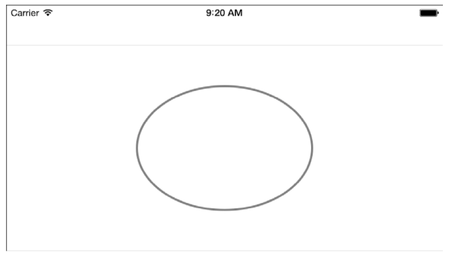

### 通过UIKit上下文来绘制
UIKit简化了创建喝管理上下文的任务。只用一行就可以创建一个新的图片或是PDF上下文，另一行用来把这些事务包起来。在这两行之间，你可以自由地添加任何绘制请求，在绘制在当前的上下文中。
在代码1-6中也处理了和代码1-5中相同的绘制任务，当然绘制的结果也是完全一致的。然而，和绘制在自己创建的Quartz上下文不同，这里改进为创建一个新的图片上下文（image context）。你可以使用UIGraphicsGetCurrentContext（）连接UIKit和Quartz，他会返回一个CGContextRef对象，允许你来处理一些核心图像的绘画请求。
又一次，当你完成1-6的代码之后，对比1-4和1-5的融合，你就会发现UIKit的绘图有多简单
```
//Establish the image context
UIGraphicsBeginImageContextWithOptions(targetSize, isOpaque, 0.0);

//Retrieve the current context
CGContextRef context = UIGraphicsGetCurrentContext();

//Perform the drawing
CGContextSetLineWidth(context,4);
CGContextSetStrokeColorWithColor(context, [UIColor grayColor].CGColor);
CGContextStrokeEllipseInRect(context, rect);

//Retrieve the drawn image
UIImage *image = UIGraphicsGetImageFromCurrentImageContext();

//End the image context
UIGraphicsEndImageContext();
```
在开启任一图片或PDF上下文之后都可以使用UIGraphicsGetCurrentImage。这个上下文会一直持续到你调用UIGraphicsEndImageContext（）或者UIGraphicsEndPDFContext（）；
相似地，你可以使用UIGraphicsPushContext（context）在这些代码的内部再创建一个上下文。支持类似代码1-4中的手动管理Quartz上下文。你可以使用UIGraphicsPopContext（）来结束上下文。这个方法可以把你绘制的上下文推入栈中。入栈出栈可以帮助你按需切换绘图目标。
此外，在明确的上下文环境之外，当前上下文为nil——并抛出异常。当调用drawRect：方法时，视图会把一个上下文推入UIKit的图像上下文栈中。所以当你使用drawRect：方法时，你可以默认总是有一个固定的上下文存在。

```
-(void) drawRect:(CGRect) rect
{
   //Perform drawing here
   //if called, UIGraphicsGetCurrentContext();
   //returns a valid context.
}
```

#### UIKit当前的上下文
在Quartz中，几乎每一个绘制方法都需要一个context参数，你可以清楚地在每一个方法中看到，比如，这个绘制划线颜色为灰色的方法：
```
CGContextSetStokeColorWithColor(context, [UIColor grayColor].CGColor);
```
在UIKit绘制中，上下文在运行时状态下创建。思考1-7的代码。这些代码又一次创建了一个一样的4像素宽的在图1-5中展示的椭圆。然而，这次的代码却没有明确的指定一个上下文。
这些代码创建了一个椭圆路径，把线宽设置为4，划线颜色设置为灰色，然后用划线绘制这个路径。每一步，上下文都被访问了。就像1-6的代码那样，一样的灰色椭圆绘制在了上下文中，只是这个上下文没有那么明确，1-7代码不用提及上下文即可完成这些操作。
```
//stroke an ellipse using a Bezier path
UIBezierPath *path = [UIBezierPath bezierPathWithOvalInRect:rect];
path.lineWidth = 4;
[[UIColor grayColor] setStroke];
[path stroke];
```
发生了什么？让我们来探究一下。原来，UIKit有一个图像上下文堆。他让绘制操作实现在堆顶的上下文中。这些什么线宽或事灰色路径之类的设置都在最高层的上下文中实现。所以，如何使Core Graphics上下文和UIKit融合？ UIKit提供了两种关键方法，可以简化我们在本章前些部分学到的方法：
* 你需要使用UIGraphicPushContext(context)方法手动入栈一个上下文。这个方法会把上下文推入栈中，然后设置你想要绘制的上下文为被激活状态。
* 通过UIGraphicsPopContext()来平衡，该操作吧当前上下文出栈，重新设置激活状态的上下文下一个上下文或是为nil。

通过融汇代码1-7的方法，你可以把贝塞尔曲线为基础的绘制代码嵌入Quartz为基础的像1-3那样的上下文中。这些方法建立起了UIKit绘图和核心图象上下文之间的桥梁。

总结，融合UIKit绘制和核心图像上下文的方法如下：
1. 创建一个核心图像上下文；
2. 通过UIGraphicsPushContext()入栈；
3. 使用暗示的在当前上下文中绘制的UIKit方法和明示上下文的Quartz方法结合来绘制。
4. （可选，把绘制好的图像存储在图片中）
5. 通过UIGraphicsPopContext(()出栈；
6. 释放上下文的内存。

如果你在一个没有激活状态下的UIKit中进行绘制，你会收到一个警告：上下文无效。

### UIKit和Quartz中的颜色
有很多核心框架的类都有对应的UIKit类，反之亦然。往往他们都是免过桥费的（toll free bridged），什么意思呢？ 就是说，核心框架风格的数据类型可以等价交换为UIKit的版本。你通过ARC桥梁请求（__bridge）在核心框架和UIKit之间切换。但免过桥费在很多Quartz转UIKit的关系中尤其少，包括颜色这一块。
大多数UIKit中的绘画方法和类封装了Quartz方法和核心图像的对象。UIColor对象中包装了CGColor类，UIBezierPath对象内部包含了CGPath。UIImage封装了CGImage或事CIImage。尽管这些封装并不是等价对象，然而你可以很容易的获得背后的Quartz元素，而不通过桥接。
在UIKit中，UIColor提供颜色的颜色值和透明度。你可以从多个入口创建颜色，但是最常用的是RGB值创建（colorWithRed：green：blue：alpha：）或HSV创建（colorWithHue：saturation：brightness：alpha：）。
当使用Core Graphics时，你将会发现你在UIKit和Quartz中来回切换。为了解决这个问题，每一个UIColor都提供了一个CGColor属性。这个属性提供了Quartz类CGColorRef相对应的颜色和透明度的值。
你可以通过这个属性来为Quartz方法提供参数，如下：
```

CGContextSetFillColorWithColor(context,[UIColor greenColor].CGColor);

```
这个方法使用了Quartz方法来设计填充颜色。第二个参数用一个标准的UIColor绿色开头，属性CGColor提供了一个Quartz 2D绘图颜色，很容易的被用来核心图像绘制。

特别要注意，从UIKit的封装中提取出Quartz颜色时，你需要手动retain这个颜色，让它可以在他的父类之外延续生命周期。当使用CGColorRef变量而非一个固定实例来计算释放内存问题的时候，很多开发者被ARC的内存管理难住。Mark Dalrymple在《the Big Nerd Ranch》中有讨论过这些问题：http://blog.bignerdranch.com/296-arc-gotcha-unexpectedly-short-lifetimes
从Quartz返回到UIKit，需要用一个类构造方法。该方法使用核心图像的对象引用构造了一个UIKit单例：
```
UIColor *color = [UIColor colorWithCGColor:myCGColorRef];
```
>  NOTE: 当使用UIColor实例创建一个CGColor对象时，当你分配一个CGColor变量之后ARC会提示你无法使用UIKit color，并弹出异常。当你创建一个核心图像属性时永远记得retain和release，即便它是有UIKit对象创建的。


### 画家模型

iOS使用画家模型在上下文中绘制。除非你特别处理，否则所有新的绘制都是在已存在的绘制之上进行绘制。就和画家在画布上用颜料绘图是一样的。修改上下文都是通过覆盖新的绘制来完成的。
代码1-8展示了这个模型。这段代码画了两个贝塞尔曲线的圆。左紫右绿。图1-6是绘制的结果。绿色的圆覆盖在紫色圆形之上。

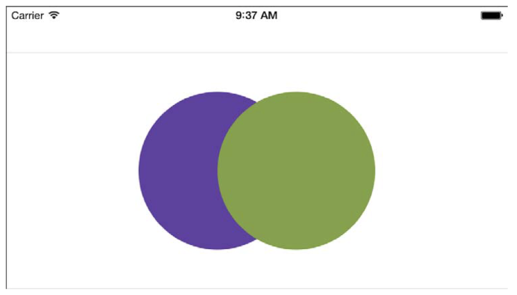

> NOTE: 这段代码用到greenColor和purpleColor并不是UIKit给的标准颜色，而是本书提供的固定的颜色，RGB值分别是（125，162，63）和（99，62，162），感兴趣可以进一步了解：http://github.com/erica/uicolor-utilities

```
- (UIImage *)buildImage
{
    //Create two circular shapes
    CGRect rect = CGRectMake(0,0,200,200);
    UIBezierPath *shape1 = [UIBezierPath bezierPathWithOvalInRect:rect];
    rect.origin.x += 100;
    UIBezierPath *shape2 = [UIBezierPath bezierPathWithOvalInRect:rect];
    
    UIGraphicsBeginImageContext(CGSizeMake(300,200));
    
    //First draw purple
    [purpleColor set];
    [shape1 fill];
    
    //Then draw green
    [greenColor set];
    [shape2 fill];
    
    UIImage *image = UIGraphicsGetImageFromCurrentImageContext();
    UIGraphicsEndImageContext();
    return image;
}
```
如果你转换绘画的顺序，shape2先，然后shape1，就得到如图1-7所示的结果。尽管位置和颜色都是和他们在图1-6中一样的。

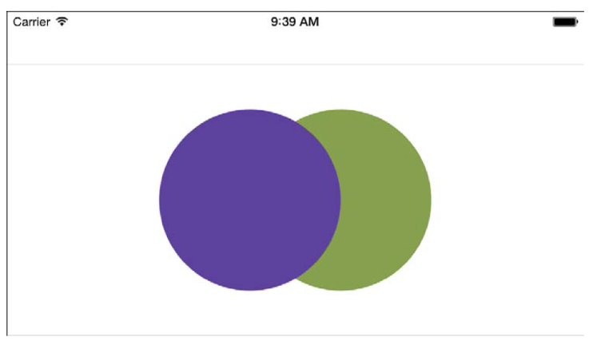

### 透明度

绘图时，透明度也是相当重要的一个角色。调整紫色的透明度会改变绘制的结果。这里把透明度改为原来的一半：
```
purpleColor = [purpleColor colorWithAlphaComponent:0.5f];

```
图1-8展示了调整透明度之后的图案，尽管紫色依然覆盖在绿色之上，但透明度的原因，绿色已经时可见的了。

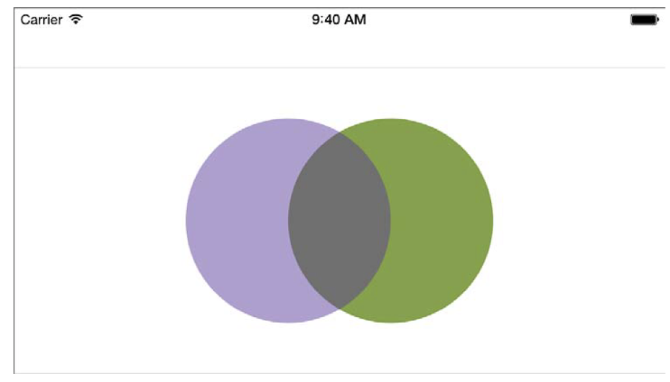

你可以已经发现，尽管绘制结果会随着程序改变，但有一个东西一直保持不变：新绘制的东西总是会影响到原来已经绘制的图像，而无视数学应用。这些应用就算使用混合模式，比如“目的顶峰”，那也只有当图片在空白位置绘制时才不会影响到原有的上下文数据（注：？？？）

关键在于理解你在添加新的源（不论是一个形状，或事一条线，一个图片）和由上下文所展示出来的你绘图的目的地。绘图程序运行你一步步向你的目标绘制就像现实中的画家一样。

### 上下文状态
在代码1-8中，当响应颜色实例时，set方法给定接下来的当前上下文的fill或是stroke操作的颜色。在这个代码中，紫色先设置，然后是绿色。当所有颜色都设置好后，才有接下来的绘制操作。
有两种颜色的指定方式：填充（setFill）和划（setStroke）。填充操作用颜色完全填充形状内部。划操仅形状边沿。图1-9中，填充色为绿色，而划颜色为紫色。
所有这三种方法（set，setFill和setStroke）都更新了当前的绘图状态，特别是激活填充和划的颜色。

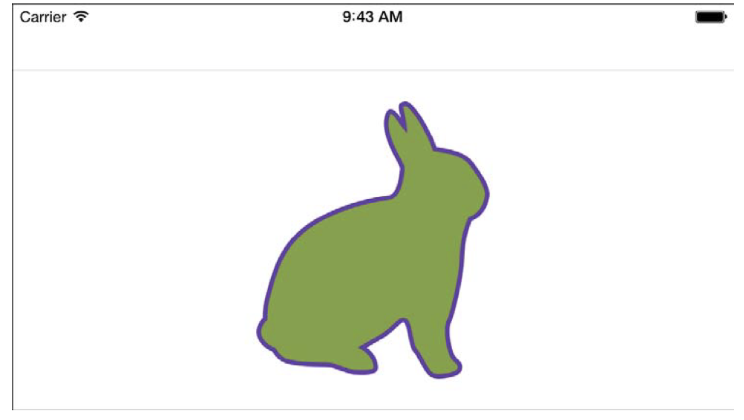

#### 应用状态
思考下列用于创建1-9图所示图像的代码：
```
[greenColor setFill];
[purpleColor setStroke];
[bunnyPath fill];
[bunnyPath stroke];

```
他设置了填充和划的颜色然后在贝塞尔曲线中应用他们。这最大的问题是：这些方法的请求的目标是谁？谁在储存这些填充和划颜色的状态，并让他们运用到接下来的操作中？
答案是当前的上下文。UIGraphicsGetCurrentContext（）方法返回的对象存储了填充和划的颜色。这个上下文会影响到所有的设置和绘图方法。

所有的上下文都会储存图像状态信息，他们扮演者绘图操作属性的角色。填充和划仅仅是储存在上下文中的两个状态类型。你之后会发现，上下文可以储存相当多的状态。图像状态会调整每一个绘图操作。

#### Push 和 Pop 图象状态
所有的上下文都拥有一个图像状态设置的栈。每次创建新的上下文时，栈都会有一个新鲜的状态。随后，你可以尽情设置状态，如果需要，还可以出栈或入栈图片状态（GState）栈。
这个栈和之前提到UIKit上下文栈不同。上下文栈储存了绘制的目的地，让你通过出栈入栈来管理当前需要绘制的上下文。绘图目的地像是一个画布。当你改变了绘制栈，你只是换了一个画布。而状态栈每一个上下文都独有一个栈。它为一个上下文储存了绘制偏好的设置，改变每个“画布”中的绘制操作。两者都是用栈，却是图像系统中不同的两个部分。
每个图片状态都记录了他的改变。比方说，你把一个新的状态推进栈，然后调整默认线宽为10，这个上下文状态会持续到他被推出栈。推出后，线宽会变为他被设置为10之前的值。
代码1-9展示了图像状态栈的管理过程。他把填充和划的颜色分别设置为绿色和紫色。画出一个兔子然后调用CGContextSaveCState（）“保存”当前状态，程序会把这些状态的复制推入当前上下文的GState栈。任何改变都会应用于新的图片状态拷贝。
如果你不做任何改变，你将继续绘制出绿色紫边的兔子。然而，代码1-9更新了代码，改为橙色和蓝色。重写当前的状态颜色设置。新的兔子绘制出来就是橙色和蓝色了。
最后代码通过CGContextRestoreCState（）还原了之前的状态。他会推出所有新加入的栈的状态。最后一个兔子便是紫色和绿色，具体如下：
```
UIGraphicsBeginImageContext(size);
CGContextRef context = UIGraphicsGetCurrentContext();

//Set initial stroke/fill colors
[greenColor setFill];
[purpleColor setStroke];

//Draw the bunny
[bunnyPath fill];
[bunnyPath stroke];

//Save the state
CGContextSaveGState(context);

//Change the fill/stroke colors
[[UIColor orangeColor] setFill];
[[UIColor blueColor] setStroke];

//Move then draw again
[bunnyPath applyTransform:CGAffineTransformMakeTranslation(50,0)];
[bunnyPath fill];
[bunnyPath stroke];

//Restore the previous state
CGContextRestoreCState(context);

//Move then draw again
[bunnyPath applyTransform:CGAffineTransformMakeTranslation(50,0)];
[bunnyPath fill];
[bunnyPath stroke];

UIImage *image = UIGraphicsGetImageFromCurrentImageContext();
UIGraphicsEndImageContext();
```


### 状态类型
一个上下文可以保存很多种的状态，不仅仅只有填充和划。每一个状态都表达了现在上下文持久的部分。表1-1列举出了可定制的状态属性，可以用来调节使用中的核心图像上下文请求，并且提供了一些图片实例粗略地展示了一下这些设置将如何改变绘制。

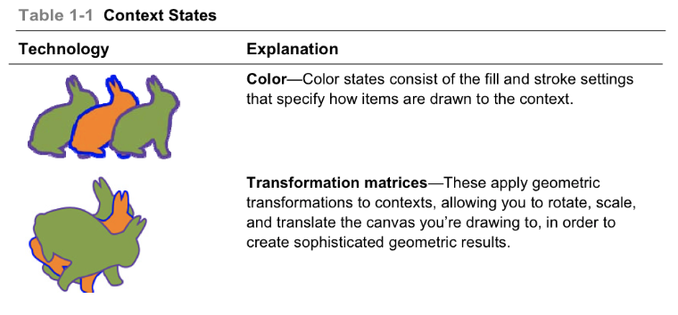
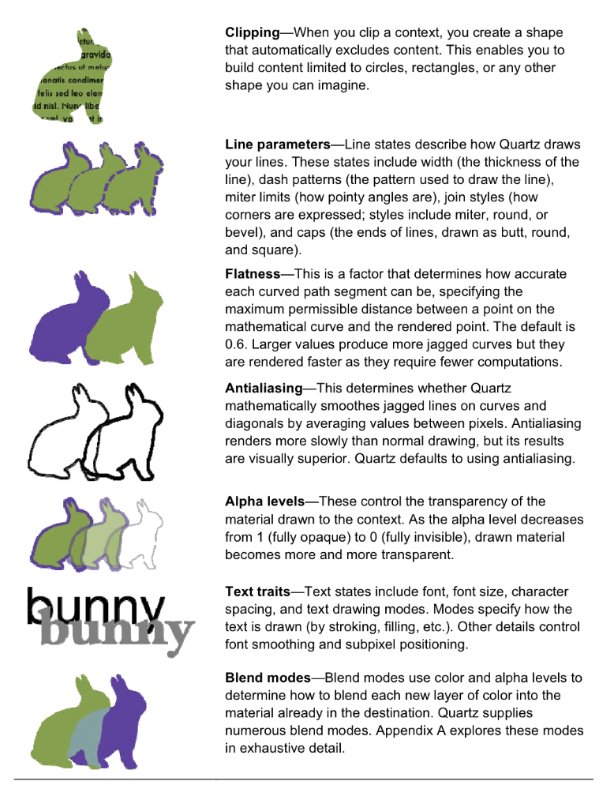

表的对照翻译：

|  Explanation        |  解释           |  翻译  |
|  :-------------: |:-------------:| ----- |
|   Color     |  颜色 | 颜色状态结合fill和stroke设置决定在上下文中如何绘制 |
|  Transformation matrices     | 变换矩阵      |  该属性实现几何变换，允许你旋转放缩和位移，可以得到复杂的几何变换结果 |
|  Clipping | 剪辑     |   当你剪辑一个上下文时，创建一个形状自动排除类容。而且不仅限于圆或矩形，还可以时任意你能想到的形状 |
| Line parameters | 线属性     |   线状态描述Quartz如何绘制线，这些状态包括宽度（线厚度），虚线（用虚线绘图），倾斜限制（尖角的度数），结合风格（如何表达角；风格包括倾斜，圆角，或是斜切），帽子（线段结束的地方端点是圆或方） |
|  Flatness |  平面度     |   这个元素决定了弯曲部分的弯曲程度，特别是数学弧度点和渲染点的最大允许距离（注：真的不会翻译这一句。。）。默认为0.6，更大会产生更多锯齿，但是会让渲染速度更快，因为需要更少的计算。 |
|  Antialiasing |  抗锯齿     |  该属性决定了Quartz的划线的流畅度通过取两像素之间的平均值。当然这样会使得渲染更慢，但是绘制结果在视觉上效果更好。Quartz是默认使用抗锯齿的  |
|  Alpha levels | 透明度     |  该属性决定了上下文绘制素材的透明度。alpha值从1全见到0全不可见，绘制材料逐渐透明  |
|  Text traits | 文本特性     |  该属性包含了字体，字体大小，字母间距，文本绘制模式。模式指文本如何绘制（划，填充等等）。其他细节还有字体流畅度和子像素位置等。  |
|  Blend modes |  混合模式     |  混合模式使用颜色和透明度来觉得新图层覆盖在已有图层上的部分的颜色，Quartz有很多复杂的混合模式，附录A详细的展示了他们  |


### 上下文坐标系
在UIKit中，坐标系原点（0，0）为屏幕左上点，然后想右和下延伸。而Quartz中，原点位于左下。
如图1-11，分别在UIKit（左）和Quartz（右）中描述了一个{ 20, 20, 40, 40}的方块。他们都是离远点20点对象，但是如你所见，出来的结果并不同。

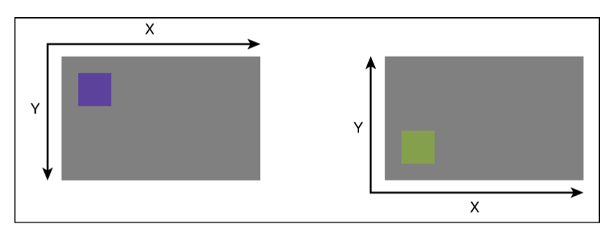

原点位置取决于你上下文的创建方法。若你使用UIKit方法创建上下文，原点为左上。如果使用CGBitmapContextCreate()创建，原点为左下。

#### 转换上下文
你可以调整核心图像上下文到UIKit的原点。代码1-10展示这些代码，包括以下这些步骤：
1. 把CGContextRef推入UIKit图像栈
2. 通过位移转换和调整比例原有的上下文，在垂直方向转换上下文。
3. 把当前转换于上下文的当前转换矩阵（CTM）链接。该操作调整上下文坐标系模仿UIKit，从左上开始绘制。
4. 在新的坐标系中开始绘制吧。
5. 出栈。

你也可以直接使用Quartz的坐标系，不做坐标转换。然而，大多数UIKit开发者鼓励使用单坐标系，在一个熟悉的坐标系中完成绘制任务。有些开发者会创建宏来定义相同的转换方法。这可以更形象地使用QUARTZ_ON/QUARTZ_OFF。代码不会变，但开发着可以很好的在当前状态的代码中检查。

代码1-10包含了次要的转换代码，不需要你使用上下文尺寸。但说实话，这有一点点黑客，但他确实奏效，因为图片恢复会使用和上下文同样的尺寸和比例。
你同样可以获得上下文的尺寸通过方法CGBitmapContextGetHeight（）和CGBitmapContextGetWidth（），通过屏幕比例分别返回像素的数量。着确保你工作在某些位图上下文中（如UIGraphicsBeginImageContextWithOptions（）创建的上下文）和你在上下文中适配的屏幕尺寸

```
//Flip context by supplying the size
void FlipContextVertically(CGSize size)
{
       CGContextRef context = UIGraphicsGetCurrentContext();
       if(context == NULL)
       {
           NSLog(@"Error: No context to flip");
           return;
       }
       CGAffineTransform transform = CGAffineTransformIdentity;
       transform = CGAffineTransformScale(transform, 1.0f, -1.0f);
       transform = CGAffineTransformTranslate(transform, 0.0f, -size.height);
       CGContextConcatCTM(context,transform);
}

//Flip context by retrieving image
void FlipImageContextVertically()
{
       CGContextRef context = UIGraphicsGetCurrent();
       if(context == NULL)
       {
             NSLog(@"Error: No context to flip");
             return;
       }
       UIImage *image = UIGraphicsGetImageFromCurrentImageContext();
       FlipContextVertically(image.size);
}

//Query context for size and use screen scale
//to map from Quartz pixels to UIKit points
CGSize GetUIKitContextSize()
{
       CGContextRef context = UIGraphicsGetCurrentContext();
       if( context == NULL) return CGSizeZero;
       CGSize size = CGSizeMake(CGBitmapContextGetWidth(context),
                                CGBitmapContextGetHeight(context));
       CGFloat scale = [UIScreen mainScreen].scale;
       return CGSizeMake(size.width/scale, size.heigth/scale);
}

//Initialize the UIKit context stack
UIGraphicsPushContext(context);

//Flip the context vertically
FlipContextVertically(size);

//Draw the test rectangle. It will now use the UIKit origin
//instead of the Quartz origin.
CGRect testRect = CGRectMake(20,20,40,40);
UIBezierPath *path = [UIBezierPath bezierPathWithRect:testRect];
[greenColor set];
[path fill];

//Pop the context stack
UIGraphicPopContext();

```
### 剪裁
剪裁（Clipping）帮助你排除所有在你上下文路径之外的绘画操作。想要裁剪，先要为你的上下文添加一个路径，然后调用CGContextClip（）方法。图1-12展示了一个例子，一些带有颜色的圆仔上下文中被一个Hello形状的单词裁剪。

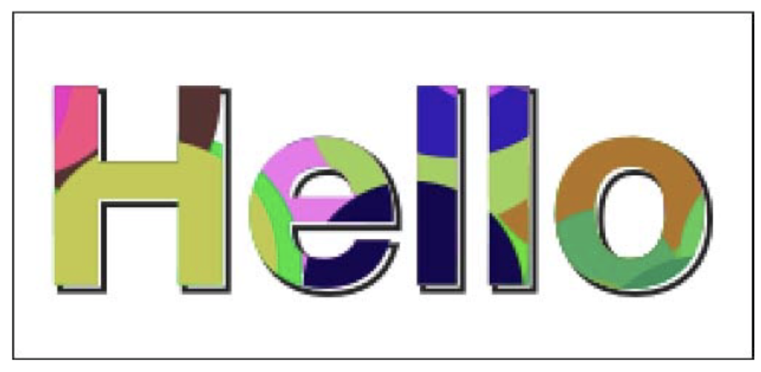

代码1-11设计到剪裁的部分分为以下几步：

1. 保存图片状态。保存裁剪之前的图片状态以便稍后恢复，不过你不需要返回未裁剪时的状态，跳过这个步骤。
2. 为上下文添加路径，使用CGContextClip（）进行裁剪。添加一个临时路径出存在图像上下文中，一旦储存，就会产生一个剪切的遮罩。他圈出了那些你不想绘制的上下文区域。本例使用UIBezierPath实例，他和CGContextClip（）方法是不兼容的。把贝塞尔曲线的CGPath属性转换为CGPathRef可以使之兼容。
3. 裁剪后，可以操作任何标准绘图操作。在区域外绘制的素材会自动被忽略掉。
4. 结尾时，恢复图片状态。这可以帮助你返回正常的绘制不会继续被裁剪。

这段程序相当于保存，裁剪，绘制，恢复。（大声读出来吧！）第六章会介绍使用Objective-C块来在保存和存储中使用裁剪和绘制，而非使用管理状态这种明确的响应。

```
//Save the state
CGContextSaveGState(context);

//Add the path and clip
CGContextAddPath(context, path.CGPath);
CGContextClip(context);

//Perform clipped drawing here

//Restore the state
CGContextRestoreGState(context);

//Drawing done here is not clipped
```

### 变换

图1-13中的字母序列是通过在一个圆上的各个点上绘制每个字母得到的。这个图利用了UIKit中很好的一个内嵌特性：NSString实例，他能很好的绘制在上下文中。你仅需告诉他绘制的点坐标或矩形即可，如下：

```
[@"Hello" drawAtPoint:CGPointMake(100, 50) withAttributes:@{NSFontAttributeName:font}];
```
这个语法在iOS7中改变，并且弃用之前的APIs。iOS7之后，你需要这样用：
```
[@"Hello" drawAtPoint:CGPointMake(100, 50) withFont:font];
```
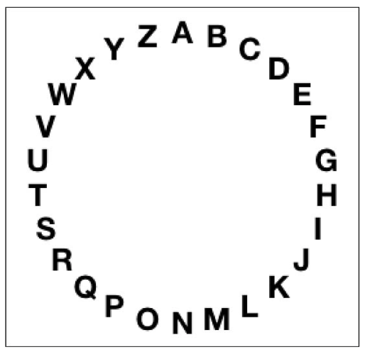

这个圆顺时针每（2 x Pi / 26）度摆放一个字母。每个x y通过计算与中心点的位移得到。下列代码通过使用r x sin（theta）和 r x cos（theta）来得到每一个字母点的位置。
```
NSString *alphabet = @"ABCDEFGHIJKLMNOPQRSTUVWXYZ";
for(int i=0; i<26; i++)
{
        NSString *letter = [alphabet substringWithRange:NSMakeRange(i, 1)];
        CGSize letterSize = [letter sizeWithAttributes:@{NSFontAttributeName:font}];
        
        CGFloat theta = M_PI - i * (2 * M_PI /26.0);
        CGFloat x = center.x + r * sin(theta) - letterSize.width /2.0;
        CGFloat y = center.y + r * cos(theta) - letterSize.height /2.0;
        
        [letter drawAtPoint:CGPointMake(x,y)
             withAttributes:@{NSFontAttributeName:font}];
}
```
这是一个还可以接受的解决办法，但是你可以通过上下文的变换更好的改进这个方法。

> 注意： 高中代数是核心图像开发者的基础。复习一下sin，cos，tan等还是很必要的（注：后面又介绍了一个网站，就不翻译了）

#### 变换状态
每一个上下文都存储了2D仿射变换的状态。这个变换被叫做当前变换矩阵。它定义了绘制时如何旋转放缩和位移。它提供了更为灵活和有力的方法来进一步改进绘制操作。对比图1-14和1-13，你会发现神奇的上下文变换所作的改进。

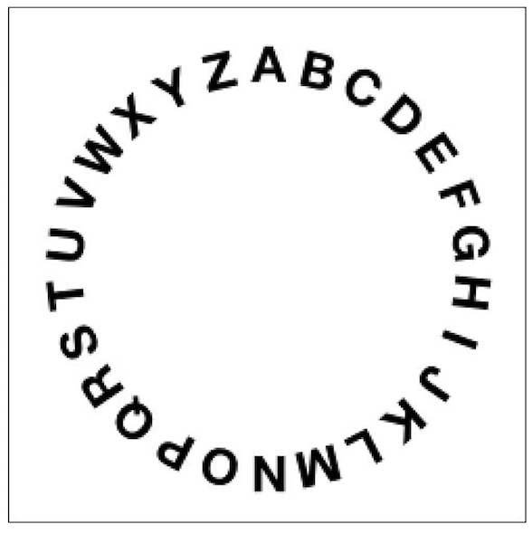

代码1-12展示了创建上图的步骤。它包含了一系列的旋转每一个字母的变换操作。上下文的保存和恢复确保了黑体的部分可以继续在后续中使用。这些变换都是基于上下文中心点的。
他可以让上下文自由旋转在某一点周围，所以每一个字母可以精确地绘制在一个角度上。向左移动半个字母宽度的距离，确保每个字母都是中心围绕在圆弧上。
```
NSString *alphabet = @"ABCDEFGHIJKLMNOPQRSTUVWXYZ";

//Start drawing
UIGraphicsBeginImageContext(bounds.size);
CGContextRef context = UIGraphicsGetCurrentContext();

//Retrieve the center and set a radius
CGPoint center = RectGetCenter(bounds);
CGFloat r = center.x * 0.75f;

//Start by adjusting the context origin
//this affects all subsequent operations
CGContextTranslateCTM(context, center.x, center.y);//(注：这句是黑体)

//Iterate through the alphabet
for(int i = 0; i < 26; i++)
{
     //Retrieve the letter and measure its display size
     NSString *letter = [alphabet substringWithRange:NSMakeRange(i, 1)];
     CGSize letterSize = [letter sizeWithAttributes:@{NSFontAttributeName:font}];
     
     //Calculate the current angular offset
     CGFloat theta = i * (2 * M_PI /(float) 26);
     
     //Encapsulate each stage of the drawing
     CGContextSaveGState(context);
     
     //Rotate the context
     CGContextRotateCTM(context, theta);
     
     //Translate up to the edge of the radius and move left by
     //half the letter width, The height translation is negative
     //as this drawing sequence uses the UIKit coordinate system.
     //Transformations that move up go to lower y values.
     COContextTranslateCTM(context, -letterSize.width /2, -r);
     
     //Draw the letter
     [letter drawAtPoint:CGPointMake(0,0) 
         withAttributes:@{NSFontAttributeName:font}];
     CGContextRestoreGState(context);
}

//Retrieve and return the image
UIImage *image = UIGraphicsGetImageFromCurrentImageContext();
UIGraphicsEndImageContext();
return image;
```
#### 创建更加精确的图层
一个更考究的解决方案需要绘制字母圆环避免“I”两端的空隙和“W”两端的挤压。代码1-13详细的展示创建更为考究的如1-15图所示的图片图层的方法。这个代码可以提供出色的图层布局。
开始时，计算图层的总宽度。计算每个独立字母的宽度（就像这里所做的一样）或者直接测量字符串作为一个整体。他允许你标记你的图层进度，产生一个从头到尾所占的百分比。
接下来，通过百分比调整每个字母的位置。用百分比计算出旋转的角度。
最后，如1-12一样绘制字母，你将会得到一个更具字母自然尺寸排列的图层。
```
//Calculate the full extent
CGFloat fullSize = 0;
for (int i = 0; i <26; i++)
{
      NSString *letter = [alphabet substringWithRange:NSMakeRange(i, 1)];
      CGSize letterSize = [letter  sizeWithAttributes:@{NSFontAttributeName:font}];
      fullSize += letterSize.width;
}

//Initialize the consumed space
CGFloat consumedSize = 0.0f;

//Iterate through each letter, consuming that width
for (int i =0; i <26; i++)
{
      //Measure each letter
      NSString *letter = [alphabet substringWithRange:NSMakeRange(i, 1)];
      CGSize letterSize = [letter sizeWithAttributes:@{NSFontAttributeName:font}];
      
      //Move the pointer forward, calculating the
      //new percentage of travel along the path
      consumedSize += letterSize.width/2.0f;
      CGFloat percent = consumedSize / fullSize;
      CGFloat theta = percent * 2 * M_PI;
      consumedSize += letterSize.width / 2.0f;
      
      //Prepare to draw the letter by saving the state
      CGContextSaveGState(context);
      
      //Rotate the context by the calculated angle
      CGContextRotateCTM(context, theta);
      
      //Move to the letter position
      CGContextTranslateCTM(context, -letterSize.width/2, -r);
      
      //Draw the letter
      [letter drawAtPoint:CGPointMake(0,0) withFont:font];
      
      //Reset the context back to the way it was
      CGContextRestoreGState(context);
}

```

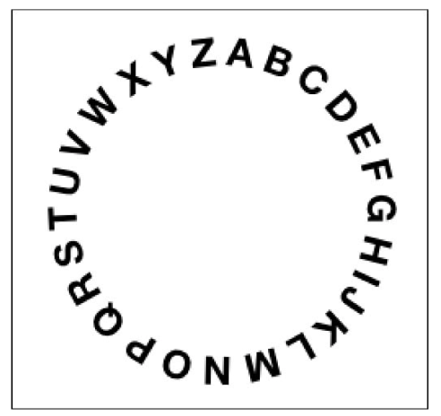

### 设置线属性
每一个上下文都保存着线宽属性坐图形状态的一部分，你可以通过调用CGContextSetLineWidth（）设置线宽，通过点尺寸（注：非像素而是点的意思）作为他的参数。随后的绘制的操作都会继承这个状态的改变。然而，线宽却不会应用于UIBezierPath实例中，以及主要的UIKit绘图工具。所有的UIKit路径都是通过lineWidth属性来调整划线的宽度的。不论他设置什么值都胜过上下文的设置。
来看看代码1-14吧。它创建了一个线宽为4的路径。然后又使用上下文创建了一个20点宽的线。图1-16展示了绘制的结果。如图所示，Quartz绘制的路径使用了20点的线宽，而UIKit所绘制的却是的是path的属性值。
```
UIGraphicsBeginImageContext(bounds.size);
CGContextRef context = UIGraphicsGetCurrentContext();

//Build a Bezier path and set its width
UIBezierPath *path = [UIBezierPath bezierPathWithRoundedRect:rect 
                                                cornerRadius:32];
path.lineWidth = 4;

//Updating the context state to use 20-point wide lines
CGContextSetLineWidth(context, 20);

//Draw this path using the context state
[purpleColor set];
CGContextAddPath(context, path.CGPath);
CGContextStrokePath(context);

//Draw the path directly through UIKit
[greenColor set];
[path stroke];
```


UIKIt代码限制了线宽对语义上的UIBezierPath对象并且总的来说对上下文无效。这并不是一件坏事，入栈一个线宽状态来绘制形状还不如直接设置width属性给特定的对象。但也不一定是这样。这段代码是普遍的。你也可以在线段中看到这样。

#### 线段
线段模式并不是像线宽那样在UIKit和Quartz中是分裂的。上下文状态中的改变也会影响到UIKit的路径，使用setLineDash：count：phase：方法。
这个代码片段会创建如图1-17那样的输出：
```
[greenColor set];
CGFloat dashes[] = {6, 2};
[path setLineDash:dashes count:2 phase:0];
[path stroke];

```
该代码段用了3个参数。第一个设置了线段模式（6个点长度有颜色，2个点长度无色），第二个参数为第一个参数中数字的个数（有两项，所以为2）。第三个参数定义了相位偏移。你将会在第四章中看到更多关于线段的知识。
用纯Quartz代码也可以得到一样的效果，CGContextSetLineDash（）。下面的代码片段一样会得到图1-17所示的效果。
```
[greenColor set];
CGFloat dashes[] = {6, 2};
CGContextSetLineDash(context, 0, dashes, 2);
[path stroke];
```

### 总结
本章介绍了iOS绘图的基础：上下文，你学习了如何创建上下文，了解到不同类型的可用上下文，同时学习了如何把上下文转换为图片或是PDF文件。在iOS中，上下文提供了大量的状态控制。在你离开本章之前，这里还有如下几点，你需要思考思考：
* 任何的绘画请求，都有很多解决方案来解决同样的问题。你更倾向于使用Core Graphics或者UIKit只会影响你所使用的API，不过往往没有谁是正确的答案。能绘出你需要的结果即可。
* UIKit的类在不断地改进。在iOS的每一代，它都提供了越来越多的资源来跳过直接使用Quartz。UIKit APIs往往更加简洁，吝啬，且易于理解。大部分的开发者都会感到使用UIKit的方法会有多便捷。
    苹果通常鼓励开发者尽可能使用高级API，仅当有高级API无法完成的任务时再使用低级API。有很多事都是低级API可以做到而高级API不行的。比方说，用带有合适的阴影的笔触来绘图，或事输出颜色空间。
* 在使用C语言基础的核心框架时，是可以收工进行内存管理，是很好的习惯。理解带Ref的对象如何工作，何时如何释放，对将来相关的操作顺利运行是很好的保障。学习使用ARC风格桥接转换核心框架的系统，肯能会花费大量的时间，但是你却会获得更多收获。
* 谨记：如果你方法以Copy或是Create开头，你必须释放这个元素。如果以Get开头，则不需要。且，无论如何，Create前缀的方法总是要跟着一个释放的方法。比如，创建一个颜色空间，需要有对应的CGColorSpaceRelease（）。
* Quartz和UIKit绘图方法都是线程安全的。苹果科技问答1637中提到iOS4开始，“在UIKit中绘制一个图像上下文是线程安全的，包括访问和操作当前的图像栈，绘制图像和字符，在第二个线程中使用颜色的字体对象”。


