# 几何语言

绘图和几何时无法避免地紧密相连的。为了完成复杂的绘图操作，你必须使用iOS可以表述的几何语言。本章将会带你从基础开始。首先是点-像素二分法，然后是核心结构，再然后转向UIKit对象。你将会学习这些项目都是什么，并了解他们如何在绘图中使用。

### 点和像素
在iOS中，点表示屏幕或绘图的位置。它由测量单元组成，描述了位置和绘图操作的范围。点对于物理世界测量和特殊屏幕硬件来说是不灵活的。它允许你表示独立使用中的设备上的位置信息。
点不是像素。像素是可寻址的屏幕组件，且直接和特定的硬件绑定。每个像素都独立设置了亮度和颜色值。而点则相反，对应逻辑坐标空间。
比方说，所有iPhone家族的成员都在纵向320点宽的位置展示一个对象。这些点在旧机型上为320像素宽，而在新的Retina设备上为640像素宽。而坐标系是统一的，无论你使用是Retina设备或是旧设备。
如图2-1所示，位于（160.0，240.0）的坐标，在3.5英寸的iPhone或iPod屏幕上位于中心位置，不论像素密度如何。同样的点在4英寸的iPhone或iPod上却里中心点偏上。新设备的中心变成了（160，284.0）。
在横向时，同样的点在iPhone屏幕上位于左下角。在更大的iPad屏幕上却出现在左上角。

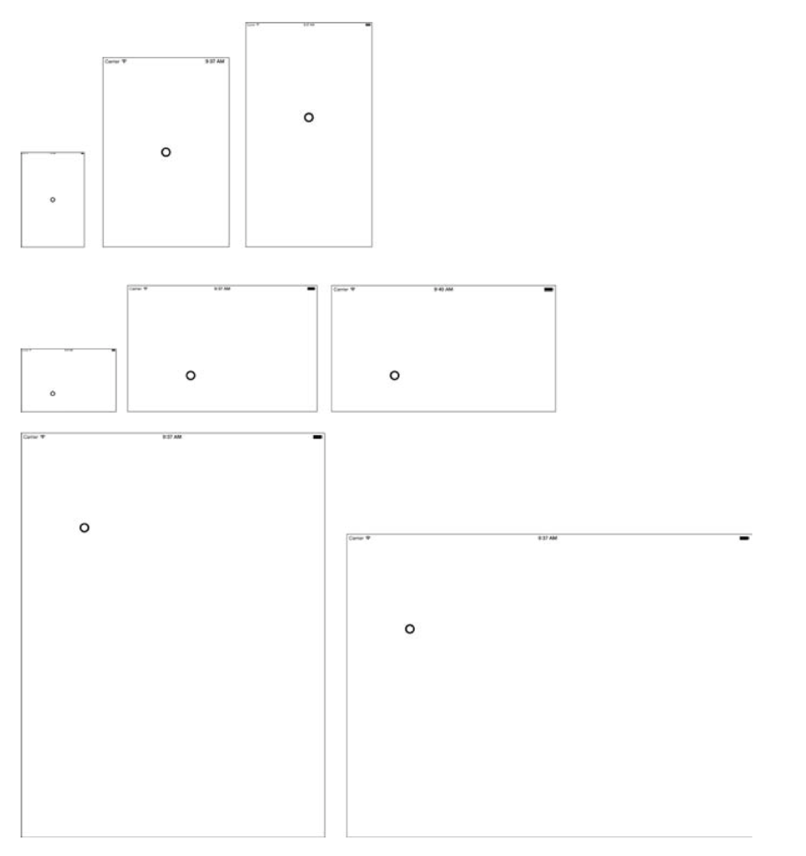

#### 比例

UIScreen类提供了一个scale属性。该属性反应了展示对象的像素密度和点系统之间的关系。屏幕比例属性用于转换用点测量的逻辑坐标空间和物理像素坐标系。Retina设备比例为2.0，非Retina设备为1.0。你可以通过如下方法检测设备是否为Retina设备：
```
- (BOOL)hasRetinaDisplay
{
        return ([UIScreen mainScreen].scale == 2.0f);
}

```
主屏总是关联设备当前的展现。其他的屏幕可能有通过AirPlay或苹果链接线展示的屏幕。每个屏幕都有一个availableModes属性。它提供了一个数组的解决方案对象，按由低到高的顺序排列。
很多屏幕支持多种模式。比方说，VGA可能会提供6个或以上的解决方案。解决方案的数量往往是由硬件决定的。总是会至少有一种解决方案存在。但是你总是需要提供更多选择给用户。
UIScreen也提供了两个很有用的展示尺寸的属性。bounds属性返回屏幕的边界矩形，通过点来测量。它给你提供了整个屏幕尺寸，不包括任何屏幕元素，比如状态条，导航条和切换条。applicationFrame属性也是用点来测量的。他包含了状态条如果状态条可见的话，提供了程序元素的窗口尺寸。

#### iOS 设备
表2-1总结了iOS的设备家族，并列出了每个成员的可寻址坐标空间。这里有5个比较有代表性的成员，你只会碰见3种逻辑空间（苹果也许会在未来介绍新的几何），如下几个：

* 3.5英寸iPhone设备（320.0x380.0点）
* 4.0英寸iPhone设备（320.0x568.0点）
* iPads （768.0x1024.0点）

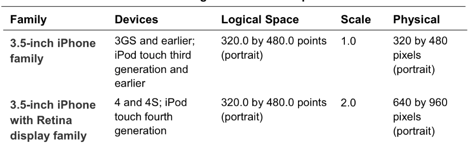
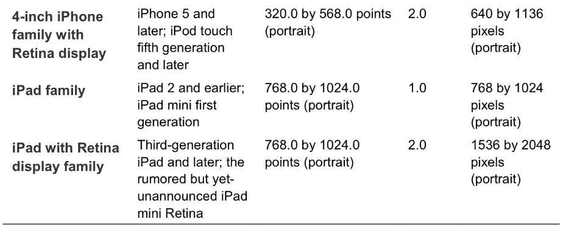

### 视图坐标
有很多绘图代码都紧密关联着你所需绘制的视图，特别是使用drawRect：方法的时候。所有视图的原生坐标系都是左上为原点的。
在iOS7以后，可以自己通过edgesForExtenedLayout属性调整视图控制器的原点是否在跳行条上或者导航条下。默认情况，是从导航条以下开始算原点的，提供一个边对边的UI。

####  Frames 和 Bounds
视图（至少）会存在于两个世界。一个视图frame属性是根据他的父视图的坐标系来确定的。该属性确定了视图在其父视图上的位置和大小。而一个视图的bounds属性在他自己的坐标系中定义，所以他的定位默认为（0，0）。（当你只使用视图的一部分时，这个定位值也是会变的，就比如说使用scroll view）。视图的frame和bounds属性时紧密相连的一对。一个改变了另一个也随之改变的。
思考图2-2，灰色视图的起始点为（80，100）。水平方向200点，垂直方向150点。他在父视图中的frame属性为{80，100，200， 150}。在自己的坐标系中，bounds属性为{0，0，200，150}。延展的值保持一致，而起始点的值不同。

|             |  Gray View          |  Parent  |
|  :-------------: |:-------------:| ----- |
|   Origin     |    {0, 0} | {80, 100} |
|  Circle    |  {66, 86}      |  {146, 186} |


  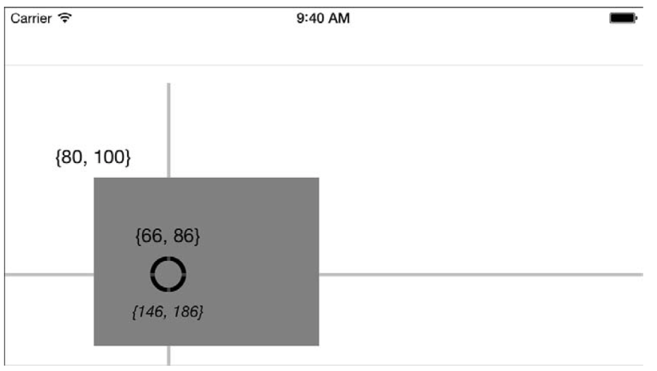

一个点的位置坐标是依据坐标系视情况而定的。在图2-2中，在灰色视图中一个圆包裹了一个点。在灰色视图的坐标系中，点位置为（66，86）。在他的父视图的坐标系中，点的位置坐标为（146， 186）。直接通过坐标相加进行转换，（66 + 80， 100 + 86），即（146，186）。

> 注意： 一个视图的frame是通过bounds，center和其他transform计算来的。他描述了可以包括整个视图的最小矩形。

#### 坐标系转换
iOS SDK提供了很多坐标系转换的方法。比如说，你也许会希望吧一个点从视图坐标系转换到它的父视图的坐标系中，来确定在它的父视图的哪个位置进行绘制。你可以如下这么做：
```
CGPoint convertedPoint = [outerView convertPoint:samplePoint fromView:grayView];
```
你可以使用任何视图实例调用这个方法。尤其是你想要转换一个点到另一个坐标系上时（toView：）或事从另一个坐标系转移过来（fromView：），像例子中那样。
这些视图必须存在于同一个UIWindow，否则这个方法不会奏效。这些视图不需要有任何其他的相关关系了。然而，他们可以是兄弟姐妹，父子，祖先，或其他关系。这个方法会返回一个你想要得到的点坐标。
转换矩形的方法和转换点的方法也是类似的。把一个矩形从一个视图转换到另一个坐标系，使用convertRect：fromView：。转换回来，使用convertRect：toView：

### 关键结构体
iOS绘图使用四个关键的结构体来定义几何基元：点，尺寸，矩形，转换。这些结构体都使用同一额单位：逻辑点。点通过CGFloat值来定义。在iOS中用float，而OS X使用double。
不像像素，固定整数点且与设备硬件无关。他们的值和亚像素精度提供的数学坐标有关。iOS绘图系统使用你习惯的数学。

你会用到的四个基元如下：
* CGPoint —— 点结构由x和y组成，他们定义了逻辑位置。
* CGSize —— 尺寸结构由width和height组成，他们定义了横纵轴上的延展
* CGRect —— 矩形由使用点定义的origin属性和一个size属性组成。
* CGAffineTransform —— 放射变换结构描述了几何项的改变——特别是，一个项目如何放置，放缩，旋转，他储存了a，b，c，d，tx和ty六个值的矩阵来定义变换。

下一章会更加深入地介绍这几项。你需要先有一个基础的几何上的认识之后，才可以更加深入地在绘图中使用他们。

#### 点
CGPoint储存了逻辑位置，通过定义x和y的值来确定。CGPointMake（）可以很方便地通过两个参数来创建结构体：
```
struct CGPoint{
    CGFloat x;
    CGFloat y;
}
```
这些值可以是任何浮点数的点值。负数依然有效。

#### 尺寸
CGSize结构体储存了两个方向上的延展，本别是width和height。使用CGSizeMake（）方法创建，两值也可以为负数，然而日常中很少这么用：
```
struct CGSize{
CGFloat width;
CGFloat height;
}
```

#### 矩形
CGRect结构体由两个子结构体组成：CGPoint定义了矩形的位置，CGSize定义了延展的大小。CGRectMake（）方法用四个参数定了rect结构体。四个参数的顺序为x，y, width, height。比方说，CGRectMake（0，0， 50，100）：

```
struct CGRect{
    CGPoint origin;
    CGSize size;
}
```
调用CGRectStandardize()把size中为负的部分转换为相等的正值。

#### 转换
转换是iOS几何学中最强大一个部分。他允许点从一个坐标系转移到另一个坐标系。也允许你放缩旋转，镜像，位移等等当你绘制的时候，通过保存线性和相关比例。你在第一章中调整绘图上下文位置时已经遇到了绘制中进行转换，或当你读到第五章操作路径或形装时，也会遇到。
在2D和3D图像中，转换都是很广泛的被应用到的。转换提供了复杂的架构来解决几何问题。核心图像的版本（CGAffineTransform）使用3x3的矩阵，来解决2D问题。而在3D中，使用Core Animation中的图层定义的4x4的矩阵。Quartz转换允许你进行几何的位移放缩旋转。
所有的转换都可以用如下所示的底层转换矩阵表示：

  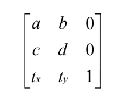
  
  用C语言机构提表示为：
  ```
  struct CGAffineTransform{
         CGFloat a;
         CGFloat b;
         CGFloat c;
         CGFloat d;
         CGFloat tx;
         CGFloat ty;
  }
```

##### 创建转换
不像其他核心图像结构体，你几乎很少直接使用放射变换。大部分人甚至都不需要使用CGAffineTransformMake（）（需要六个参数）来创建结构体。
取而代之的是，CGAffineTransformMakeScale（），CGAffineTransformMakeRotate（）或是CGAffineTransformMakeTranslation（）。这些方法分别通过参数创建了放缩，旋转，位移矩阵。这些方法可以允许你根据你想完成的变换执行对应的操作。需要旋转一个对象？直接输入特定的选择程度即可。需要移动对象？直接输入移动位移即可。每一个方法创建了一个transform来完成指定操作。

##### 分层转换
相关方法允许你把一个转换覆盖在另一个转换之上，完成一个复杂的变换。不像第一个函数，他们只取一部分变换作为参数。他们定义一个变换会层叠另一个变换在顶上。不像“make”方法，他们总是按一定序列摆放的，且每一个变换的结果都会传递到下一个变换。比方说，你也许想创建一个围绕他的中心选择和放缩的事物，你可以如下列代码这样处理：
```
CGAffineTransform t = CGAffineTransformIdentity;
t = CGAffineTransformTranslate(t, -center.x, -center.y);
t = CGAffineTransformRotate(t, M_PI_4);
t = CGAffineTransformScale(t, 1.5, 1.5);
t = CGAffineTransformTranslate(t ,center.x, center.y);
```
开始是一个默认的变换。默认的transfrom是个基础，就像加法中的0或者乘法中的1一样。在使用几何对象时，一般以此开始。是用来也确保一个固定的起始点以服务于之后的操作。
因为转换应用于对象的起始点，并不是中心点。你需要把中心点移动到起始位置。放缩和选择总是与坐标为（0，0）的点关联。如果你想让他们关联到另一个点，比如说一个视图或是路径的中心点，你需要把你想要的点移动到0，0的位置。这一连串的变换都会存储在唯一的变换t中。

##### 曝露转换
UIKit库提供了大量的辅助图像和绘制操作的方法。还包括一些转为放射变换特定的方法。你可以通过UIKit的NSStringFromCGAffineTransform（）方法打印出一个视图的变换。下面展示的是一个视图选择45度并放缩1.5倍的变换打印：
```
2013-03-31 09:43:20.837 HelloWorld[41450:c70] [1.06066, 1.06066, -1.06066, 1.06066, 0, 0]
```
这里没有做中心在定位，所以只有两个操作。
这些数字并不是那么直观。特别是，他没有直接告诉你放缩了多少选择了多少。不过幸运的是，又很简单方法可以处理，可直接展示更加直观的值。代码2-1展示如何计算X，Y方向上的放缩，以及旋转角度。
当然，没有必要去计算translation（位移）的值，因为这些值直观地储存在tx和ty中。
```
//Extract the x scale from transform
CGFloat TransformGetXScale(CGAffineTransform t)
{
     retrun sqrt(t.a * t.a + t.c * t.c);
}

//Extract the y scale from transform
CGFloat TransformGetYScale(CGAffineTransform t)
{
      retrun sqrt(t.b * t.b + t.d * t.d);
}

//Extract the rotation in radians
CGFloat TransformGetRotation(CGAffineTransform t)
{
      return atan2f(t.b, t.a);
}
```
#### 预定义常量
每一个核心图像结构体都有预定义的常量。常见如下：
* Geometric zeros —— 这个常量提供默认的零值。CGPointZero坐标（0，0）的点常量，CGSizeZero提供宽高均为0的尺寸常量。CGRectZero等价于CGRectMake（0，0，0，0）。
* Geometric identity —— CGAffineTransformIdentity 提供一个常量默认转换。应用于任何几何元素，这个变换都会以相同的开始值返回。
* Geomeric infinity —— CGRectInfinite是一个无穷范围的矩形。宽和高都被设置为CGFLOAT_MAX, 可达的最大的浮点数。起始点设置为可达的最小负数（-CGFLOAT_MAX/2）。
* Geometric nulls —— CGRectNull 和CGRectZero有区别，他没有位置信息。CGRectZero的位置是（0，0）CGRectNull的位置是（INFINITY，INFINITY）。当你请求矩形交叉或分离时会用到这个矩形。
任何与CGRectNull结合的矩形都会返回原始的rect。例如，{10,10,10,10}与CGRectNull结合结果仍然是{10,10,10,10}.而与CGRectZero结合这会变为{0, 0, 20, 20},原点变为（0，0）且翻倍尺寸，改变位置。
#### 转换为对象
因为几何元素和结构体并不是对象，把他们与标准Objective-C结合往往是困难的。你不能把一个尺寸或是矩形添加到NSArray或是一个字典中。你也无法给一个点或者变换设置初始值。正因如此，核心图像和核心框架提供方法和类来转换和压缩结构体为一个对象。对常见的几何结构体对象解决方案为字符串，字典和值。
##### strings
通过2-2表中的一系列方法，可以把结构体转换为一个字符串。这些便捷的方法允许你通过易读的格式来打印信息和储存结构体到文件，通过很好的定义和很容易恢复的代码。一个转换过的点或者尺寸会显示成这样：{5, 2}.（NSStringFromCGPoint（CGPointMake（5，2）））
> 字符串是打印debugging信息最有用的。

  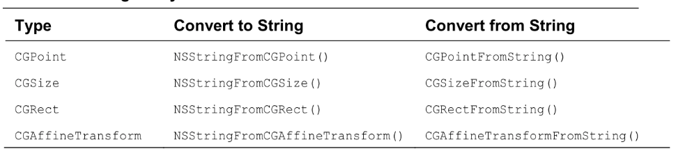
  
  ##### 字典
  字典提供了另一种转换几何结构体到可以储存和打印的对象的方法。表2-3所示，它被限制只能转换点，尺寸和矩形。而且，他返回的是CFDictionaryRef实例，你还需要把结果桥接为NSDictionary对象。
  > 字典在储存用户定义的结构体时是最有用的。
  
  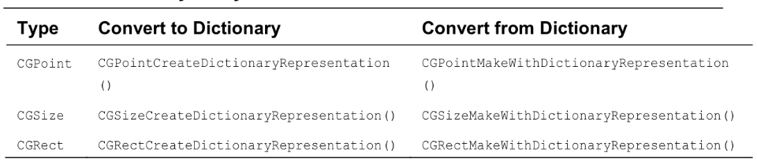
  
  下列代码转换一个矩形到一个Cocoa Touch字典，然后转换回CGRect并打印：
```
//Conert CGRect to NSDictionary representation
CGRect textRect =  CGRectMake(1, 2, 3, 4);
NSDictionary *dict = (__brigde_transfer NSDictionary *)CGRectCreateDictionaryRepresentation(testRect);
NSLog(@"Dictionary: %@", dict);

//Convert NSDictionary representation to CGRect
CGRect outputRect;
BOOL success = CGRectMakeWithDictionaryRepresentation(__bridge CFDictionaryRef)dict, &outputRect);
if(success)
    NSLog(@"Rect: %@",NSStringFromCGRect(outputRect));
```
下面是上列代码的输出, 如你所见矩形被储存，然后重新取出：
```
2013-04-02 08:23:07.323 HelloWorld [62600:c07] Dictionary:{
        Height =4;
        Width =3;
        X = 1;
        Y = 2;
}
2013-04-02 08:23:07.323 HelloWorld[62600:c07]
        Rect:{{1,2},{3,4}}
```
>  注意：CGRectMakeWithDictionaryRepresentation（）有一个bug，又一些在OS X上创建的值在iOS中不可读。

##### 值
NSValue类提供了一个C语言数据的容器。他可以储存数量类型（像是integers和floats），点和结构体。UIKit扩大普通的NSValue行为为一个压缩的核心图像基元。 当一个数量类型转为值类型后，你可以添加几何基元到Objective-C 像其他对象那样收集和处理。
> 值在添加结构体到数组和字典进行应用内计算的时候最有用

 
  
  > 注意：NSCoder提供UIKit定制的几何转码和解码方法，提供给CGPoint，CGSize，CGRect和CGAffineTransform。这些方法帮助你储存和恢复你给予特殊key的几何结构体。
  
  #### 几何测试
  核心图像提供一系列的几何测试方法，如表2-5所示。这些项目可以让你比较其他的项目或是检查你可能遇到的特殊情况。这些方法的名字很好的解释了他们的用途。
  
  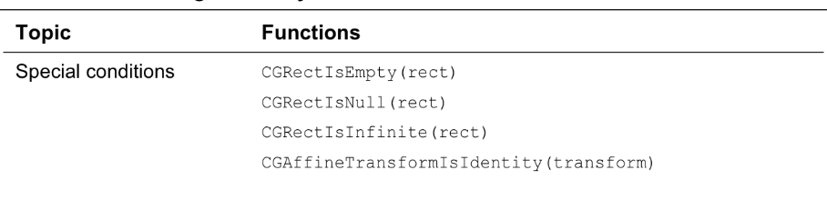
  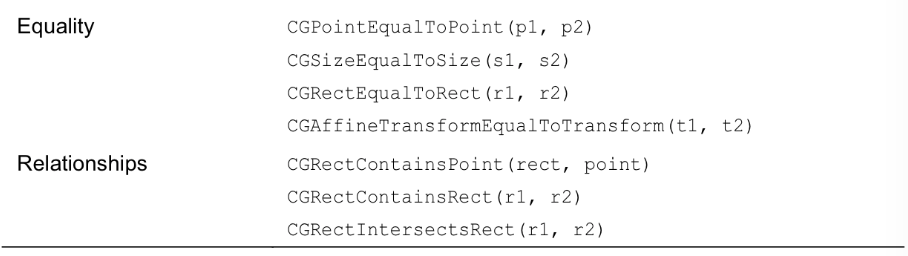

#### 其他基础方法
这些最后还有一些你可能需要了解的方法：
* CGRectInset（rect， xinset， yinset） —— 这个方法会得到一个与原矩形同中心但更大或者更小的矩形。inset为正则变小，反之变大。这个方法在移动绘制图形和子图像离开边界来提供一个空白空间是会显得很有用。
* CGRectOffset (rect, xoffset, yoffset)  —— 这个方法会得到一个与原矩形偏离x，y距离的矩形。Offset可以很好的应用于拖动矩形在屏幕上移动，或是创建一个阴影效果。
* CGRectGetMidX（rect）和 CGRectGetMidY（rect） —— 这两个方法返回矩形x方向和y方向上的中心坐标。这个方法可以很容易的获取bounds或者frames的中心点。相关方法还有minX，maxX，minY，maxY，width和height。中心点可以很好的在绘图中心项中使用。
* CGRectUnion（rect1，rect2） —— 这个方法返回一个可以所有源矩形都包括进去的最小矩形。这个方法可以帮你确定你所绘制的元素最小的边界盒子。这个方法可以把你所有的绘制路径和元素结合起来并且作为他们的背板。
* CGRectIntersection（rect1，rect2） —— 这个方法返回两个矩形的交叉部分，若无交叉则返回CGRectNull。交叉可以在使用AutoLayout计算矩形插入时起到很好的作用。路径边界和图像边界之间的交叉，可以得到两者间固有的内容。
* CGRectIntegral（rect） —— 这个方法把源矩形转换为整数。所有的orign值都会四舍五入到整数。而size值则会向上舍入。如此来确保新的矩形会把原始的矩形完整的包括进去。整数话矩形可以为绘制提速。视图绘制通过像素边界，这样操作可以更好的减少锯齿和模糊。
* CGRectStandardize（rect） —— 这个方法会返回一个正数宽高值的基础矩形。标准化可以帮助你更好地简化数学运算当操作一些交叉绘制，特别当用户交叉在左上中而非右下时。
* CGRectDivide（rect， &sliceRect， &remainderRect， amount， edge） —— 这个方法是核心图像这些方法中最复杂的一个了，但是它也是举足轻重的。除法可以交叉切割一个矩形成一个部分，以便于你可以细化绘制区域。

### 使用CGRectDivide（）
CGRectDivide（）方法是极其便利的。它提供了真地非常简单的方法来分割和细化矩形成几部分。每一步，你都会定义需要分割多少，分割哪一部分。你可以用从任何边界进行分割，包括CGRectMinXEdge，CGRectMinYEdge，CGRectMaxXEdge和CGRectMaxYEdge。
一系列的代码之后会得到如图2-3所示的图案。代码2-2展示了具体如何实现。这段代码先是分割出矩形左边的一小部分，然后纵轴对半分割剩下的部分。然后再在剩下的部分左右两侧再分出一小块。

  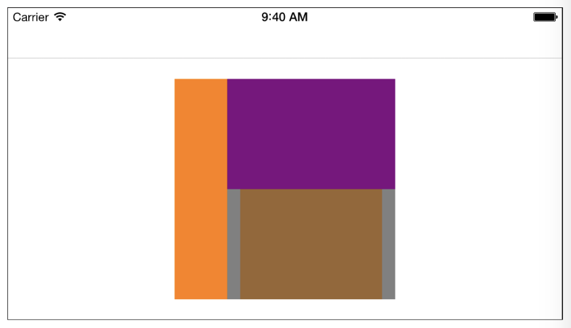
  
```
UIBezierPath *path;
CGRect remainder;
CGRect slice;

//Slice a section off the left and color it orange
CGRectDivide(rect, &slice, &remaider, 80, CGRectMinXEdge);
[[UIColor orangeColor] set];
path = [UIBezierPath bezierPathWithRect:slice];
[path fill];

//slice the other portion in half horizontally
rect = remainder;
CGRectDivide(rect, &slice, &remainder, remainder.size.height / 2, CGRectMinYEdge);

//Tint the sliced portion purple
[[UIColor purpleColor] set];
path = [UIBezierPath bezierPathWithRect:slice];
[path fill];

//Slice a 20-point segment from the bottom left
//Draw it in gray
Rect = remainder;
CGRectDivide(rect, &slice, &remainder, 20, CGRectMinXEdge);
[[UIColor grayColor] set];
path = [UIBezierPath bezierPathWithRect:slice];
[path fill];

//And another 20-point segment from the bottom right,
//Draw it in gray
rect = remainder;
CGRectDivide(rect, &slice, &remainder, 20, CGRectMaxXEdge);
//Use same color on the right
path = [UIBezierPath bezierPathWithRect:slice];
[path fill];

//Fill the rest in brown
[[UIColor brownColor] set];
path = [UIBezierPath bezierPathWithRect:remainder];
[path fill];

```
  
### 矩形公用自定义方法
你使用CGRectMake（）来创建frames，bounds或者其他矩形参数。它接收4个浮点数参数x，y，width和height。这是Quartz绘图中最为重要的一个方法。
但常常，你总是想通过你经常使用的对象，如points和size，来直接创建矩形。但你可以通过组合域来重写方法。你也行会发现有一个实用的简化方法是多么有用，通过使用结构体为参数。如代码2-3:
```
CGRect RectMakeRect(CGPoint origin,CGSize size)
{
     return (CGRect){.origin = origin, .size = size};
}
```
出奇意料地，Quartz没有一个内建方法来获取矩形的中心点。虽然你可以很容易地通过核心图像方法取到x，y的中点。直接通过rect返回一个点坐标会更加方便一些。代码2-4是我自己在绘图工作中经常会使用到的。
```
CGPoint RectGetCenter(CGRect rect)
{
      return CGPointMake(CGRectGetMidX(rect),CGRectGetMidY(rect));
}
```
围绕着一个中心点来创建一个矩形也是常常会遇到的挑战。比方说，你想让一个文本中心对齐某点，或事围绕一个点来摆放某个形状。代码2-5即为实现方法。你提供一个中心点和一个尺寸，返回的矩形会描述你的目标位置。
```
CGRect RectAroundCenter（CGPoint center， CGSize size）
{
     CGFloat halfWidth = size.width / 2.f;
     CGFloat halfHeight = size.height / 2.f;
     return CGRectMake(center.x - halfWidth, center.y - halfHeight, size.width, size.height);
}
```
代码2-6使用代码2-4和2-5的结合来给指定矩形绘制一个中心对齐的字符串。它计算了字符串的尺寸（使用iOS7的API），然后和矩形的中心一起来创建了一个中心围绕的对象。图2-4即为效果。
```
NSString *string = @"Hello World";
UIFont *font = [UIFont fontWithName:@"HelveticaName" size:48];

//Calculate string size
CGSize stringSize = [string sizeWithAttributes:[NSFontAttributeName:font]];

//Find the target rectangle
CGRect target = RectAroundCenter(RectGetCenter(grayRectangle), stringSize);

//Draw the string
[greenColor set];
[string drawInRect:target withFont:font];
```

  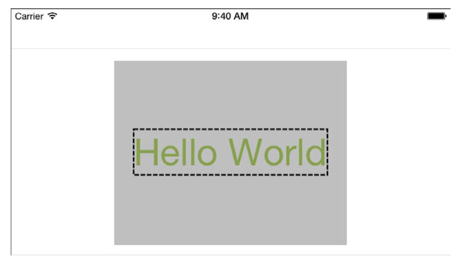
  
另一个解决中心对齐的方法在代码2-7中展示。它使用一个已存在的矩形和它的中心来得到另一个矩形，而非通过尺寸和目标点。你可以使用这个方法通过Bezier曲线得到的bounds矩形来计算。通过下列方法来让路径位于一个矩形中心处。
```
CGRect RectCenteredInRect(CGRect rect, CGRect mainRect)
{
      CGFloat dx = CGRectGetMidX(mainRect) - CGRectGetMidX(rect);
      CGFloat dy = CGRectGetMidY(mainRect) - CGRectGetMidY(rect);
      return CGRectOffset(rect , dx, dy);
}
```

