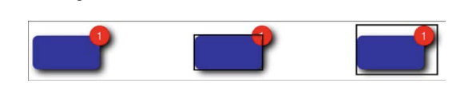
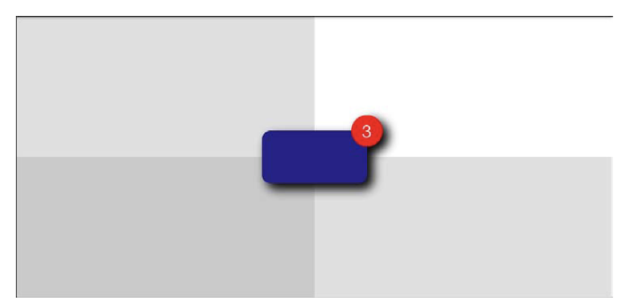

# 绘制图像

本章介绍图像绘制，它将会涉及到在一个图像上下文创建，调整，恢复事物。你将会用到很多关于图像，绘图和iOS相关的知识。你可以在图像上下文中渲染一个图像并改变他们的版本。你也可以生产缩略图或是取到图片的一部分。你也可以创建事物来根据按钮或其他Auto Layout对象来适当地收缩。上下文提供方法转变图像实例为数据对象。允许你应用图片处理技术以便融入结果到你的用户界面中。本章，你会学习到常见的图像绘制任务并且找到他们的解决方案。

### UIKit Images

UIKit图像总是围绕着UIImage类。它是一个强大且灵活的类，并且很好的隐藏了内部实现细节，以便可以使用很少的代码来完成很多展示任务。它最常用的代码是从文件中倒入数据并把数据表示的图象添加到UIImageView实例中，下面有一个例子：
```

UIImage *image = [UIImage imageNamed:@"myImage"];
myImageView.image = image;

```
当然也不限制你去夹在外部数据来导入图像。iOS允许你在需要的时刻用特定的方法用代码创建图像。代码3-1是一个不那么重要的例子，它创建一个新的UIImage实例，设置了颜色和尺寸。函数返回了一个颜色样本。
为了完成这些，代码3-1创建了一个图像上下文。然后设置了一个颜色并且通过UIRectFill（）填充上下文。然后恢复并从上下文返回一个新的图像。
代码3-1展示了基础的绘制骨架。在这个方法的绘制颜色矩形的地方，你可以绘制你自己的“蒙娜丽莎”。通过你自己的自定义绘制程序并设置符合你的app要求的绘制尺寸。
```
UIImage *SwatchWithColor(UIColor *color, CGFloat side)
{
     //Create image context (using the main screen scale)
     UIGraphicsBeginImageContextWithOptions(CGSizeMake(side,side), YES, 0.0);
     
     //Perform drawing
     [color setFill];
     UIRectFill(CGRectMake(0, 0, side, side));
     
     //Retrieve image
     UIImage *image = UIGraphicsGetImageFromCurrentImageContext();
     UIGraphicsEndImageContext();
     return image;
}
```
这里有一些其他的有关图像的事情你需要记住：
* 你通过size属性来查询图像的长宽。size返回点单位而非像素单位。所以返回点值也许会在Retina设备中变为双倍：
```
UIImage *swatch = SwatchWithColor(greenColor, 120);
NSLog(@"%@",NSStringFromCGSize(swatch.size));
```
* 图像可以在PNG数据或是JPEG数据中相互转换，通过使用UIImagePNGRepresentation()和UIImageJPEGRepresentation()方法。这两个方法返回NSData对象，其中包括了压缩后的图像数据。
* 你可以通过CGImage属性来恢复一个图像的Quartz展示。UIImage基本上对Core Graphics和Core Image来说不怎么有用。很多核心图像的方法都需要CGImage。当然这个属性也不能用于核心图像的创建，你还必须转换底层的CIImage到CGImage以便于在核心图像中使用。

> UIImage支持TIFF，JPEG，GIF，PNG，DIB（BMP），ICO，CUR和XBM格式，你也可以通过使用ImageIO框架来导入其他格式（如RAW）。

### 创建缩略图。
通过创建缩略图，你可以把一个大图实例转换为一个小图。缩略图可以嵌入到表视图单元格里，联系人总结（注：我也不太懂是什么，有了解的同学可以偷偷告诉我。。。），和一些其他图片起到重要作用的地方。第二章有介绍仅提取图片一部分的方法。缩略图提供了一个实际的，图片定向为其服务，同时为简单的图像绘制提供一个很好的起点。
你可以通过创建一个想要得到的图像上下文尺寸来创建缩略图，如100x100。使用drawInRect：来绘制源图像到上下文中。以得到一个新的缩略图结束：
```
UIImage *image = [UIImage imageNamed:@"myImage"];
[image drawInRect:destinationRect];
UIImage *thumbnail = UIGraphicsGetImageFromCurrentImageContext();
```
得到合适缩略图的关键是纵横比。不论你要划或是填充，我们都希望能保留图片的内部特征而不扭曲变形。图3-1展示了一个悬崖的图。图片的长度要比宽度高——1933像素宽和2833像素高。缩略图展示在右侧，它并没有过多关注纵横比问题。因为如此，缩略图的纵向被挤压了。
这也不算是一个难看的结果——实际上，如果你们有看到左侧的图，你可能根本不会发现问题——但这毕竟不是一个精确的结果。使用这样的图像会有很大的出现错误图像陈列的风险。也许不会跳出错误，但是很明确地会对对比例敏感的用户产生困扰。


图3-2展示了一个合适的缩略图应该如何。并非直接绘制到目标中，它计算了矩形填充（左侧）和适配（右侧）目标区域。代码3-2解释了不同之处，创建了填充或是适配的矩形来绘制，而不是直接绘制。


```
UIImage *BuildThumbnail(UIImage *sourceImage,CGSize targetSize,BOOL useFitting)
{
    UIGraphicsBeginImageContextWithOptions(targetSize, NO, 0, 0);

    //Establish the output thumbnail rectangle
    CGRect targetRect = SizeMakeRect(targetSize);
    
    //Create the source image`s bounding rectangle
    CGRect naturalRoot = (CGRect){.size = sourceImage.size};
    
    //Calculate fitting or filling destination rectangle
    //See Chapter 2 for a discussion on these functions
    CGRect destinationRect = useFitting ? RectByFittingRect(naturalRect, targetRect) : RectByFillingRect(naturalRect, targetRect);
    
    //Draw the new thumbnail
    [sourceImage drawInRect:destinationRect];
    
    //Retrieve and return the new image
    UIImage *thumbnail = UIGraphicsGetImageFromCurrentImageContext();
    UIGraphicsEndImageContext();
    return thumbnail;
}
```

### 提取子图像
不像缩略图那样，会把图像数据变为一个更小的版本。子图像会取到源图像的一部分并且按照一样的标准。图3-3展示了一个展示图像左上侧雪貂头部特写的子视图。倍放大的子视图突出了取到的那一部分。如你所见，因为放大的原因，图像也变模糊了。


代码3-3展示详细的实现代码。使用简单的Quartz方法CGImageCreateWithImageInRect（）来从源图像中创建新的图像。使用Quartz而不是UIKit是因为这里已经有一个创建好的方法了。
当你使用核心图像方法时，矩形会自动代表你调整像素线使用CGRectIntegral()。然后会被原始图像矩形分割，所以不会出现超出原始图像的部分。这帮你节省了很多的工作量。你所需要做的仅仅是把CGImageRef转换成为UIImage实例。
但是当你在Retina体系中使用或者是在从Quartz坐标中取出数据时缺点也会暴露出来。因为如此，我在代码3-3放入了第二个方法，一个完全由UIKit来完成的方法，避免了坐标的转换。这个方法所用的相关参数都是以点为单位的，而非像素。这在你询问一个图像的边界然后在起中心创建矩形时显得尤为重要。如果你忘记进行点到像素转换到话，在Retina中“中心”会往左上角偏移。但是始终使用UIKit的话，你就可以回避全部的问题，确保你所取的部分是你想要取到的精确的部分。
```
UIImage *ExtractRectFromImage(UIImage *sourceImage, CGRect subRect)
{
    //Extract image 
    CGImageRef imageRef = CGImageCreateWithImageInRect(sourceImage.CGImage, subRect);
    if(imageRef != NULL)
    {
         UIImage *output = [UIImage imageWithCGImage:imageRef];
         CGImageRelease(imageRef);
         return output;
    }
    
    NSLog(@"Error: Unable to extract subimage");
    return nil;
}

//This is a little less flaky
//when moving to and from Retina images
UIImage *ExtractSubimageFromRect(UIImage *sourceImage,CGRect rect)
{
      UIGraphicsBeginImageContextWithOptions(rect.size, NO, 1);
      CGRect destRect = CGRectMake(-rect.origin.x, -rect.origin.y, sourceImage.size.weight, sourceImage.size.height);
      [sourceImage drawInRect:destRect];
      UIImage *newImage = UIGraphicsGetImageFromCurrentImageContext();
      UIGraphicsEndImageContext();
      return newImage;
}
```
### 转换图像为灰度图
图3-4展示了黑熊的图像，图片中心有一个灰度框，所有的其他颜色都被移除了。


为了得到这个图像，我绘制了黑熊图两次。第一次绘制，我绘制了整个图像，而第二次裁剪了图像中间的矩形的部分并把他转换为灰度图。我在原图上方新画了一版，并给灰度图像添加了一个黑色边界。
涉及到的步骤如下：
```
//Clip the context
CGContextSaveGState(context);
CGRect insetRect = RectInsetByPercent(destinationRect, 0.40);
UIRectClip(insetRect);

//Draw the grayscale version
[GrayscaleVersionOfImage(sourceImage) drawInRect:destinationRect];
CGContextRestoreGState(context);

//Outline the border between the two versions
UIRectFrame(insetRect);
```
如何处理灰度图的细节在下面的代码3-4中有写。GrayscaleVersionOfImage()函数使用原图来创建一个新的上下文来完成任务。“设备灰色”每个像素占用一个字节且没有透明度信息。他形成了一个新的绘图区域只可以显示灰度结果。
在真实世界中，当你用紫色蜡笔画画的时候，所有紫色接触的地方都会是紫色。而在灰度图中绘制却像是拍一张黑白照片。不论你用什么颜色绘制，出来的结果都是灰色的，它会根据你的画笔的亮度来调整灰度，而不会设计任何色彩。
在所有上下文中，恢复结果和储存数据都取决于你。CGBitmapContextCreateImage（）可以绘制源图像并且重新取到灰度版本。这个方法和在位图上下文中使用UIGraphicsGetImageFromCurrentImageContext（）类似，仅是多了一点内存的管理。
以一个保存原图亮度值的UIImage结束，而不是颜色。Quartz会代表你处理所有的细节工作。你不需要分开计算每个像素的亮度等级对应的灰度。你只需要输入目标特性即可（尺寸和颜色空间），剩下的都会帮你完成。这真是一个简单的处理图像的方法啊。
```
UIImage *GrayscaleVersionOfImage(UIImage *sourceImage)
{
     //Establish grayscale color space
     CGColorSpaceRef colorSpace = CGColorSpaceeCreateDeviceGray();
     if(colorSpace == NULL)
     {
         NSLog(@"Error creating grayscale color space");
         return nil;
     }
     
     //Extents are integers
     int width = sourceImage.size.width;
     int height = sourceImage.size.height;
     
     //Build context: one byte per pixel, no alpha
     CGContextRef context = CGBitmapContextCreate(NULL,width,height,
                                                 8,//8 bits per byte
                                                 width, colorSpace,
                                                 (CGBitmapInfo)kCGImageAlphaNone);
     CGColorSpaceRelease(colorSpace);
     if(context == NULL)
     {
          NSLog(@"Error building grayscale bitmap context");
          return nil;
     }
     
     //Replicate image using new color space
     CGRect rect = SizeMakeRect(sourceImage.size);
     CGContextDrawImage(context, rect, sourceImage.CGImage);
     CGImageRef imageRef = CGBitmapContextCreateImage(context);
     CGContextRelease(context);
     
     //Return the grayscale image
     UIImage *output = [UIImage imageWithCGImage:imageRef];
     CFRelease(imageRef);
     return output;
}
```

### 带水印的图像
水印是图像绘制中很常见的一种请求。原本的水印是模糊地印在报纸上来标记文章来源的。现在的文本水印实用就不一样了。它印在图片上避免复制和重用，或是用特殊标志或来源来标记素材。
代码3-5展示了如何制作一个图3-5那样的简单水印。水印无外乎就是绘制一个图像，然后再绘制点别的——也许会是字符串，logo或是符号——覆盖在图像，然后恢复到新的版本。


代码3-5的例子绘制了一个覆盖在原图上的斜向字符串水印（“watermark”）。通过45度角旋转上下文来实现，它使用混合模式来强调水印同时也展示原图的细节。因为这段代码是在iOS7上面写的，当你绘制的时候必须独立设置文本的颜色和字体。如果你不设置的话，字符串就会“消失”——然后你就会抓耳挠腮不知所以，就像我在更新这个例子的时候一样。
另一个常用代码是使用扩散的白色覆盖图适度调整透明度，然后就像绘制logo的影子一样绘制出来（而非直接绘制logo）在图片的某一部分上。路径裁剪在这里会有使用。在第五章会进一步的探讨。
每个水印都会不同程度上改变原有的图像。随着图像的改变或模糊，移除水印变得越发困难。
```
UIGraphicsBeginImageContextWithOptions(targetSize, NO, 0.0);
CGContextRef context = UIGraphisGetCurrentContext();

//Draw the original image into the context
CGRect targetRect = SizeMakeRect(targetSize);
UIImage *sourceImage = [UIImage imageNamed:@"pronghorn.jpg"];
CGRect imgRect = RectByFillingRect(SizeMakeRect(sourceImage.size), targetRect);
[sourceImage drawInRect:imgRect];

//Rotate the context
CGPoint center = RectGetCenter(targetRect);
CGContextTranslateCTM(context, center.x, center.y);
CGContextRotateCTM(context, M_PI_4);
CGContextTranslateCTM(context, -center.x, -center.y);

//Create a string
NSString *watermark = @"watermark";
UIFont *font = [UIFont fontWithName:@"HelveticaName" size:48];
CGSize size = [watermark sizeWithAttributes:@{NSFontAttributeName:font}];
CGRect stringRect = RectCenteredInRect(SizeMakeRect(size), targetRect);

//Draw the string, using a blend mode
CGContextSetBlendMode(context, kCGBlendModeDifference);
[watermark drawInRect:stringRect withAttributes:@{NSFontAttributeName:font, NSForegroundColorAttributeName:[UIColor whiteCOlor]}];

//Retrieve the new image
UIImage *image = UIGraphicsGetImageFromCurrentImageContext();
UIGraphicsEndImageContext();
return image;
```
### 取得图像数据
你可以通过PNG（UIImagePNGRepresentation（））和JPEG（UIImageJPEGRepresentation（））来查询图像，这些方法返回的数据很合适根据文件类型来储存图片。它包括了文件头和标记数据，内部块，和压缩。这些数据并不是一位一位地操作的。当你想要进行图片处理的时候，你想要取到上下文的位数组。代码3-6展示了如何做到。
这个方法在上下文中绘制了一个图片然后是用CGBIitMapContextGetData（）来获得位数据。它会复制这些位数据到NSData实例中，然后返回这个实例。
把输出到数据封装到一个NSData对象中可以绕开内存管理的问题。虽然你最后可能还是会用到C语言的API来进行计算，但是目前为止还是在Objective-C的语境中。
> 注意：这里讨论位级别的处理并不是代表着要使用Core Image，它有自己的技术和实际使用。
#### 创建上下文
你已经在本书见过很多次CGBitmapContextCreate（）方法了。但是如何创建上下文依然值得被讨论。大多数情况下，你可以视其为样板，仅需做少量的改变。这里有一些参数的分解和你写你需要支持的值：
* void *data ——第一个参数填的是NULL，表示让Quartz代替你分配内存。随后Quartz会用自己的方法来管理内存，所以你不必显示分配内存或释放。通过CGBitmapContextGetData（）来获取数据，如代码3-6中所示。如方法名中的“get”暗示的那样，这个方法只读数据却不进行拷贝，否则会干涉到内存管理。
* size_t width 和 size_t height —— 接下来的两个参数为图像的宽和高，size_t在iOS中定义为unsigned long。代码3-6传递的是从源数据获取到的延展值到CGBitmapContextCreate（）中。
* size_t bitsPerComponent —— 在UIKit中，都是使用8位的（uint_8）。除非你有什么非要改变不可的原因，一般都是填入8。在Quartz 2D中，程序引导表中都支持像素格式，包括5位，16位，32位组件。一个“组件（component）”代表单个数据频道。ARGB数据使用4个组件每像素。灰度图使用一个组件（没有透明通道）或是两个（有透明通道）。
* size_t bytesPerRow —— 行尺寸乘以每一个组件的位数来计算每一行的位数。典型地，在ARGB图中使用width * 4，而在直接灰度图（无透明度）中使用width即可。特别注意这个值。它不仅作为属性很有用，你也需要用它来计算位数组中任意像素的（x，y）的偏移，通过（y * bytesPerRow + x）。
* CGColorSpaceRef colorspace —— 当使用设备RGB和设备灰度时，需要传入色彩空间来供给Quartz在位图上下文中使用。
* CGBitmapInfo bitmapInfo —— 这个参数定义了位图使用的alpha通道的风格。根据经验来说，彩色图像使用kCGImageAlphaPremultipliedFirst，灰度图使用kCGImageAlphaNone。如果你好奇，查询Quartz2D编程指导可以查到更多的其他选项。在iOS7以后，确保在CGBitmapInfo中设置alpha值设置以避免复杂的问题。

```
NSData *BytesFromRGBImage(UIImage *sourceImage)
{
if(!sourceImage) return nil;

//Establish color space
CGColorSpaceRef colorSpace = CGColorSpaceCreateDeviceRGB();
if(colorSpace == NULL)
{
      NSLog(@"Error creating RGB color space");
      return nil;
}

//Establish context
int width = sourceImage.size.width;
int height = sourceImage.size.height;
CGContextRef context = CGBitmapContextCreate(NULL, width, height,
                                             8,//bits per byte
                                             width * 4,//bytes per row
                                             colorSpace,
                                             (CGBitmapInfo)kCGImageAlphaPremultipliedFirst);
CGColorSpaceRelease(colorSpace);
if(context == NULL)
{
    NSLog(@"Error creating context");
    return nil;
}

//Draw source into context bytes
CGRect rect = (CGRect){.size = sourceImage.size};
CGContextDrawImage(context, rect, sourceImage.CGImage);

//Create NSData from bytes
NSData *data = [NSData dataWithBytes:CGBitmapContextGetData(context) 
                              length:(width * height * 4)];//bytes per image
CGContextRelease(context);
return data;
}
```
> 注意：当响应能力是不可忽略要考虑进去的时候，不要等着UIImage实例或者他底层的CGImage来慢慢解压。通过CGImageSource可以缓存用CGImage加载的解压后的图片。这是ImageIO框架中的一部分，可以设定自己的缓存解压策略（kCGImageSourceShouldCache）。这样操作会带来更快的绘画体验，虽然也需要消耗更多内存。

### 通过字节来创建图像
代码3-7颠倒了图片导出字节的剧本，它通过字节来创建图片。因此，你可以把字节作为第一个参数传给CGBitmapContextCreate（）。这告诉Quartz不需要去申请内存但需要把数据从源上下文转移到新的上下文中。
除了一个小的改变，代码3-7到目前为止都看起来很熟悉。从上下文创建新的图片，转换CGImageRef到UIImage，返回新的image实例。
为了确保可以从任何方向对数据进行转换——图片到数据或是数据到图片——你可以把图片处理整合到绘制代码中，使用UIView中的结果。
```
UIImage *ImageFromBytes(NSData *data, CGSize targetSize)
{
//check data
int width = targetSize.width;
int height = targetSize.height;
if(data.length < (width * height * 4))
{
          NSLog(@"Error: Got %d bytes. Expected %d bytes", data.length,width * height * 4);
         return nil;
}

//Create a color space
CGColorSpaceRef colorSpace = CGColorSpaceCreateDeviceRGB();
if(colorSpace == NULL)
{
     NSLog(@"Error creating RGB color space");
     return nil;
}

//Create the bitmap context
Byte *bytes = (Byte *) data.bytes;
CGContextRef context = CGBitmapContextCreate(bytes, width, height,
                            BITS_PER_COMPONENT,//8 bits per component
                            width * ARGB_COUNT,//4 bytes in ARGB
                            colorSpace,
                            (CGBitmapInfo)kCGImageAlphaPremultipliedFirst);
CGColorSpaceRelease(colorSpace);
if(context == NULL)
{
      NSLog(@"Error creating context");
      return nil;
}

//Convert to image
CGImageRef imageRef = CGBitmapContextCreateImage(context);
UIImage *image = [UIImage imageWithCGImage:imageRef];

//Clean up
CGContextRelease(context);
CFRelease(imageRef);

return image;

}
```

### 绘图和自动布局
在自动布局中 —— 一个iOS和OS X中最新的以约束为基础的系统 —— 一个视图的内容扮演者很重要的作用就如同约束之于布局那样。这就涉及到“视图的固有内容尺寸”。这个尺寸描述了展示视图的全部内容所需要的最小空间，而没有挤压或裁剪。它通过所有视图展示的内容属性获得。在图像和绘图中，它表示为以点为单位的图像的“自然尺寸”。
当你为你点视图添加了装饰（比如阴影，闪光，或其他超出你的视图核心内容区域的部分）之后，自然尺寸也许就不会反映出你真实想要在自动布局中想要的样子。在自动布局中，约束决定了视图的大小和位置，使用几何元素“alignment rectangle”。如你将看到的，UIKit使用帮助控制来布局。

#### Alignment Rectangles
当开发者制作复杂的视图时，他们也许会使用视觉上的装饰品，比如说阴影，外部高光，反射，雕刻线。做这些工作往往会导致有些东西会画在视图外面。不像frame，一个视图的对齐矩形（alignment rectangle）必须限制核心可见元素。它的值需要不被画在视图之外的新视图影响。如图3-6中最左的图，它描述了一个绘有阴影和标记的视图。当自动布局的时候，你希望自动布局只关注核心元素——中心的蓝色矩形——而不是关注其他的装饰品。



中心的图突出了视图的对齐矩形。这个矩形没有包括进所有的装饰，只框住了你想要自动适配去关注的部分。对比右侧图，这个版本包括了所有可见的部分，把视图的结构扩展到了需要对齐的矩阵之外。
右手边的图包含了所有视图的可见部分，包括阴影和标记。这些装饰品可能会潜在地改变视图的对齐特征（比如说center，bottom和right）当你需要在自动适配中考虑进去的时候。
当你使用alignment rectangle而非frame的时候，自动适配会确保关键的信息，比如边界和中心，合适的在布局中使用。在图3-7中，被装饰的视图很好地和背景网格对齐。而边界和阴影都不会改变它的对齐。



#### Alignment Inset
绘图经常会包含写死的装饰品比如高光，阴影等等，他们占用很小的内存并且高效运行。因此，很多开发者会提前绘制他们因为他们的低开销。
为了容纳多余的视觉元素，使用imageWithAlignmentRectInsets：使用UIEdgeInset结构体和UIImage，返回一个处理后的图像。Insets定义了矩形top，left，bottom和right的偏移。使用它来描述矩形边界的移动。这个inset可以确保对齐矩阵是正确的，就算在图片里还绘制有额外的装饰

```
typedef struct {
     CGFloat top, left, bottom, right;
}UIEdgeInsets;
```
下面的代码片段容纳一个20点单位的阴影通过插入对齐rect到底部和右侧：
```
UIImage *image =  [[UIImage imageName:@"Shadowed.png"] imageWithAlignmentRects:UIEdgeInsetsMake(0, 0, 20, 20)];
UIImageView *imageView = [[UIImageView alloc] initWithImage:image];
```
手动约束insets也许会比较困难，尤其是当你需要更新图片的时候。当你已知对齐rect和所有图像的边界，你可以通过如下方法自动计算出边界。代码3-8定义了一个简单的inset创建器。它能得到对齐矩阵子啊每一个边界上的偏移，然后返回UIEdgeInset。使用该方法通过核心可见部分的固定几何来创建insets
```
UIEdgeInsets BuildInsets(CGRect alignmentRect, CGRect imageBounds)
{
//Ensure alignment rect is fully within source
CGRect targetRect = CGRectIntersection(alignmentRect, imageBounds);

//Calculate insets
insets.left = CGRectGetMinX(targetRect) - CGRectGetMinX(imageBounds);
insets.right = CGRectGetMaxX(imageBounds) - CGRectGetMaxX(targetRect);
insets.top = CGRectGetMinY(targetRect) - CGRectGetMinY(imageBounds);
insets.bottom = CGRectGetMaxY(imageBounds)  - CGRectGetMaxY(targetRect);

return insets;
}
```
#### 使用Alignment Rects来绘制图像
图3-8展示了运行在布局中的对齐矩形。上方图片中的图没有设置对齐偏好。因此，整个图片（所有的灰色正方形，包括那个兔子，阴影以及星星）都中心对齐与它的父视图。而下方的图片使用了alignment insets。这次仅有兔子的边框（内部轮廓）中心对齐。所以中心也改变了。现在兔子的中学对应父视图的中心，而非整个视图的中心。多余的绘画区域和其他图片的细节将不会影响布局。


代码3-9展示了下方图片对齐和绘制的过程。它创建了一个灰色的背景，一个绿色的兔子，一个红色的标记，还有一个展示兔子边界的轮廓框。并且还给兔子添加了阴影，把标记移动到了兔子的右上角。阴影和标记是在iOS可视元素中非常常见的，尽管在iOS7扁平化之后。
然而麻烦的在后面，为了对齐输出的图像，通过兔子的UIBezierPath来获得边界框，这个路径和标志，背景，阴影都是对立的。通过应用代码3-8的边界嵌入，代码3-9创建了一个图像仅仅把兔子给框住。
这确实是一个很好的方法，让带有装饰的Quartz或UIKit绘图与Auto Layout无缝地协同工作。
```
UIBezierPath *path;

//Begin the image context
UIGraphicsBeginImageContextWithOptions(targetsize, NO, 0.0);
CGContextRef context = UIGraphicsGetCurrentContext();
CGRect targetRect = SizeMakeRect(targetSize);

//Fill the background of the image and outline it 
[backgroundGrayColor setFill];
UIRectFill(targetRect);
path = [UIBezierPath bezierPathWithRect:targetRect];
[path strokeInside:2];

//Fit bunny into an inset, offset rectangle
CGRect destinationRect = RectInsetByPercent(SizeMakeRect(targetSize), 0.25);
destinationRect.origin.x = 0;
UIBezierPath *bunny = [[UIBezierPath bunnyPath] pathWithinRect:destinationRect];

//Add a shadow to the context and draw the bunny
CGContextSaveGState(context);
CGContextSetShadow(context, CGSizeMake(6,6), 4);
[greenColor setFill];
[bunny fill];
CGContextRestoreGState(context);

//Outline bunny`s bounds,which are the alignment rect
CGRect alignmentRect = bunny.bounds;
path = [UIBezierPath bezierPathWithRect:alignmentRect];
[darkGrayColor setStroke];
[path strokeOutside:2];

//Add a red badge at the top-right corner
UIBezierPath *badge = [[UIBezierPath badgePath] pathWithinRect:CGRectMake(0, 0, 40, 40)];
badge = [badge pathMoveCenterToPoint:RectGetTopRight(bunny.bounds)];
[[UIColor redColor] setFill];
[badge fill];

//Retrieve the initial image
UIImage *initialImage = UIGraphicsGetImageFromCurrentImageContext();
UIGraphicsEndImageContext();

//Build and apply the insets
UIEdgeInsets insets = BuildInsets(alignmentRect, targetRect);
UIImage *image = [initialImage imageWithAlignmentRectInsets:insets];

//Return the updated image
return image;
```

### 创建可伸缩的图片
可以调整尺寸的绘制允许创建适配视图时边界不会变形的图像。他们保存图像细节，确保你改变的尺寸只是图片的中部。图3-9展示了一个伸缩过的图片的例子。这里展示了一个按钮的背景，他的中部可以收缩或扩张，取决于绑定在按钮上的文字。为了确保只有中部被缩放，一套“cap insets”来禁止边缘缩放。
