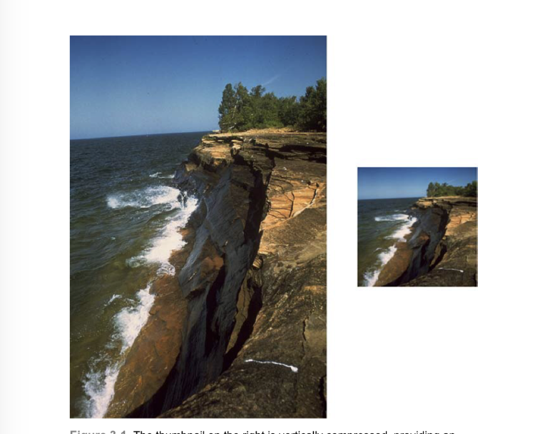
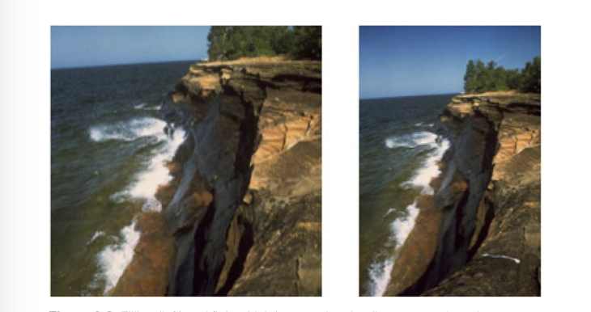
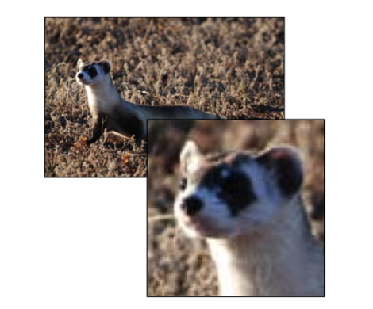
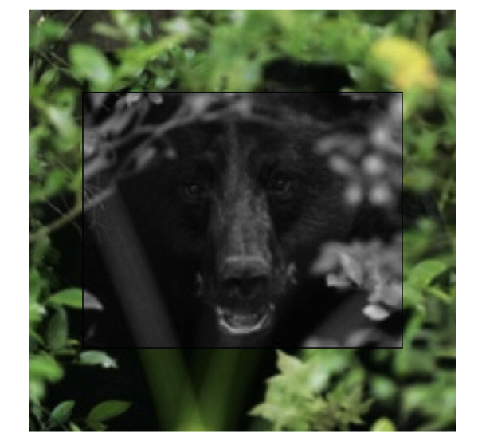
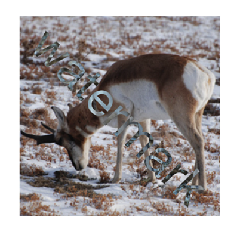

# 绘制图像

本章介绍图像绘制，它将会涉及到在一个图像上下文创建，调整，恢复事物。你将会用到很多关于图像，绘图和iOS相关的知识。你可以在图像上下文中渲染一个图像并改变他们的版本。你也可以生产缩略图或是取到图片的一部分。你也可以创建事物来根据按钮或其他Auto Layout对象来适当地收缩。上下文提供方法转变图像实例为数据对象。允许你应用图片处理技术以便融入结果到你的用户界面中。本章，你会学习到常见的图像绘制任务并且找到他们的解决方案。

### UIKit Images

UIKit图像总是围绕着UIImage类。它是一个强大且灵活的类，并且很好的隐藏了内部实现细节，以便可以使用很少的代码来完成很多展示任务。它最常用的代码是从文件中倒入数据并把数据表示的图象添加到UIImageView实例中，下面有一个例子：
```

UIImage *image = [UIImage imageNamed:@"myImage"];
myImageView.image = image;

```
当然也不限制你去夹在外部数据来导入图像。iOS允许你在需要的时刻用特定的方法用代码创建图像。代码3-1是一个不那么重要的例子，它创建一个新的UIImage实例，设置了颜色和尺寸。函数返回了一个颜色样本。
为了完成这些，代码3-1创建了一个图像上下文。然后设置了一个颜色并且通过UIRectFill（）填充上下文。然后恢复并从上下文返回一个新的图像。
代码3-1展示了基础的绘制骨架。在这个方法的绘制颜色矩形的地方，你可以绘制你自己的“蒙娜丽莎”。通过你自己的自定义绘制程序并设置符合你的app要求的绘制尺寸。
```
UIImage *SwatchWithColor(UIColor *color, CGFloat side)
{
     //Create image context (using the main screen scale)
     UIGraphicsBeginImageContextWithOptions(CGSizeMake(side,side), YES, 0.0);
     
     //Perform drawing
     [color setFill];
     UIRectFill(CGRectMake(0, 0, side, side));
     
     //Retrieve image
     UIImage *image = UIGraphicsGetImageFromCurrentImageContext();
     UIGraphicsEndImageContext();
     return image;
}
```
这里有一些其他的有关图像的事情你需要记住：
* 你通过size属性来查询图像的长宽。size返回点单位而非像素单位。所以返回点值也许会在Retina设备中变为双倍：
```
UIImage *swatch = SwatchWithColor(greenColor, 120);
NSLog(@"%@",NSStringFromCGSize(swatch.size));
```
* 图像可以在PNG数据或是JPEG数据中相互转换，通过使用UIImagePNGRepresentation()和UIImageJPEGRepresentation()方法。这两个方法返回NSData对象，其中包括了压缩后的图像数据。
* 你可以通过CGImage属性来恢复一个图像的Quartz展示。UIImage基本上对Core Graphics和Core Image来说不怎么有用。很多核心图像的方法都需要CGImage。当然这个属性也不能用于核心图像的创建，你还必须转换底层的CIImage到CGImage以便于在核心图像中使用。

> UIImage支持TIFF，JPEG，GIF，PNG，DIB（BMP），ICO，CUR和XBM格式，你也可以通过使用ImageIO框架来导入其他格式（如RAW）。

### 创建缩略图。
通过创建缩略图，你可以把一个大图实例转换为一个小图。缩略图可以嵌入到表视图单元格里，联系人总结（注：我也不太懂是什么，有了解的同学可以偷偷告诉我。。。），和一些其他图片起到重要作用的地方。第二章有介绍仅提取图片一部分的方法。缩略图提供了一个实际的，图片定向为其服务，同时为简单的图像绘制提供一个很好的起点。
你可以通过创建一个想要得到的图像上下文尺寸来创建缩略图，如100x100。使用drawInRect：来绘制源图像到上下文中。以得到一个新的缩略图结束：
```
UIImage *image = [UIImage imageNamed:@"myImage"];
[image drawInRect:destinationRect];
UIImage *thumbnail = UIGraphicsGetImageFromCurrentImageContext();
```
得到合适缩略图的关键是纵横比。不论你要划或是填充，我们都希望能保留图片的内部特征而不扭曲变形。图3-1展示了一个悬崖的图。图片的长度要比宽度高——1933像素宽和2833像素高。缩略图展示在右侧，它并没有过多关注纵横比问题。因为如此，缩略图的纵向被挤压了。
这也不算是一个难看的结果——实际上，如果你们有看到左侧的图，你可能根本不会发现问题——但这毕竟不是一个精确的结果。使用这样的图像会有很大的出现错误图像陈列的风险。也许不会跳出错误，但是很明确地会对对比例敏感的用户产生困扰。



图3-2展示了一个合适的缩略图应该如何。并非直接绘制到目标中，它计算了矩形填充（左侧）和适配（右侧）目标区域。代码3-2解释了不同之处，创建了填充或是适配的矩形来绘制，而不是直接绘制。



```
UIImage *BuildThumbnail(UIImage *sourceImage,CGSize targetSize,BOOL useFitting)
{
    UIGraphicsBeginImageContextWithOptions(targetSize, NO, 0, 0);

    //Establish the output thumbnail rectangle
    CGRect targetRect = SizeMakeRect(targetSize);
    
    //Create the source image`s bounding rectangle
    CGRect naturalRoot = (CGRect){.size = sourceImage.size};
    
    //Calculate fitting or filling destination rectangle
    //See Chapter 2 for a discussion on these functions
    CGRect destinationRect = useFitting ? RectByFittingRect(naturalRect, targetRect) : RectByFillingRect(naturalRect, targetRect);
    
    //Draw the new thumbnail
    [sourceImage drawInRect:destinationRect];
    
    //Retrieve and return the new image
    UIImage *thumbnail = UIGraphicsGetImageFromCurrentImageContext();
    UIGraphicsEndImageContext();
    return thumbnail;
}
```

### 提取子图像
不像缩略图那样，会把图像数据变为一个更小的版本。子图像会取到源图像的一部分并且按照一样的标准。图3-3展示了一个展示图像左上侧雪貂头部特写的子视图。倍放大的子视图突出了取到的那一部分。如你所见，因为放大的原因，图像也变模糊了。



代码3-3展示详细的实现代码。使用简单的Quartz方法CGImageCreateWithImageInRect（）来从源图像中创建新的图像。使用Quartz而不是UIKit是因为这里已经有一个创建好的方法了。
当你使用核心图像方法时，矩形会自动代表你调整像素线使用CGRectIntegral()。然后会被原始图像矩形分割，所以不会出现超出原始图像的部分。这帮你节省了很多的工作量。你所需要做的仅仅是把CGImageRef转换成为UIImage实例。
但是当你在Retina体系中使用或者是在从Quartz坐标中取出数据时缺点也会暴露出来。因为如此，我在代码3-3放入了第二个方法，一个完全由UIKit来完成的方法，避免了坐标的转换。这个方法所用的相关参数都是以点为单位的，而非像素。这在你询问一个图像的边界然后在起中心创建矩形时显得尤为重要。如果你忘记进行点到像素转换到话，在Retina中“中心”会往左上角偏移。但是始终使用UIKit的话，你就可以回避全部的问题，确保你所取的部分是你想要取到的精确的部分。
```
UIImage *ExtractRectFromImage(UIImage *sourceImage, CGRect subRect)
{
    //Extract image 
    CGImageRef imageRef = CGImageCreateWithImageInRect(sourceImage.CGImage, subRect);
    if(imageRef != NULL)
    {
         UIImage *output = [UIImage imageWithCGImage:imageRef];
         CGImageRelease(imageRef);
         return output;
    }
    
    NSLog(@"Error: Unable to extract subimage");
    return nil;
}

//This is a little less flaky
//when moving to and from Retina images
UIImage *ExtractSubimageFromRect(UIImage *sourceImage,CGRect rect)
{
      UIGraphicsBeginImageContextWithOptions(rect.size, NO, 1);
      CGRect destRect = CGRectMake(-rect.origin.x, -rect.origin.y, sourceImage.size.weight, sourceImage.size.height);
      [sourceImage drawInRect:destRect];
      UIImage *newImage = UIGraphicsGetImageFromCurrentImageContext();
      UIGraphicsEndImageContext();
      return newImage;
}
```
### 转换图像为灰度图
图3-4展示了黑熊的图像，图片中心有一个灰度框，所有的其他颜色都被移除了。



为了得到这个图像，我绘制了黑熊图两次。第一次绘制，我绘制了整个图像，而第二次裁剪了图像中间的矩形的部分并把他转换为灰度图。我在原图上方新画了一版，并给灰度图像添加了一个黑色边界。
涉及到的步骤如下：
```
//Clip the context
CGContextSaveGState(context);
CGRect insetRect = RectInsetByPercent(destinationRect, 0.40);
UIRectClip(insetRect);

//Draw the grayscale version
[GrayscaleVersionOfImage(sourceImage) drawInRect:destinationRect];
CGContextRestoreGState(context);

//Outline the border between the two versions
UIRectFrame(insetRect);
```
如何处理灰度图的细节在下面的代码3-4中有写。GrayscaleVersionOfImage()函数使用原图来创建一个新的上下文来完成任务。“设备灰色”每个像素占用一个字节且没有透明度信息。他形成了一个新的绘图区域只可以显示灰度结果。
在真实世界中，当你用紫色蜡笔画画的时候，所有紫色接触的地方都会是紫色。而在灰度图中绘制却像是拍一张黑白照片。不论你用什么颜色绘制，出来的结果都是灰色的，它会根据你的画笔的亮度来调整灰度，而不会设计任何色彩。
在所有上下文中，恢复结果和储存数据都取决于你。CGBitmapContextCreateImage（）可以绘制源图像并且重新取到灰度版本。这个方法和在位图上下文中使用UIGraphicsGetImageFromCurrentImageContext（）类似，仅是多了一点内存的管理。
以一个保存原图亮度值的UIImage结束，而不是颜色。Quartz会代表你处理所有的细节工作。你不需要分开计算每个像素的亮度等级对应的灰度。你只需要输入目标特性即可（尺寸和颜色空间），剩下的都会帮你完成。这真是一个简单的处理图像的方法啊。
```
UIImage *GrayscaleVersionOfImage(UIImage *sourceImage)
{
     //Establish grayscale color space
     CGColorSpaceRef colorSpace = CGColorSpaceeCreateDeviceGray();
     if(colorSpace == NULL)
     {
         NSLog(@"Error creating grayscale color space");
         return nil;
     }
     
     //Extents are integers
     int width = sourceImage.size.width;
     int height = sourceImage.size.height;
     
     //Build context: one byte per pixel, no alpha
     CGContextRef context = CGBitmapContextCreate(NULL,width,height,
                                                 8,//8 bits per byte
                                                 width, colorSpace,
                                                 (CGBitmapInfo)kCGImageAlphaNone);
     CGColorSpaceRelease(colorSpace);
     if(context == NULL)
     {
          NSLog(@"Error building grayscale bitmap context");
          return nil;
     }
     
     //Replicate image using new color space
     CGRect rect = SizeMakeRect(sourceImage.size);
     CGContextDrawImage(context, rect, sourceImage.CGImage);
     CGImageRef imageRef = CGBitmapContextCreateImage(context);
     CGContextRelease(context);
     
     //Return the grayscale image
     UIImage *output = [UIImage imageWithCGImage:imageRef];
     CFRelease(imageRef);
     return output;
}
```

### 带水印的图像
水印是图像绘制中很常见的一种请求。原本的水印是模糊地印在报纸上来标记文章来源的。现在的文本水印实用就不一样了。它印在图片上避免复制和重用，或是用特殊标志或来源来标记素材。
代码3-5展示了如何制作一个图3-5那样的简单水印。水印无外乎就是绘制一个图像，然后再绘制点别的——也许会是字符串，logo或是符号——覆盖在图像，然后恢复到新的版本。



代码3-5的例子绘制了一个覆盖在原图上的斜向字符串水印（“watermark”）。通过45度角旋转上下文来实现，它使用混合模式来强调水印同时也展示原图的细节。因为这段代码是在iOS7上面写的，当你绘制的时候必须独立设置文本的颜色和字体。如果你不设置的话，字符串就会“消失”——然后你就会抓耳挠腮不知所以，就像我在更新这个例子的时候一样。
另一个常用代码是使用扩散的白色覆盖图适度调整透明度，然后就像绘制logo的影子一样绘制出来（而非直接绘制logo）在图片的某一部分上。路径裁剪在这里会有使用。在第五章会进一步的探讨。
每个水印都会不同程度上改变原有的图像。随着图像的改变或模糊，移除水印变得越发困难。
```
UIGraphicsBeginImageContextWithOptions(targetSize, NO, 0.0);
CGContextRef context = UIGraphisGetCurrentContext();

//Draw the original image into the context
CGRect targetRect = SizeMakeRect(targetSize);
UIImage *sourceImage = [UIImage imageNamed:@"pronghorn.jpg"];
CGRect imgRect = RectByFillingRect(SizeMakeRect(sourceImage.size), targetRect);
[sourceImage drawInRect:imgRect];

//Rotate the context
CGPoint center = RectGetCenter(targetRect);
CGContextTranslateCTM(context, center.x, center.y);
CGContextRotateCTM(context, M_PI_4);
CGContextTranslateCTM(context, -center.x, -center.y);

//Create a string
NSString *watermark = @"watermark";
UIFont *font = [UIFont fontWithName:@"HelveticaName" size:48];
CGSize size = [watermark sizeWithAttributes:@{NSFontAttributeName:font}];
CGRect stringRect = RectCenteredInRect(SizeMakeRect(size), targetRect);

//Draw the string, using a blend mode
CGContextSetBlendMode(context, kCGBlendModeDifference);
[watermark drawInRect:stringRect withAttributes:@{NSFontAttributeName:font, NSForegroundColorAttributeName:[UIColor whiteCOlor]}];

//Retrieve the new image
UIImage *image = UIGraphicsGetImageFromCurrentImageContext();
UIGraphicsEndImageContext();
return image;
```
