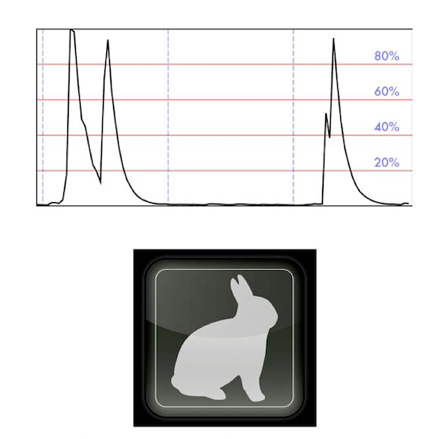
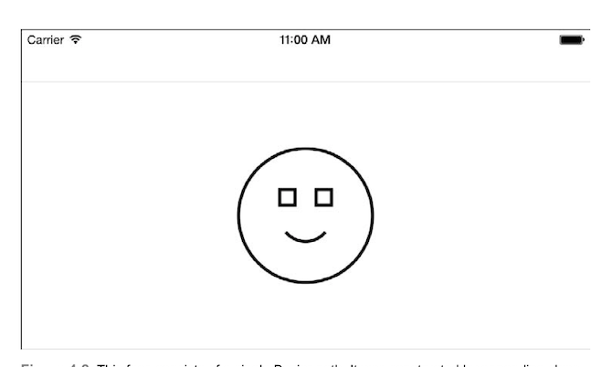

# 路径基础

贝塞尔曲线是iOS最重要的绘制工具之一，可以用来绘制轮廓，裁剪路径，定义动画路径，等等。不论你是创建自定义视图中的某一个元素，或是添加一个PS级别的效果，或者基础的任务比如画线和圆，使用UIBezierPath类都可以轻易且有效的实现。

### 为什么使用贝塞尔

当创建一个按钮或是斜角，阴影或是图案的时候，贝塞尔曲线都能提供有效且灵活的解决方案。如图4-1，所有的截屏都是由各种贝塞尔曲线的元素绘制而组成的。

上方的截屏来自一个简单的音频app，他是蓝白相间的图像还有黑色的音频线条，他们都会通过连续的或断续的线条绘制的。这些线条是非常常用的，在很多绘制的情况下都会用到。
下方的图就比较复杂了，兔子的几何图存在单独的一个贝塞尔曲线中，被圆角矩形包围，覆盖在按钮上的弧度也是贝塞尔曲线为基础的椭圆。贝塞尔曲线同事裁剪边界形状的路径，用来定义限制微妙的颜色变化的范围，从而得到3D的效果。
虽然这两个截图的绘制效果截然不同，类的操作方式却是相同的。如果你想在你的app中使用UIKit绘制，你需要和UIBezierPath类建立起更加亲密且舒适的关系。

### 类的便捷方法

UIBezierPath类的方法创建矩形，椭圆，圆角矩形和弧，提供只用一个参数就可以使用的路径风格元素的方法。

* Rectangles —— bezierPathWithRect：用于绘制界面中的各种矩形元素。你可以使用该方法绘制任何种类的矩形。
* Ovals and circle —— bezierPathWithOvalInRect：提供绘制任何形状的圆和椭圆的工具。
* Rounded rectangles —— bezierPathWithRoundedRect：cornerRadius：可以用于创建iOS设计师非常喜欢的圆角矩形，该路径非常适合按钮和提示框，还有很多其他的视图元素。
* Corner-controlled rounded rectangles ——bezierPathWithRoundedRect:byRoundingCorners:cornerRadii:允许你仅在矩形的某一个或几个角进行圆角操作。这个方法很方便的帮助你创建一些并不想要四个角都是圆角的控件。
* Arcs —— bezierPathWithArcCenter：radius：startAngle：endAngle：clockwise：通过定义起始角度和结尾角度来绘制弧线，通过弧线增加视觉修饰，来创建个新的视觉分割，以达到优化全局GUI的效果。

贝塞尔曲线类方法提供一个基础的绘制起点，如代码4-1的例子演示的那样，这段代码通过结合多个形状创建一个新的贝塞尔曲线。每一步，添加一个路径，最后凑成一个如图4-2所示的“脸”的图像。
如代码4-1所示的，贝塞尔曲线单例内部是易变的。你可以添加形状和元素让他们变成一个新的图像。此外，路径也不必是连续的，如图4-2，他们明显是由不相交的子形状构成的，每一个都可以单独绘制。

> 注意：这里使用的代码只是例子，仅展示绘制时需要的API的简例，而非之前书中的代码，可以直接用在项目中。

尽管你可能会在绘制过于复杂的路径时遇到性能的问题，但其实更多的时候是在处理用户交互的操作时才会发生。
