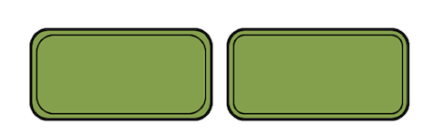
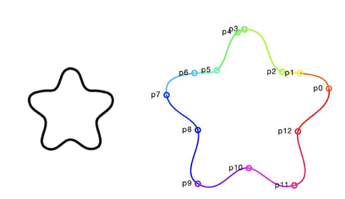
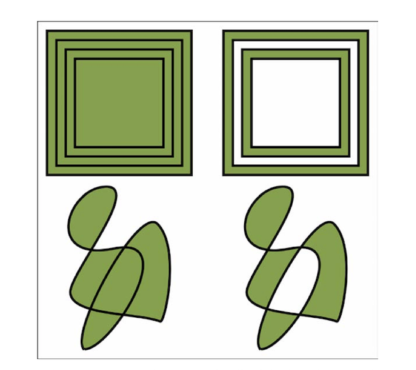
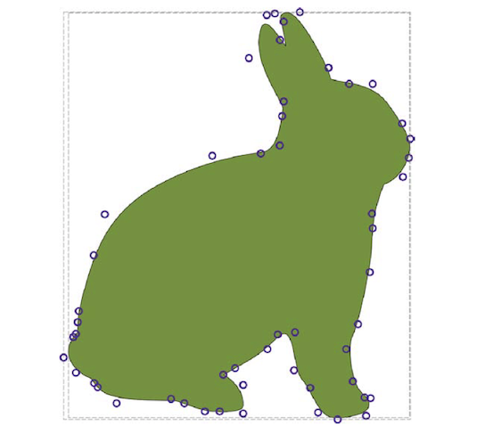
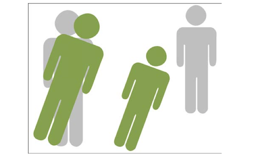
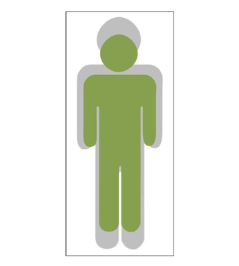

# 路径基础

贝塞尔曲线是iOS最重要的绘制工具之一，可以用来绘制轮廓，裁剪路径，定义动画路径，等等。不论你是创建自定义视图中的某一个元素，或是添加一个PS级别的效果，或者基础的任务比如画线和圆，使用UIBezierPath类都可以轻易且有效的实现。

### 为什么使用贝塞尔

当创建一个按钮或是斜角，阴影或是图案的时候，贝塞尔曲线都能提供有效且灵活的解决方案。如图4-1，所有的截屏都是由各种贝塞尔曲线的元素绘制而组成的。

上方的截屏来自一个简单的音频app，他是蓝白相间的图像还有黑色的音频线条，他们都会通过连续的或断续的线条绘制的。这些线条是非常常用的，在很多绘制的情况下都会用到。
下方的图就比较复杂了，兔子的几何图存在单独的一个贝塞尔曲线中，被圆角矩形包围，覆盖在按钮上的弧度也是贝塞尔曲线为基础的椭圆。贝塞尔曲线同事裁剪边界形状的路径，用来定义限制微妙的颜色变化的范围，从而得到3D的效果。
虽然这两个截图的绘制效果截然不同，类的操作方式却是相同的。如果你想在你的app中使用UIKit绘制，你需要和UIBezierPath类建立起更加亲密且舒适的关系。

### 类的便捷方法

UIBezierPath类的方法创建矩形，椭圆，圆角矩形和弧，提供只用一个参数就可以使用的路径风格元素的方法。

* Rectangles —— bezierPathWithRect：用于绘制界面中的各种矩形元素。你可以使用该方法绘制任何种类的矩形。
* Ovals and circle —— bezierPathWithOvalInRect：提供绘制任何形状的圆和椭圆的工具。
* Rounded rectangles —— bezierPathWithRoundedRect：cornerRadius：可以用于创建iOS设计师非常喜欢的圆角矩形，该路径非常适合按钮和提示框，还有很多其他的视图元素。
* Corner-controlled rounded rectangles ——bezierPathWithRoundedRect:byRoundingCorners:cornerRadii:允许你仅在矩形的某一个或几个角进行圆角操作。这个方法很方便的帮助你创建一些并不想要四个角都是圆角的控件。
* Arcs —— bezierPathWithArcCenter：radius：startAngle：endAngle：clockwise：通过定义起始角度和结尾角度来绘制弧线，通过弧线增加视觉修饰，来创建个新的视觉分割，以达到优化全局GUI的效果。

贝塞尔曲线类方法提供一个基础的绘制起点，如代码4-1的例子演示的那样，这段代码通过结合多个形状创建一个新的贝塞尔曲线。每一步，添加一个路径，最后凑成一个如图4-2所示的“脸”的图像。
如代码4-1所示的，贝塞尔曲线单例内部是易变的。你可以添加形状和元素让他们变成一个新的图像。此外，路径也不必是连续的，如图4-2，他们明显是由不相交的子形状构成的，每一个都可以单独绘制。

> 注意：这里使用的代码只是例子，仅展示绘制时需要的API的简例，而非之前书中的代码，可以直接用在项目中。


尽管你可能会在绘制过于复杂的路径时遇到性能的问题，但其实更多的时候是在处理用户交互的操作时才会发生。我会将绘图应用程序中的绘图表示为路径。比如幼儿园的孩子，没有谁比他们更会长时间的绘制五到十分钟，甚至都不带抬手指的，过长的路径会导致性能的下降。你的普通预构建的路径中加入矢量图，都不应该忽略掉这个问题。
有时候你也想分割开路径，一旦绘制，j路径的秒变颜色和填充颜色都会应用在所有的元素中。当你需要多种绘制的风格时，你需要创建多个独立的路径，每一个都是一个独立的统一操作单元。

```
CGRect fullRect = (CGRect)(.size = size);

//Establish a new path
UIBezierPath *bezierPath = [UIBezierPath bezierPath];

//Create the face outline
//and append it to the path
CGRect inset = CGRectInset(fullRect, 32, 32);
UIBezierPath *faceOutline = [UIBezierPath bezierPathWithOvalInRect:inset];

[bezierPath appendPath:faceOutline];

//Move in again, for the eyes and mouth
CGRect insetAgain = CGRectInset(inset, 64, 64);

//Calculate a radius
CGPoint referencePoint = CGPointMake(CGRectGetMinX(insetAgain),CGRectGetMaxY(insetAgain));
CGPoint center = RectGetCenter(inset);
CGFloat radius = PointDistanceFromPoint(referencePoint, center);

//Add a smile from 40 degrees around to 140 degree
UIBezierPath *smile = [UIBezierPath bezierPathWithArcCenter:center radius:radius startAngle:RadianFromDegrees(140) endAngle:RadiansFromDegrees(40) clockwise:NO];
[bezierPath appendPath:smile];

//Build Eye 1
CGPoint p1 = CGPointMake(CGRectGetMinX(insetAgain),CGRectGetMinY(insetAgain));
CGRect eyeRect1 = RectAroundCenter(p1, CGSizeMake(20,20));
UIBezierPath *eye1 = [UIBezierPath bezierPathWithRect:eyeRect1];
[bezierPath appendPath:eye1];

//Build Eye 2
CGPoint p2 = CGPointMake(CGRectGetMaxX(insetAgain),CGRectGetMinY(insetAgain));
CGRect eyeRect2 = RectAroundCenter(p1, CGSizeMake(20,20));
UIBezierPath *eye2 = [UIBezierPath bezierPathWithRect:eyeRect2];
[bezierPath appendPath:eye2];


//Draw the complete path
bezierPath.lineWidth = 4;
[bezierPath stroke];
```
### 嵌套圆角矩形
图4-3显示了两个嵌套的圆角矩形，构建圆角矩形在iOS绘图任务中非常常见，每个路径都被填充和描边：外部线宽为2点宽，内部为1点宽，图4-3展示了一个很常见的错误。



仔细观察每个图像的四个角。第一张图和第二张图的拐角半径不同。左图内部矩形缩进4点，并使用12曲度点圆角。
```
UIBezierPath *path2 = [UIBezierPath bezierPathWithRoundedRect:CGRectInset(destinationRect, 4, 4) cornerRadius:12];
```
第二个图同样向内缩进4点，但是曲度改为8，使两套路径之间更好的拟合，确保两条曲线在平行的位置从始至终都有不错的视觉效果。


### 创建路径
当系统提供的路径（如矩形和椭圆）不足以满足您的需求时，您可以迭代地构建路径。通过逐点布局，来添加曲线和直线。
每个贝塞尔曲线都可以包括多种几何元素，包括如下：

* 通过moveToPointc：创建定位
* 通过addLineToPoint：创建直线
* 通过addCurveToPoint:controlPoint1:controlPoint2:创建三次贝塞尔曲线线段
* 通过addArcToCenter:radius:startAngle:endAngle:clockwise:创建弧线。

图4-4显示了一个由一系列三次曲线线段组成的星星。代码4-2有详细的创建过程，他创建了一个新的路径，起点为p0，然后通过一系列的三次曲线来构成星形。



这个代码看起来不是特别友好，确实，它就是这样的。构建贝塞尔曲线时非常不友好的过程。事实上，这个特别的形状我是从Photoshop那边创建的。我画了这个形状，然后保存到psd中，然后使用PaintCode（Mac商城中的Photoshop内构项目99美元+20美元）将矢量图转换为一系列的objective-C的请求。
说到绘图，最适合表现形状的工具往往都不在Xcode里。但是，在设计了形状之后，你的代码有很多事情可以做，来管理和优化你的app素材。因此，你不必担心在Photoshop或其他工具中建立的素材会有精确度的问题。你会发现UIBezierPath实例展示了矢量艺术。你可以缩放，平移，旋转等等，更具你的需求来调整素材。

```
//Create new path, courtesy of PaintCode (paintcodeapp.com)
UIBezierPath *bezierPath = [UIBezierPath bezierPath];

//Move to the start of the path, at the right side
[bezierPath moveToPoint:CGPointMake(883.23, 430.54)]//p0

//Add the cubic segments
[bezierPath addCurveToPoint:CGPointMake(749.25, 358.4)  //p1
              controlPoint1:CGPointMake(873.68, 370.91)
              controlPoint2:CGPointMake(809.43,367.95)];
[bezierPath addCurveToPoint:CGPointMake(661.1, 353.25)  //p2
              controlPoint1:CGPointMake(721.92, 354.07)
              controlPoint2:CGPointMake(690.4,362.15)];
[bezierPath addCurveToPoint:CGPointMake(492.9, 156.15)  //p3
              controlPoint1:CGPointMake(575.39, 316.25)
              controlPoint2:CGPointMake(629.21, 115.47)];
[bezierPath addCurveToPoint:CGPointMake(461.98, 169.03)  //p4
              controlPoint1:CGPointMake(482.59, 160.45)
              controlPoint2:CGPointMake(472.29, 164.74)];
[bezierPath addCurveToPoint:CGPointMake(365.36, 345.52)  //p5
              controlPoint1:CGPointMake(409.88, 207.98)
              controlPoint2:CGPointMake(425.22, 305.23)];
[bezierPath addCurveToPoint:CGPointMake(262.31, 358.4)  //p6
              controlPoint1:CGPointMake(341.9, 364.44)
              controlPoint2:CGPointMake(300.41, 352.37)];
[bezierPath addCurveToPoint:CGPointMake(133.48, 460.17)  //p7
              controlPoint1:CGPointMake(200.89, 368.12)
              controlPoint2:CGPointMake(118.62, 376.61)];
[bezierPath addCurveToPoint:CGPointMake(277.77, 622.49)  //p8
              controlPoint1:CGPointMake(148.46, 544.36)
              controlPoint2:CGPointMake(258.55, 544.36)];
[bezierPath addCurveToPoint:CGPointMake(277.77, 871.12)  //p9
              controlPoint1:CGPointMake(201.89, 700.9)
              controlPoint2:CGPointMake(193.24, 819.76)];
[bezierPath addCurveToPoint:CGPointMake(513.51, 798.97)  //p10
              controlPoint1:CGPointMake(382.76, 934.9)
              controlPoint2:CGPointMake(435.24, 786.06)];
[bezierPath addCurveToPoint:CGPointMake(723.49, 878.84)  //p11
              controlPoint1:CGPointMake(582.42, 810.35)
              controlPoint2:CGPointMake(628.93, 907.89)];
[bezierPath addCurveToPoint:CGPointMake(740.24, 628.93)  //p12
              controlPoint1:CGPointMake(834.7, 844.69)
              controlPoint2:CGPointMake(722.44, 699.2)];
[bezierPath addCurveToPoint:CGPointMake(883.23, 430.54)  //p0
              controlPoint1:CGPointMake(756.58, 564.39)
              controlPoint2:CGPointMake(899.19, 530.23)];
```

### 绘制贝塞尔曲线路径
创建贝塞尔路径实例后，通过应用填充或者描边绘制在上下文中。填充绘制，为路径内的所有区域添加颜色。描边绘制，使用路径线宽属性中的线宽来描画路径轮廓，仅绘制边缘。典型的绘图模式如下所示：

```
myPath.lineWidth = 4.0f;
[[UIColor blackColor] setStroke];
[[UIColor redColor] setFill];
[myPath fill];
[myPath stroke];
```

这个代码片段为路径设置线宽，并设置填充和描边的颜色，然后进行填充和描边。
代码清单4-1介绍了我认为更方便的方法。方法定义了一个类类别，添加了两种新的绘制方式，浓缩了绘制的过程，使用如下：
```
[myPath fill:[UIColor redColor]];
[myPath stroke:4 color:[UIColor blackColor]];
```
这些设置都会变成一个参数，这些函数可以帮助你无需更新上下文的属性及可以完成一系列新的绘图操作，所有的状态都会恢复或保存在如第一章所述的图形状态（GState）中。这确保了传递的参数不会丢失，您可以返回到之前完全相同的上下文中。

> 注意：在使用生产代码时（也就是说，并非是去写一本书或是编写易读的例子的时候），请确保命名你的类别，添加自定义前缀以确保不会和其他的Apple或Apple日后可能更新的类重叠。esstroke：color：看起来肯定不如stroke：color：好看，但他起码可以确保长久的安全性。

```
@implementation UIBezierPath (HandyUtilities)
//Draw with width
- (void) stroke: (CGFloat) width color:(UIColor *)color
{
     CGContextRef context = UIGraphicsGetCurrentContext();
     if(context == NULL)
     {
         NSLog(@"Error: No context to draw to");
         return;
     }
     
     CGContextSaveGState(context);
     
     //Set the color 
     if (color) [color setStroke];
     
     //Store the width
     CGFloat holdWidth = self.lineWidth;
     self.lineWidth = width;
     
     //Draw
     [self stroke];
     
     //Restore the width
     self.lineWidth = holdWidth;
     CGContextRestoreGState(context);
}

//Fill with supplied color
- (void) fill:(UIColor *)fillColor
{
      CGContextRef context = UIGraphicsGetCurrentContext();
      if(context == NULL)
      {
           NSLog(@"Error: No context to draw to");
           return;
      }
      CGContextSaveGState(context);
      [fillColor set];
      [self fill];
      CGContextRestoreGState(context);
}
```
### 绘制内部路径
在UIKit中，UIRectFrame()函数作为参数可以在矩形内绘制一条线。该函数提供特别干净好看的结果。代码4-2是我的一些灵感。
代码4-2执行了和图4-3相同的操作，但是有两点轻微的不同。首先，画笔大小加倍的粗了。然后，他通过addClip来剪切图像。
通常情况下，画线描边操作会在路径边缘的中心绘制。他使绘制的边一半在边缘外，一半在边沿内。双倍的尺寸确保了在内部的路径正好是你想要的尺寸。
如第一章所说，裁剪会创建一个遮罩。它不允许把素材添加到边界之外的上下文中。代码4-2中，裁剪防止笔画越过路径边缘，因此所有的绘图都发生在路径内部。

```
- (void)strokeInside:(CGFloat)width color:(UIColor *)color
{
      CGContextRef context = UIGraphicsGetCurrentContext()'
      if(context == NULL)
      {
           NSLog(@"Error: No context to draw to");
           return;
      }
      
      CGContextSaveGState(context);
      [self addClip];
      [self stroke:width * 2 color:color]; // Listing 4-1
      CGContextRestoreGState(context);
}
```
### 填充路径 和 奇/偶填充路径
在矢量图中，缠绕规则确定所在区域是在内部还是在外部。这些规则确定如图4-5所示的区域是否是需要作色填充的区域。Quartz使用一种奇/偶规则，这是一种算法，来确定某一区域是否是路径的“内部”。



在许多绘图场景您都会使用此规则。例如，奇偶规则允许你绘制的复杂边界。它提供一种从文本布局中剪切区域的方法，以便于插入图像。同时为选择区域反转提供了基础，允许你创建正负空间等等。
该算法通过投射光线（一端固定的直线，指向给定的方向）从路径内的点到路径外远处的点，算法计算光线穿过任何一条线的次数。如果光线穿过次数为偶数，该点在形状之外。如果为基数，则在其内部。
图4-5左侧嵌套的正方形示例中，中心点通过四条交线后离开路径，在最后一个交点之前，第三个和第四个框内部的正方形之间，只有3个交线。因此，更具奇/偶填充规则，第一个位于形状外部，因为它穿过偶数行，第二个点位于内部，因为它穿过奇数个点。
这样产生的结果即为图4-5所示。当你使用usesEvenOddFillRule属性之后，UIKit会用此来计算哪些是内部，应该填充，而哪些是外部，不能填充。
在Quartz中有一个特殊的上下文填充方法CGContextEOFillPath(),会使用奇偶填充法来填充路径。如果用普通的版本，CGContextFillPath(), 则不会使用奇偶填充规则。

### 检索路径边界和中心
UIBezierPath类有一个bounds（边界）属性。它返回一个完全把矩形包裹住的矩形，包括控制点。如果把该属性当作路径的frame，起始点几乎从来不会为零。相反，它展示了最左上的点，或是用于构建路径的控制点。
bounds是很有用的，因为它提供了快速的计算和足够好的近似绘制。图4-6展示了一个固有的缺点。当您使用精确的布局时，bounds不会把图像曲线的真实长度考虑在计算中。因此，bounds几乎总是超过实际边界范围的。


虚线表示的路径外界矩形为bounds，内部矩形为真实边界。

尽管尺寸相近，但是它们并不相同。当你需要绘制完美的图像时，这些不同可能会非常重要。
代码4-3使用Quartz的CGPathGetPathBoundingBox（）方法来获得更好的bounds。这种方法需要更多的计算，因为函数必须在控制点之间进行插值，以沿着曲线建立点。得到的结果会远好于之前的方法。通过时间开销和处理器需求来换取准确性。
PathBoundingBox（）方法返回图4-6中更加接近的边界。相关函数PathBoundingBoxWithLinewidth（），通过吧lineWidth属性加入计算来获得bounds。描边绘制是在边界上绘制的，因此路径通常会延展一半的线宽在所有方向。
代码4-3还包括了一个计算路径中心点的方法，同时包括一般的（PathCenter（））和精确的（PathBoundingCenter（））结果。后者提供了更好的解决方案，因为精确度很重要。（轻微的误差都会导致仿射变换的错误）

> 注意： 在我自己的开发中，我会将代码4-3的例子实现为UIBezierPath的类别。

```
//Return calculated bounds
CGRect PathBoundingBox(UIBezierPath *path)
{
     return CGPathGetPathBoundingBox(path.CGPath);
}

//Return calculated bounds taking line width into account
CGRect PathBoundingBoxWithLineWidth(UIBezierPath *path)
{
     CGRect bounds = PathBoundingBox(path);
     return CGRectInset(bounds, -path.lineWidth/2.f, -path.lineWidth/2.f);
}

//Return the calculated center point
CGPoint PathBoundingCenter(UIBezierPath *path)
{
     return RectGetCenter(PathBoundingBox(path));
}

//Return the center point for the bounds property
CGPoint PathCenter(UIBezierPath *path)
{
     return RectGetCenter(path.bounds);
}

```

### 变换路径
贝塞尔曲线的applyTransform：方法转换路径上的所有点和控制点，通过把仿射变换矩阵作为参数传递给这个方法。这些更改会在适当的位置发生并且会更新路径。比如，使用如下比例变换后，整个myPath都会缩小：
```
[myPath applyTransfrom:CGAffineTransformMakeScale(0.5f, 0.5f)];
```
如果希望保留原始路径，清先创建一个副本，并将变换应用于该副本。这使你可以执行多个更改，而保持原始的路径不变：
```
UIBezierPath *pathCopy = [myPath copy];
[pathCopy applyTransfrom:CGAffineTransformMakeScale(0.5f, 0.5f)];
```
使用identity转换是无法还原路径的，他会产生一个“无操作”的结果（路径保持不变）而不是反转（路径返回原来的位置）。

#####起始点问题
使用变换不是总会产生你所期望的结果，如图4-7所示，比如说，我创建了一个路径，并让其旋转：

```
[path applyTransform:CGAffineTransfromMakeRotation(M_PI/9)];
```
图4-7中的左图展示了你也许想要得到的结果：图像绕着自己的中心点旋转了20度。右图才是在你没有设置一个变换的起始点时，真实会发生的效果。路径会环绕坐标系的远点来旋转。



幸运的是，确保选择和放缩以希望的方式发生相对比较容易。代码4-4详细介绍了ApplyCenteredPathTransform()，这个方法通过设置平移来结束仿射变换，然后重置坐标系。这些额外的步骤会创建一个你想要的可控结果。

```
//Translate path`s orign to its center before applying the transform
void ApplyCenteredPathTransform(UIBezierPath *path,CGAffineTransform transform)
{
      CGPoint center = PathBoundingCenter(path);
      CGAffineTransform t = CGAffineTransformIdentity;
      t = CGAffineTransformTranslate(t, center.x, center.y);
      t = CGAffineTransformConcat(transfrom, t);
      t = CGAffineTransformTranslate(t, -center.x, -center.y);
      [path applyTransform:t];
}

//Rotate path around its center
void RotatePath(UIBezierPath *path, CGFloat theta)
{
    CGAffineTransform t = CGAffineTransformMakeRotation(theta);
    ApplyCenteredPathTransform(path, t);
}
```

##### 其他变换
和选择一样，如果你想在适当的位置缩放一个物体，确保应用于边界的中心发生变化。图4-8显示了缩放路径的变换：在每个维度减少百分之85。创建这种变换的函数如代码4-5所示，同时还附有一些其他的便捷转换。


