# 路径深入

使用路径的内部构件可以提高您使用UIBezierPath的方式。特别地，它能够利用每一个实例底层的CGPath中的CGPathElement元数据结构来为许多常见的iOS绘图工作提供解决方案。想要沿着路径曲线放置对象吗？想把路径分为若干的子路径进行上色吗？以CGPathElement为基础的解决方案，能够做到这些。

本章以许多的教学实施细节入手，以利用这些实现的解决方案结束，为您的iOSs项目提供令人瞩目的绘图效果。

### Path Element
UIBezierPath类支持三种贝塞尔元素：线段，二次曲线，三次曲线。如图5-1所示，每个元素代表五个描述路径布局操作中的一个：

* kCGPathElementMoveToPoint —— 此元素重新设置路径的位置，但不添加曲线或线段。
* kCGPathElementAddLineToPoint —— 此元素位置上的某一点添加线段。在图5-1中图上面的一个图，你可以看到一条线段。
* kCGPathElementAddQuadCurveToPoint —— 此元素添加了一条二次曲线指向元素位置上的一个点。如图5-1中中间的那个图，创建四元曲线构建单个控制点。
* kCGPathElementAddCurveToPoint —— 此元素添加了一条三次曲线指向元素位置上的一个点。如图5-1的下图所示三次曲线和两个控制点。
* kCGPathElementCloseSubpath —— 这个元素关闭了子路径，从当前点到最近子路径的起点，画一条线，这个起始点设置使用MoveToPoint元素来设置。

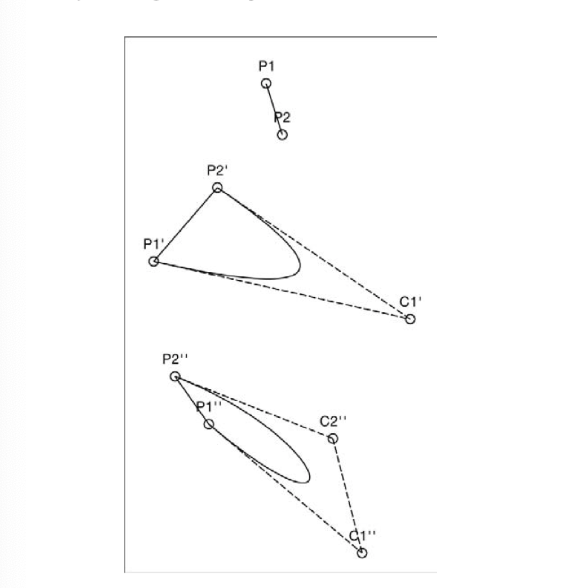

每个CGPathElmentc储存一个元素类型（刚刚提到的物种之一）以及一个CGPoint数据：

```
struct CGPahElement {
     CGPathElementType type;
     CGPoint *points;
};
```
元素的数组点数可以是0，1，2，3。数量取决于元素在路径中的角色。关闭的元素路径不定任何点。MoveToPoint和LineToPoint元素使用一个点，它制定了目的地。这个目的地告诉了元素，移动到哪里或是添加线到哪里。二次曲线和三次曲线除了要有目的地点外，还需要控制点。二次曲线储存了一个目的地点和一个控制点，三次曲线储存了一个目的地点和两个控制点。此外，点在数字中的顺序也是根据点的类型来排列的。
如代码5-1所示，在Objective-C类中包装这些路径元素，简化了路径的使用。这个类隐藏了点数组的复杂性以及实现细节，比目数组的哪一项是对应目标点的，哪一项是对应控制点的。每个以元素为基础的对象都表达了一组一致的属性，为许多有用的UIBezierPath使用程序提供了垫脚石。

```
#define NULLPOINT CGRectNull.origin

@interface BezierElment : NSObject <NSCopying>
@property (nonatomic, assign) CGPathElementType elementType;
@property (nonatomic, assign) CGPoint point;
@property (nonatomic, assign) CGPoint controlPoint1;
@property (nonatomic, assign) CGPoint controlPoint2;
@end

@implementation BezierElement
- (instancetype) init
{
    self = [super init];
    if(self)
    {
         _elementType = kCGPathElementMoveToPoint;
         _point = NULLPOINT;
         _controlPoint1 = NULLPOINTl;
         _controlPoint2 = NULLPOINT2;
    }
    return self;
}

//Create a BezierElement object that represents
//the data stored in the passed element
+ (instancetype) elementWithPathElement:(CGPointElement)element
{
       BezierElement *newElement = [[self alloc] init];
       newElement.elementTyep = element.type;
       
       switch(newElement.elemenType)
       {
           case kCGPathElementCloseSubpath:
                break;
           case kCGPathElementMoveToPoint:
           case kCGPathElementAddLineToPoint:
           {
               newElement.point = element.points[0];
               break;
           }
           case kCGPathElementAddQuadCurveToPoint:
           {
               newElement.point = element.point[2];
               newElement.controlPoint1 = element.points[0];
               newElement.controlPoint2 = element.points[1];
               break;
           }
           default:
               break;
       }
       
       return newElement;
}
```

### 将贝塞尔曲线转换为元素数组
Quartz的CGPathApply（）方法遍历构成路径的所有元素。如5-2所示，它帮助您把UIBezierPath转换为由组建构成的数组。此代码沿着路径收集转换元素。得到Objective-C的BezierPath对象组成的NSArray，每个对象代表了一个原始的路径元素。

```
//Convert one element to BezierElement and save to array
void GetBezierPathElements(void *info, const CGPathElement *element)
{
      NSMutbleArray *bezierElements = (__bridge NSMutableArray*)info;
      if(element)
          [bezierElements addObject:[BezierElement elementWithPathElement:*element]];
} 

- (NSArray *)elements
{
      NSMutableArray *elements = [NSMutableArray array];
      CGPathApply(self.CGPath, (__bridge void *)elements, GetBezierElements);
      return elements;
}
```

从贝塞尔曲线中提取元素能够帮助更好地对你的组建完成几何操作。然后，你可以用更新后的组建从新构建你的贝塞尔路径。代码5-3显示了这种重新组装。它的BezierPathWithElements（）构造函数创建了一个新路径。然后依次对每一个元素使用addToPath：方法。从代码中所见，这个方法用每一个点的值和路径来构建一个新的路径。

```
//Construct a Bezier path from an element array
UIBezierPath *BezierPathWithElements(NSArray *elements)
{
     UIBezierPath *path = [UIBezierPath bezierPath];
     for(BezierElement *element in elements)
     {
         [element addToPath:path];
     }
     return path;
}

//This is a BezierElement method. The element
//adds itself to the path passed as the argument
- (void)addToPath:(UIBezierPath *)path
{
     switch (self.elementType)
     {
         case kCGPathElementCloseSubPath:
             [path closePath];
             break;
         case kCGPathElementMoveToPath:
             [path moveToPoint:self.point];
             break;
         case kCGPathElementAddLineToPoint:
             [path addLineToPoint:self.point];
             break;
         case kCGPathElmentAddQuadCurveToPoint:
             [path addQuadCurveToPoint:self.point
                   controlPoint:self.controlPoint1];
             break;
         case kCGPathElementAddCurveToPoint:[path addCurveToPoint:point
                                                    controlPoint1:self.controlPoint1
                                                    controlPoint2:self.controlPoint2];
             break;
        default:
             break;
     } 
}

```

### 合法和非法路径
一个合法的路径总是从移动操作开始，然后才是一系列的直线和曲线，然后以一个可以选的闭合操作结束。你可以根据需要进行重复。下图为对合法路径的总结：
```
path: - %|{move · （add）* {add · close | %}} *
```
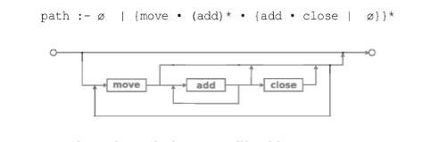

路径可以完全是空的，就像初始化的时候这样：
```
UIBezierPath *path = [UIBezierPath bezierPath];
```
或者一个路径包含一个移动操作和零个或若干个添加的元素。下面的代码片段通过移动点p1，然后添加一个从p1到p2的二次曲线（以c1为控制点），然后用一个从p2到p1的直线来关闭这个路径：
```
[path moveToPath:p1];
[path addQuadCurveToPoint:p2 cotrolPoint:c1];
[path closePath];
```
图5-1（中）显示了这条路径以及它的移动弯曲和关闭。如果使用一个闭合元素，它始终会跟着一个添加线或曲线的元素。这里它告诉路径添加一个从当前点p2到p1点的线。

##### 路径状态

路径操作依赖于路径储存（或者更加准确地说，可导出）两个关键的状态。这两个关键状态是路径第一个点所摆放的位置和路径所摆放的当前点。
例如，将直线添加到点时，完整的线段是 【路径的当前点，新请求的点】 。关闭路径时，您创建的线段为【路径的当前点，路径的第一点】。这些值推进了路径的创建。每次操作中，新请求的点变成了路径的当前点：

```
[path moveToPoint:p1]; //First and current points are p1
[path addQuadCurveToPoint:p2 controlPoint:c1]; // Current point is p2
[path closePath]; //No current point
```

这些状态很重要，因为每个添加请求都需要至少一个额外的状态，这不是方法调用所指定的。你不需要写addLineFrom：to：一样可以将直线或曲线添加到某个点或者某个闭合路径。路径了解当前点和起始点的位置。如果不能确定这两个状态，任何新的涉及到这两个状态的操作都是非法的。
仅仅是xcode不加抱怨地编译了你的代码，并不意外这你的代码是合法的。示例5-1显示了非法路径的构建，它开始于一个闭合的路径，然后添加二次曲线。
```
UIBezierPath *path = [UIBezierPath bezierPath];
[p close];
[p addQuadCurveToPoint:p1 controlPoint:p2];
[p stroke];
```
执行此代码会参赛控制台错误，如下所示：
```
<Error>: void CGPathCloseSubpath(CGMutablePathRef): nocurrent point.
<Error>: void CGPathAddQuadCurveToPoint(CGMutablePathRef, const CGAffineTransform *, CGFloat, CGFloat, CGFloat, CGFloat):no current point.
```
如果你将它粘贴到到一个项目中，你会发现没有引发任何异常应用程序仍然正常运行。然而，无法绘制路径。目前这种情况依然存在，即使在最后一行到stroke命令已被执行，也没有改变。尽管这个例子展示了绘图底层的健壮性，然而并非每一个操作都是如此幸运。一些绘图错误会引发干扰程序执行的异常，苹果buggyf路径反转方法bezierPathByReversingPath方法就是一个让我的程序崩溃的例子。

##### 复合路径
UIBezierPath允许添加多个路径来构成复合路径。如图5-2所示，路径不必是连续的，它可以由多个不相交的部分构成。图5-2的路径包括了6个字路径，由四个外部部分组成。四个字母的外部部分和两个洞（p和a的内部）。

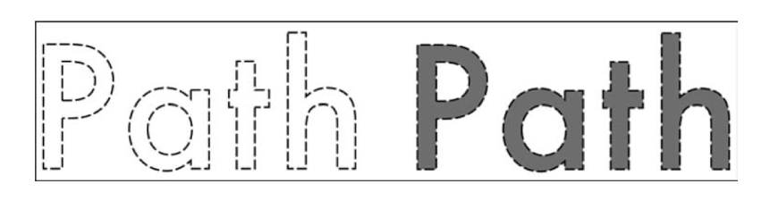

考虑在代码中构建多个子路径的例子。通过一系列的move，add和close语句，代码5-2创建了一个新的路径。这个例子使用了两种不同的move-add-close序列，建立具有两个关闭子路径的关闭路径。

```
UIBezierPath *path = [UIBezierPath bezierPath];

//Begin subpath1
[path moveToPoint:p1];
[path addLineToPoint:p2];
[path addCurveToPoint:p3 controlPoint1:p4 controlPoint2:p5];
[path closePath];

//Begin subpath2
[path moveToPoint:p6];
[path addCurveToPoint:p7 controlPoint:p8];
[path addCurveToPoint:p9 controlPoint:p0];
[path closePath];
```
你可以使用appendPath：来为原路径增加路径。当你需要把以及创建的路径作为组建添加到路径上时，这个选项十分有用。如代码5-3所示：

```
UIBezierPath *path = [UIBezierPath bezierPath];
[path appendPath:[UIBezierPath bezierPathWithRec:rect1]];
[path appendPath:[UIBezierPath bezierPathWithOvalInRect:rect2]];
```
复合路径可以帮助你创建带有孔的或者是相互独立的元素。在图5-2中，你看到了一条有六个不同子路径的路径：每个字母的外壳和p与a的孔。在第四章介绍的奇偶规则可以确保这两个孔的内部保持空白，如图5-2（下）所示。

### 路径背后的数学

正如你所见。UIBezierPath类支持三种贝塞尔曲线：线性，二次，三次。每一个都是UIKit和Quartz绘图中的重要一部分。检索元件直线和曲线能够计算长度并沿着路径进行插值。运用这些知识，您可以在计算好的点中应用绘图方法，就像图5-3这样：

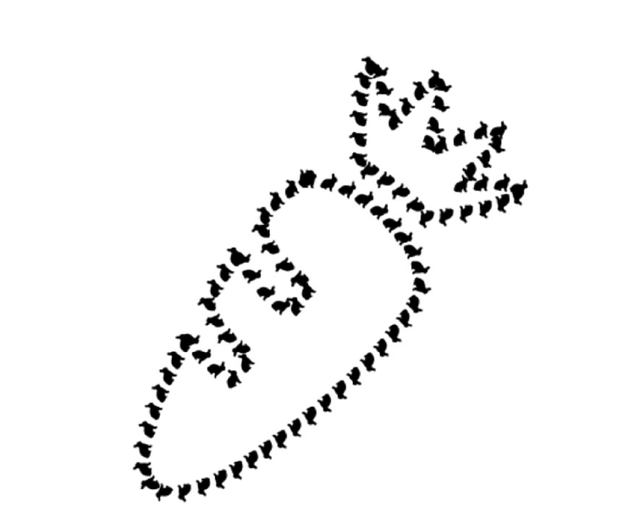

但不幸的是，CGPathElement结构体没有提供那么多的方法。他只提供一种元素类型，可能是如下几种之一：移动到点，添加直线到点，添加曲线到点，关闭路径。那么，如何计算点与点之间到中间点呢？
对于线性的例子来说，很容易。计算从一点到下一点到向量，然后放缩百分比。代码5-4展示了一个插值函数。

```
// Interpolate between p1 and p2
CGPoint InterpolateLineSegment(CGPoint p1,CGPoint p2, CGFloat percent, CGPoint *slope)
{
     CGFloat dx = p2.x - p1.x;
     CGFloat dy = p2.y - p1.y;
     if(slope)
        *slope = CGPointMake(dx, dy);
     
     CGFloat px = p1.x + dx * percent;
     CGFloat py = p1.y + dy * percent;
     
     return CGPointMake(px, py);
}
```
但是如果是一条曲线该如何进行插值呢？幸运的是，你可以使用和UIBezierPath类使用的同样的曲线数学函数来进行处理。代码5-5提供了三次（两个控制点）的函数和二次（一个控制点）插值来计算。你需要提供一个进度百分比（0到1），开始值，结束值，以及一到两个控制点。函数返回插值点。

```
//Calculate Cubic curve
CGFloat CubicBezier(CGFloat t,CGFloat start, CGFloat c1,CGFloat c2, CGFloat end)
{
    CGFloat t_ = (1.0 - t);
    CGFloat tt_ = t_ * t_;
    CGFloat ttt_ = t_ * t_ * t_;
    CGFloat tt = t * t;
    CGFloat ttt = t * t * t;
    
    return start * ttt_ + 3.0*c1*tt_*t + 3.0*c3*t_*tt + end*ttt;
}

//Calculate quad curve
CGFloat QuadBezier(CGFloat t, CGFloat start,CGFloat c1, CGFloat end)
{
    CGFloat t_ = (1.0 - t);
    CGFloat tt_ = t_ * t_;
    CGFloat tt = t * t;
    
    return start *tt_ + 2.0 *c1 *t_ *t +end *tt;
}

//Interpolate points on a cubic curve
CGPoint CubicBezierPoint(CGFloat t, CGPoint start, CGPoint c1,CGPoint c2,CGPoint end)
{
    CGPoint result;
    result.x = CubicBezier(t, start.x, c1.x, c2.x, end.x);
    result.y = CubicBezier(t, start.y, c1.y, c2.y, end.y);
    return result;
}

//Interpolate points on a quad curve
CGPoint QuadBezierPoint(CGFloat t, CGPoint start, CGPoint c1,CGPoint end)
{
    CGPoint result;
    result.x = QuadBezier(t, start.x, c1.x, end.x);
    result.y = QuadBezier(t, start.y, c1.y, end.y);
    return result;
}
```

### 计算路径距离
在你能够使用诸如“沿着一条路径移动百分之30”之前，你必须能够评估一条路径的长度。
代码5-6中的函数和方法就是为您提供的。他们返回一个以点为单位的值，表示路径在当前比例线的范围。pathLength方法通过使用ElementDistanceFromPoint()方法应用于每个元素来计算贝塞尔路径的长度。此函数使用路径状态（特别是当前点和第一点）返回每个连续路径元素的距离。
这依赖于计算直线距离或二次曲线或三次曲线的距离这三个函数。曲线会被采样n次，你可以指定采样的次数，在这个代码中，采样了6次。这对于大多数曲线来说是一个不错的近似。有一些解决方案将采样了改为3次，以提高整体效率。但是，作为交换的是，距离测量上的不准确。
图5-4展示了一个真实的例子，可以看出三点采样和六点采样之间的差异。每条曲线的结果等于采样点之间的线性距离之和。在这种情况下，三点采样比六点采样大概短百分之6，随着曲率的增加，取样的差异也随之增加。对于高度弯曲的立方体截面，取样差异高达百分之10到15.

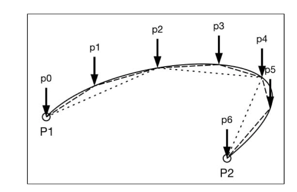

当然需要权衡利弊，取样数量增加，计算时间会增加，测量精度也增加了。很多实例中，你只是在旋转CPU的轮子（比喻），没有在数学上有实质性的改进。

```
//Distance from p1 to p2
CGFloat PointDistanceFromPoint(CGPoint p1, CGPoint p2)
{
     CGFloat dx = p2.x - p1.x;
     CGFloat dy = p2.y - p1.y;
     return sqrt(dx*dx + dy*dy);
}

//How many points to interpolate
#define NUMBER_OF_BEZIER_SAMPLES 6

//Cubic length
float CubicBezierLength(CGPoint start, CGPoint c1, CGPoint c2,CGPoint end)
{
      int steps = NUMBER_OF_BEZIER_SAMPLES;
      CGPoint current;
      CGPoint previous;
      float length = 0.0;
      
      for(int i =0 ; i<= steps; i++)
      {
         float t = (float) i / (float) steps;
         current = CubicBezierPoint(t, start, c1, c2, end);
         if(i > 0)
              length += PointDistanceFromPoint(current, previous);
              previous = current;
      }
      return length;
}

//Quad length
float QuadBezierLength(CGPoint start, CGPoint c1, CGPoint end)
{
      int steps = NUMBER_OF_BEZIER_SAMPLES;
      CGPoint current;
      CGPoint previous;
      float length = 0.0;
      
      for(int i =0; i <= steps; i++)
      {
          float t = (float) i / (float) steps;
          current = QuadBezierPoint(t, start, c1, end);
          if( i>0 )
              length += PointDistanceFromPoint(current, previous);
              previous = current;
      }
      return length;
}

//Calculate element-to-element distance
CGFloat ElementDistanceFromPoint(BezierElement *element, CGPoint point, CGPoint startPoint)
{
     CGFloat distance = 0.0f;
     switch(element.elementType)
     {
        case kCGPathElementMoveToPoint:
          return 0.0f;
        case kCGPathElementCloseSubpath:
          return PointDistanceFromPoint(point, startPoint);
        case kCGPathElementAddLineToPoint:
          return PointDistanceFromPoint(point, element.point);
        case kCGPathElementAddCurveToPoint:
          return CubicBezierLength(point, element.controlPoint1, element.controlPoint2, element.point);
        case kCGPathElementAddQuadCurveToPoint:
          return QuadBezierLength(point, element,controlPoint1, element.point);
      }
      return distance;
}

//Bezier pathLength property
-(CGFloat)pathLength
{
     NSArray *element = self.elements;
     CGPoint current = NULLPOINT;
     CGPoint firstPoint = NULLPOINT;
     float totalPointLength = 0.0f;
     
     for(BezierPathElement *element in elements)
     {
         totalPointLength += ElementDistanceFromPoint(element,current,firstPoint);
         if(element.elementType == kCGPathElementMoveToPoint)
         {
             firstPoint = element.point;
         }
         else if(element.elementType == kCGPathElementCloseSubpath)
         {
             firstPoint = NULLPOINT;
         }
         
         if(element.elementType != kCGPathElementCloseSubpath)
             current = element.point;
      }
      return totalPointLength;
}
```

### 插值路径
代码5-7实现了插值路径，用于找到沿着路径上某个百分比的点的位置。因为两件事，代码的量会比较大。首先，必须考虑所有情况 —— 线性，三次曲线和二次曲线。这包括了很多switch语句来计算每一种可能。然后，这个方法返回一个可选的斜率——CGPoint地址作为最后一个参数。计算斜率需要的代码大概和计算曲线上的点所需的代码量相当。你需要这个斜率值，因为他表示了问题点处的曲线的切线。这使得你可以做一些事情，比如让你的所有形状都定向在曲线内部，如图5-3所示。
请注意，反转路径会反转斜率。每一个曾代表曲线外侧的点会变为向内，反之亦然。这是因为正切函数在y轴上是对称的。从p2移动到p1而不从p1移动到p2会产生一个正切值，并且产生一个角度，这是原始角度的负值。
使用这种百分比的方法，在计算方面是十分昂贵的，可能的话，你需要预先计算这些插值值，并使用缓存的百分比对点的数组来运用于动画和布局。

```
//Calculate a point that`s a given percentage along a path
- (CGPoint) pointAtPercent: (CGFloat) percent
                 withSlope: (CGPoint *)slope
{
     //Retrieve path elements
     NSArray *elements = self.elements;
     
     if(percent == 0.0f)
     {
         BezierElement *first = [elements objectAtIndex:0];
         return first.point;
     }
     
     //Retrieve the full path distance
     float pathLength = self.pathLength;// see Listing 5-6
     float totalDistance = 0.0f;
     
     //Establish the current and firstPoint states
     CGPoint current = NULLPOINT;
     CGPoint firstPoint = NULLPOINT;
     
     //Iterate through elements until the percentage
     //no longer overshoots
     for(BezierElement *element in elements)
     {
        float distance = ElementDistanceFromPoint(element, current, firstPoint);
        CGFloat proposedTotalDistance = totalDistance +distance;
        CGFloat proposedPercent = proposedTotalDistance / pathLength;
        
        if(proposedPercent < percent)
        {
            //Consume and continue
            totalDistance = proposedTotalDistance;
            
            if(element.elementType == kCGPathElementMoveToPoint)
                 firstPoint = element.point;
                 current = element.point;
            continue;
        }
        
        //What percent between p1 and p2?
        CGFloat currentPercent = totalDistance / pathLength;
        CGFloat dPercent = percent - currentPercent;
        CGFloat percentDistance = dPercent * pathLength;
        CGFloat targetPercent = percentDistance / distance;
        
        //Return result
        CGPoint point = InterpolatePointFromElement(element, current, firstPoint);
        return point;
      }
      
      return NULLPOINT;
}

//Interpolate individual distances along element 
CGPoint InterpolatePointFromElement(BezierElement *element,CGPoint point,CGPoint startPoint, CGFloat percent, CGPoint *slope)
{
     switch (element.elementType)
     {
        case kCGPathElementMoveToPoint:
        {
            //No distance
            if(slope)
              *slope = CGPointMake(INFINITY, INFINITY);
            return point;
        }
        case kCGPathElementCloseSubpath:
        {
            //from self.point to firstPoint
            CGPoint p = InterpolateLineSegment(point, startPoint, percent, slope);
            return p;
        }
        case kCGPathElementAddLineToPoint:
        {
            //From point to self.point
            CGPoint p = InterpolateLineSegment(point, element.point, percent, slope);
            return p;
        }
        case kCGPathElementAddQuadCurveToPoint:
        {
            //From point to self.point
            CGPoint p = QuadBezierPoint(percent, point, element.controlPoint1, element.point);
            
            //Calculate slope by moving back slightly
            CGFloat dx = p.x - QuadBezier(percent * 0.9, point.x, element.controlPoint1.x, element.point.x);
            CGFloat dy = p.y - QuadBezier(percent * 0.9, point.y, element.controlPoint1.y, element.point.y);
            if(slope)
              *slope = CGPointMake(dx, dy);
            return p;
         }
         case kCGPathElementAddCurveToPoint:
         {
             //From point to self.point
             CGPoint p = CubicBezierPoint(percent, point, element.controlPoint1, element.controlPoint2, element.point);
             
             //Calculate slope by moving back slightly
             CGFloat dx = p.x - CubicBezier(percent *0.9, point.x, element.controlPoint1.x, element.controlPoint2.x, element.point.x);
             CGFloat dy = p.y - CubicBezier(percent *0.9, point.y, element.controlPoint1.y, element.controlPoint2.y, element.point.y);
             if(slope)
                 *slope = CGPointMake(dx, dy);
            return p;
          }
       }
       
       //Element could not be interpolated
       return NULLPOINT;
}
```

### 检索路径
贝塞尔曲线可能包含一个或多个字路径，由许多组建组成，如弧或者线，或者封闭的组件。如图5-5中所示的椭圆。这里的每一个椭圆被创建为单独的子路径，并且附加到同一个父路径上。

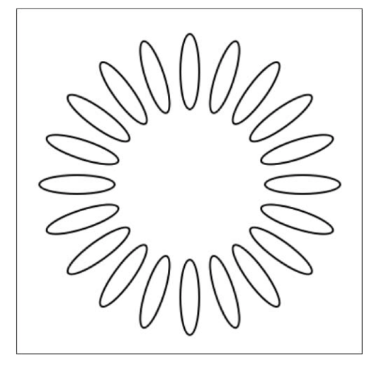

许多有用的绘图操作都是基于分解复合路径的。比如，您肯能想要用不同的颜色给每个子路径上色，如图5-6所示，迭代操作子路径能够根据父路径上的顺序应用自定义绘图操作。

> 注意：使用色调分量迭代色轮。图5-6通过colorWithHue：saturation：brightness：alpha：来创建这个色轮。其色调参数从0（红色）到1（再次为红色，但经过所有其他可能的色调）。每个子路径代表百分之5的变化。

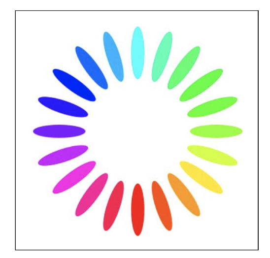

代码5-8的子路径方法，分解了一条路径，他穿过路径的各个元素。每当遇到一个移动操作是开启一个新的子路径，每个子路径变成一个新的UIBeizerPath实例，该方法将结果储存到数组中并返回。

```
//Return array of component subpaths
- (NSMutableArray *)subpaths
{
     NSMutableArray *results = [NSMutableArray array];
     UIBezierPath *current = nil;
     NSArray *elements = self.elements;
     
     for (BezierElement *element in elements)
     {
         //Close the subpath add add to the results
         if(element.elementType == kCGPathElementCloseSubpath)
         {
             [current closePath];
             [results addObject:current];
             current = nil;
             continues;
         }
         
         //Begin new paths on move-to-point
         if(element.elementType == kCGPathElementMoveToPoint)
         {
              if(current)
                  [results addObject:current];
               current = [UIBezierPath bezierPath];
               [current moveToPoint:element.point];
               continue;
         }
         if(current)
               [element addToPath:current];
         else
         {
               NSLog(@"Cannot add to nil path: %@",element.stringValue);
               continue;
         }
       }
       
       if(current)
          [results addObject:current];
          
       return results;
}
```

###  反向路径
图5-7显示了三种Bezier路径。都是由一系列的旋转着的椭圆放入一个圆中组合而成。左图简单地填充。中图反转了该路径。填充了所有图像外的部分。右图展示了第三种状态，他反转了路径，但将路径限制在自然边界中。

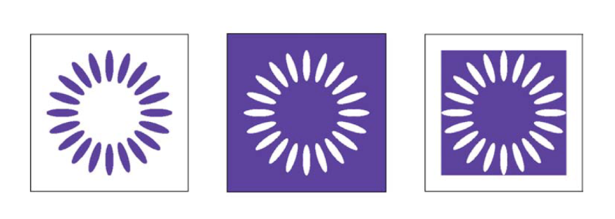

每个方向操作都是利用第四章所提到的奇偶填充规则所制定的。基本上路径中的任何点都必须经过基数个点后才走向无限的边缘。在原始路径外再添加一个矩形反转，每个点偶数值和奇数值来得到反向选择。中间的图像（通过代码5-9的反转方法）讲一个无限矩形添加到路径中。这位所有路径点建立了另一个边界，将他的内部空间反转为外部空间。奇偶规则使用新的“内部”来决定填充什么，这个新的“内部”完全不在原来的路径之中。
右方的图像做了同样的事情——添加另一个矩形，这样内部的路径会反转到外部——但是它通过使用原始路径的边界来做到这一点。代码5-9中的boundedInverse方法实现了这一操作。路径边界之外的任何点都保存在反转路径的外部，不会被填充。
反转路径是许多重要的绘图操作的强大工具，例如内部和外部发光和阴影，你会在本章稍后的部分读到这些内容，为需要Photoshop风格的图元奠定基础。

```
- (UIBezierPath *)invesInRect:(CGRect) rect
{
      UIBezierPath *path = [UIBezierPath bezierPath];
      [path appendPath:self];
      [path appendPath:[UIBezierPath bezierPathWithRect:rect]];
      path.usesEvenOddFillRule = YES;
      return path;
}

- (UIBezierPath *)inverse
{
      return [self inverseInRect:CGRectInfinite];
}

- (UIBezierPath *)boundedInverse
{
      return [self inverseInRect:self.bounds];
}
```
### 阴影绘制
Quartz上下文支持阴影绘制作为上下文可选的特定功能。画在路径上一定偏移量的阴影，可以模仿固定物理光源下的灯光效果。图5-8展示了融入上下文后，阴影可以非常强烈，但是为你的界面提供了更加美丽的外观细节。

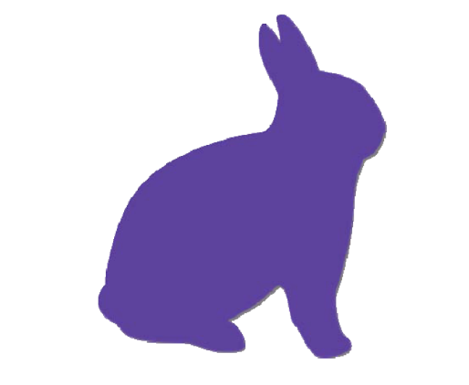

阴影和其他上下文状态的改变一样，会影响所有后续的绘图操作。如果你想要在应用阴影之后重置状态，请确保保存上下文图形状态（GState）。将阴影颜色设置为透明（[UIColor clearColor].CGColor）来“禁用”阴影。
代码5-10用Objective-C颜色参数包装了CGContextSetShadowWithColor（）函数。你可以指定颜色，偏移量和模糊程度。该函数更新上下文的状态，并应用这些参数到路径中。以下是一些关于阴影的知识：
* 每个阴影都是从绘图操作中的xy偏移来添加的。你通过CGSize来指定偏移。
* 浮点模糊参数指定边沿的硬度，0为硬，大于零变软。
* 你可以通过CGContextSetShadow（）来跳过颜色值。该函数默认是半透明的黑色，0.33阿尔法值。代码5-10中使用nil来调用SetShadow（）函数就会出现这种情况。

```
void SetShadow(UIColor *color, CGSize size, CGFloat blur)
{
    CGContextRef context = UIGraphicsGetCurrentContext();
    if(context == NULL)
    {
        NSLog(@"Error: No context to draw into");
        return;
    }
    
    if(color)
        CGContextSetShadowWithColor(context, size, blur, color.CGColor);
    else
        CGContextSetShadow(context, size, blur);
}
```
表5-1展示了影阴参数对绘图的印象

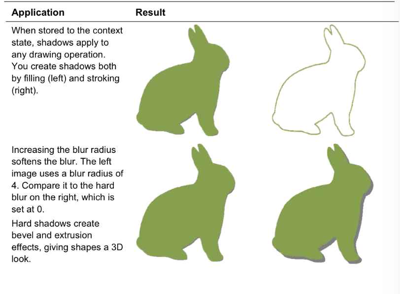
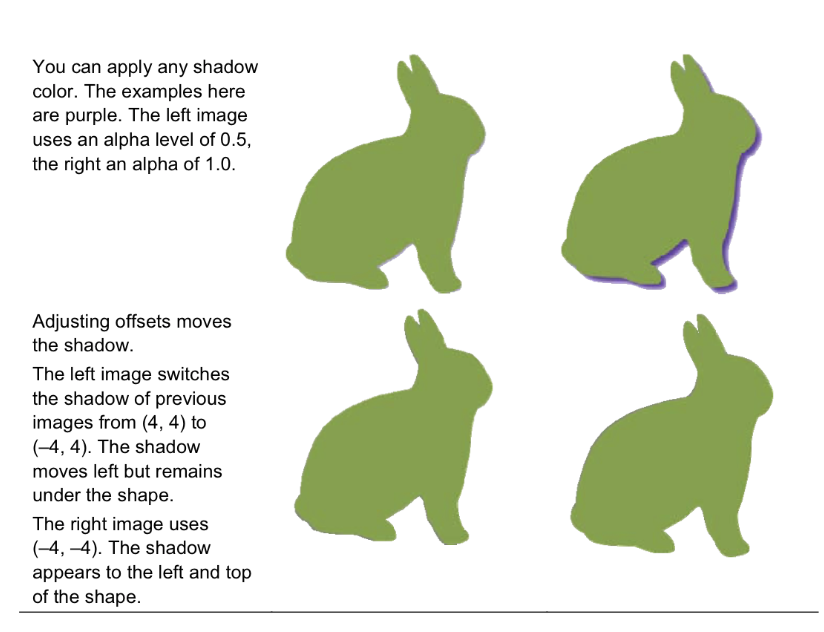

##### 阴影的代价
阴影会给你带来很大的计算负担，这是无法回避的事实。虽然视觉上很好看，但是他们不一定是你想要使用的实时高性能界面元素。
只要有可能，在开发过程中描绘
