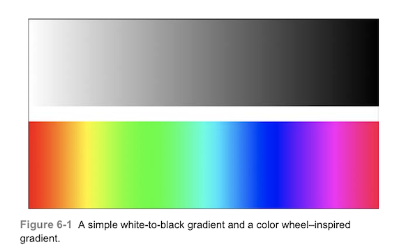
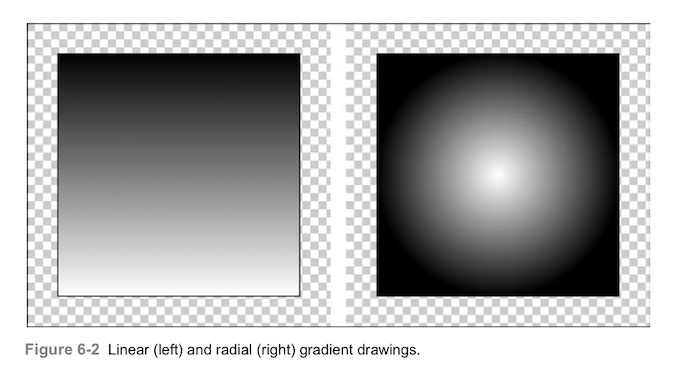
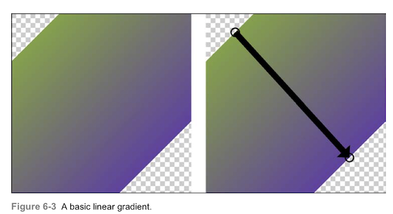
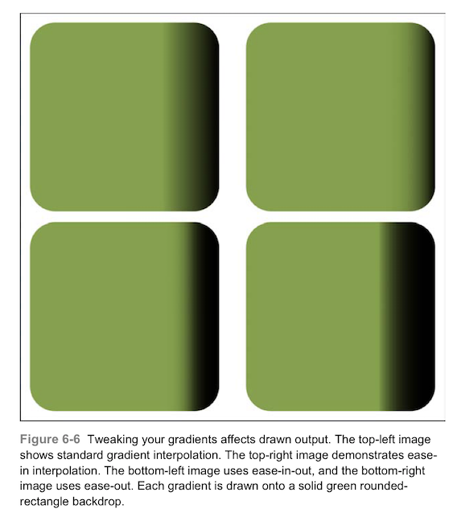
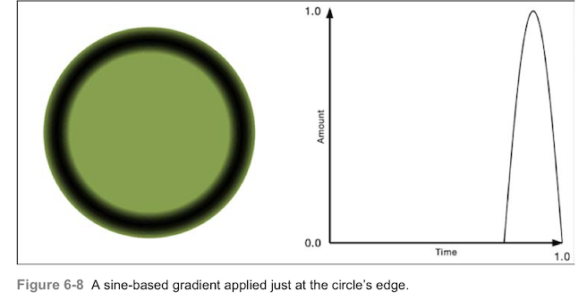

# 绘制渐变

在iOS中，渐变描绘颜色的逐渐改变。用于遮盖绘制，在计算机生成的图形中模拟真实世界的照明，渐变是一个重要的组件，可以产生强大的视觉效果。本章介绍iOS的渐变，并演示如何使用他们来添加活力。

### 渐变
渐变总是包含至少两种颜色。颜色与开始点和结束点向关联，在0到1之间变化。除此之外，梯度可以十分简单，也可以变得非常复杂如果你需要的话。图6-1展示了这个范围。上图展示了可能是最简单的梯度，他从白色的0变为黑色的1。下图显示了由24种不同的色调构成的渐变。这个复杂的渐变从红色到橙色，黄色到绿色等等。



如果您之前接触过梯度渐变，您会知道您可以绘制线性和辐射状的输出。如果没有，图6-2介绍了这两种风格。左边为线性渐变，从底部白色到顶部黑色。线性渐变沿着指定的轴来绘制颜色。
相比下，辐射状的渐变从开始到结束会改变其图形的宽度。在右侧，辐射从白色开始（中间），延伸到附近的黑色。在本例中，半径从中间的0开始，在右边沿的范围结束。随着半径增大，颜色变暗，从而产生这里看到的球体。



你可能还没有意识到，图6-2的两幅图使用的是相同的梯度原——如图6-1上图所示的那样。渐变没有形状，位置或任何几何属性。他们简单地描述了颜色是如何改变的。绘制渐变的方式完全取决于你以及你所使用的核心图像的方法。

### 封装CGGradientRif类
CGGrandientRif是core foundation风格的类，储存了从0.0到1.0范围内任意数量的颜色。你通过传递两个设置颜色和位置的数组来建立渐变，如本例所示：

```
CGGradientRef CGGradientCreateWithColor(CGColorSapceRef space, CFArrayRef colors, const CGFloat locations[])
```
在进一步了解核心图像的实现之前，我们先暂停一下，来了解了解Objective-C的解决方法，这个方法有时候是非常有用的。
总的来说，使用Objective-C封装的渐变要比需要关心内存管理的C语言混合和Core Foundation风格的元素要简单的多。如这里使用的两个数组，因为这里没有UIKit提供简便包装，也没有桥接的基础，我构建了一个Objective-C封装，这就是该解决方案发挥作用的地方。我使用了一点点属性上的诡计，让ARC来管理Core Foundation引用就像一个普通的Cocoa对象。http://llvm.org/ 网站上描述了这一功能。

> GCC在结构体指针中引入了__attribute__((NSObject))，表示“这是一个对象”。这很有用，因为许多低级数据结构被声明为不透明指针，如CFStringRef，CFArrayRef等。

你用这个技巧来创立一个派生类，这里是我为使用Quartz渐变创建的类型定义：

```
typedef __attribute__((NSObject)) CGGradientRef GradientObject;
```

此声明使你在使用ARC内存管理时能够建立Core Foundation驱动的超出桥接范围的类属性类型。这很重要，因为作为一个规则，Quartz并不是什么都不耗费就可以接入UIKit的。使用派生类需要使用ARC风格的strong管理来创建属性：
```
@property (nonatomic, strong) GradientObject storedGradient;
```
当代码6-1中的创建的Gradient实例释放时，在底层的CGGradientRef也被释放了。你不必去创建特殊的dealloc方法来管理Core Foundation的对象。你得到的是一个带有Objective-C接口的渐变类。你可以使用UIColor的数组和NSNumber的数组。

> 警告：正如你在这里看到的，这种属性方法需要明确的类型定义。避免普遍使用具有其他语言的特点。如__typeof。更多详细信息请查阅LLVM的文档。我觉得使用这种方法很舒服很顺手，因为苹果的工程师也向我介绍了它。

```
@interface Gradient ()
@property (nonatomic, strong) GradientObject storedGradient;
@end

@implementation Gradient
- (CGGradientRef) gradient
{
      //Expose the internal GradientObject property
      //as a CGGradientRef to the outside world on demand
      return _storedGradient;
}

//Primary entry point for the class. Construct a gradient
//with the supplied colors and locations
+ (instancetype)gradientWithColors:(NSArray *)colorArray locations:(NSArray *)locationArray
{
     //Establish color space
     CGColorSpaceRef space = CGColorSpaceCreateDeviceRGB();
     if(space == NULL)
     {
         NSLog(@"Error: Unable to create RGB color space");
         return nil;
     }
     
     //Convert NSNumber *locations array to CGFloat *
     CGFloat locations[locationArray.count];
     for(int i=0; i < locationArray.count; i++)
          locations[i] = fminf(fmaxf([locationArray[i] floatValue], 0), 1);
     
     //Convert colors array to (id) CGColorRef
     NSMutableArray *colorRefArray = [NSMutableArray array];
     for(UIColor *color in colorsArray)
         [colorRefArray addObject:(id)color.CGColor];
     
     //Build the internal gradient
     CGGradientRef gradientRef = CGGradientCreateWithColors(space, (__bridge CFArrayRef) colorRefArray, locations);
     CGColorSpaceRelease(space);
     if(gradientRef == NULL)
     {
        NSLog(@"Error:Unable to construct CGGradientRef");
        return nil;
     }
     
     //Build the wrapper, store the gradient, and return
     Gradient *gradient = [[self alloc] init];
     gradient.storedGradient = gradientRef;
     CGGradientRelease(gradientRef);
     return gradient;
}

+ (instancetype)gradientFrom:(UIColor *)color1 to:(UIColor *)color2
{
return [self gradientWithColors:@[color1,color2] locations:@[@(0.0f),@(1.0f)]];
}
@end
```

### 绘制渐变
Quartz提供两种绘制渐变的方法：线性和放射性，CGContextDrawLinearGradient()和CGContextDrawRadialGradient()函数在指定的起点和终点之间绘制渐变。本节中的设置都是使用从紫色到绿色的渐变，以及共同的起点和终点。变化的是绘制到上下文的函数和参数。
##### 绘制线性渐变
图6-3显示了基本的使用线性渐变函数来绘制的方法：
```
void CGContextDrawLinearGradient(CGContextRef context, CGGradientRef gradient, CGPoint startPoint, CGPoint endPoint, CGGradientDrawingOptions options);
```
这个绿色到紫色的渐变是从左上角到右下角绘制的：



最后一个参数是选填的，您可以用它来指定渐变超出其起点和终点属性。使用0（否，图6-3）或kCGGradientDrawsBeforeStartLocation或kCGGradientDrawsAfterEndLocation。图6-4显示了这些选项的设置：


##### 绘制辐射状渐变
辐射状渐变绘制函数比线性函数多了两个参数。这俩参数指定了图像开始和结束时的半径。图6-5显示了以初始半径20最终半径为50绘制的绿色到紫色的渐变。左图没有使用options选项，右图的版本在开始和结束之前和之后继续绘制。下面的圆圈会被绘图矩形的边界裁剪：

```
void CGContextDrawRadialGradient(CGContextRef context, CGGradientRef gradient, CGPoint startCenter, CGFloat startRadius, CGPoint endCenter, CGFloat endRadius, CGGradientDrawingOptions options);
```


代码6-2展示了我用Objective-C封装的线性绘制和辐射性绘制的方法。这个方法构成了代码6-1自定义渐变类的一部分。他们提供了简便的方法在使用中UIKit绘图上下文来绘制嵌入的核心图像渐变。

``` 
//Draw a linear gradient between the two points
- (void) drawFrom:(CGPoint)p1 toPoint:(CGPoint)p2 style:(int)mask
{
     CGContextRef context = UIGraphicsGetCurrentContext();
     if(context == NULL)
     {
         NSLog(@"Error:No context to draw to");
         return;
     }
     CGContextDrawLinearGradient(context, self.gradient, p1, p2, mask);
}

//Draw a radial gradient between the two points
- (void) drawRadialFrom:(CGPoint)p1 toPoint:(CGPoint)p2 radii:(CGPoint)radii style:(int)mask
{
     CGContextRef context = UIGraphicsGetCurrentContext();
     if(context == NULL)
     {
        NSLog(@"Error: No context to draw to");
        return;
     }
     
     CGContextDrawRadialGradient(context, self.gradient, p1, radii.x, p2, radii.y, mask);
}
```

### 创建渐变
每个渐变都是由两组值组成的：
* 有序的一组颜色
* 颜色变化发生的位置
例如，你可以定义从红色到绿色到蓝色的渐变，分别在0.0,0.5,1.0,沿着渐变的方向，渐变会在这些点之间进行插值。大约在0.33位置颜色，红色到绿色大约占了整个渐变的百分之66。或者，例如，想象一个简单的黑色到白色的渐变，中间灰色显示在开始和结束之间的位置。
你可以提供任意颜色的颜色和位置的序列。只要这些颜色在RGB或灰色的色域中（不能使用图案颜色绘制渐变）。位置序列介于0.0和1.0之间。如果您提供的值超出该范围，则创建函数返回NULL。
最常用的渐变时从白到黑，从白到透明，或者黑色到透明。因为使用了颜色的不同alpha等级。下面是一个方便的宏：
```
#define WHITE_LEVEL(_amt_, _alpha_) [UIColor colorWithWhite:(_amt_) alpha:(_alpha_)]
```
此宏返回一个指定的白色程度和透明级别的灰度颜色。白色程度从0（黑色）到1（白色），alpha从0（透明）到1（透明）。
许多开发者使用颜色之间的默认插值来设置渐变，如代码6-1所示。本例创建一个从透明到黑色的渐变，并从百分之70的点绘制到百分之100覆盖在下面的绿色上。您可以在图6-6左上图看到绘制的结果。对比6-6中的其他图，你会发现“渐变缓冲”这个东西。

```
Gradient *gradient = [Gradient gradientFrom:WHITE_LEVEL(0, 0) to:WHITE_LEVEL(0, 1)];

//Calculate the points
CGPoint p1 = RectGetPointAtPercents(path.bounds, 0.7, 0.5);
CGPOint p2 = RectGetPointAtPercents(path.bounds, 1.0, 0.5);

//Draw a green background
[path fill:greenColor];

//Draw the gradient across the green background
[path addClip];
[gradient drawFrom:p1 toPoint:p2];
```


##### 缓冲
缓冲函数会改变阴影变化的速率。更具你选择的方法，他们提供了更加柔和的渐变效果。我最喜欢“加速进入”（EaseIn）和“加入进入加速退出”（EaseInOut）这两种柔和的效果，如图6-6中的右上和左下图一样。如你所见，这两种方法避免了突然的结束变化。这些严格的变化是由感知带产生的，也叫虚幻马赫带（注：名词illusory mach bands，我随便翻译的，不要纠结。）。马赫带是物理学家恩特斯马赫首先注意到的一种光学错觉，由大脑处理模式自然造成的，当边界出现稍微不同的灰色阴影时就会出现这种现象。他们出现在计算图像中因为绘制会在算法告诉他该停止的地方结束。在图6-6的左上图和右下图中，你可以在渐变的绘制区域看到这种效果。通过快入快出的绘图，可以在底层的颜色和渐变色之间有一个过渡叠加效果，而不会出现终止带。
图6-7显示了图6-6中渐变的缓冲方法。一组分别是：线性（左上角），快入（右上角），快入快出（左下角），快出（右下角）。缓冲效果使用方法的开始（in）或结束（out）来建立更多渐进的变化。这些方法在很多绘图和动画算法中都会用到。


代码6-3定义了一个Gradient类方法，该方法从函数中构建渐变应用。你传递输入百分比（时间轴）的块，返回一个应用于开始和结束颜色的值（数量轴）。该方法插入颜色，并将值添加到渐变当中去。
这三个标准渐变缓冲方法使用两个参数：经过的时间和指数。你传递的指数决定了缓冲的类型，对于标准三次缓冲，第二个参数需要传入3，二次缓冲则传入2，传入1则为线性无缓冲。
你可以在插值块中应用你喜欢的任何函数。如下，使用输入输出三次缓冲曲线构建渐变：
```
Gradient *gradient = [Gradient gradientUsingInterpolationBlock:^(CGFloat percent){
     return EaseInOut(percent, 3);
     } between:WHITE_LEVEL(0, 0) and:WHITE_LEVEL(0,1)];
```

```
typedef CGFloat(^InterpolationBlock)(CGFloat percent);

//Build a custom gradient using the supplied block to
//interpolate between the start and end colors
+(instancetype)gradientUsingInterpolationBlock:(InterpolationBlack)block between:(UIColor *)c1 and:(UIColor *)c2
{
      if(!block)
      {
         NSlog(@"Error: No interpolation block");
         return nil;
      }
      
      NSMutableArray *colors = [NSMutableArray array];
      NSMutableArray *locations = [NSMutableArray array];
      int numberOfSamples = 24;
      for(int i = 0; i <= numberOfSamples; i++)
      {
         CGFloat amt = (CGFloat) i / (CGFloat) numberOfSamples;
         CGFloat percentage = fmin(fmax(0.0, block(amt)), 1.0);
         [colors addObject:InterpolateBetweenColors(c1, c2, percentage)];
         [locations addObject:@(amt)];
      }
      return [Gradient gradientWithColors:colors locations:locations];
}

//Return an interpolated color
UIColor *InterpolateBetweenColor(UIColor *c1,UIColor *c2, CGFloat amt)
{
    CGFloat r1, g1, b1, a1;
    CGFloat r2, g2, b2, a2;
    
    if(CGColorGetNumberOfComponents(c1.CGColor) == 4)
    {
        [c1 getRed:&r1 green:&g1 blue:&b1 alpha:&a1];
    }
    else
    {
        [c1 getWhite:&r2 alpha:&a2];
        g1 = r1; b1 = r1;
    }
    
    if(CGColorGetNumberOfComponents(c2.CGColor) == 4)
       [c2 getRed:&r2 green:&g2 blue:&b2 alpha:&a2];
    else
    {
       [c2 getWhite:&r2 alpha:&a2];
       g2 = r2; b2 = r2;
    }
    
    CGFloat r = (r2 * amt) + (r1 * (1.0 - amt));
    CGFloat g = (g2 * amt) + (g1 * (1.0 - amt));
    CGFloat b = (b2 * amt) + (b1 * (1.0 - amt));
    CGFloat a = (a2 * amt) + (a1 * (1.0 - amt));
    return [UIColor colorWithRed:r green:g blue:b alpha:a];
}


#pragma mark - Easing Functions

//Ease only the beginning
CGFloat EaseIn(CGFloat currentTime, int factor)
{
    return powf(currentTime, factor);
}

//Ease only the end
CGFloat EaseOut(CGFloat currentTime, int factor)
{
    return 1 - powf((1 - currentTime), factor);
}

//Ease both beginning and end
CGFloat EaseInOut(CGFloat currentTime, int factor)
{
    currentTime = currentTime * 2.0;
    if(currentTime < 1)
       return (0.5 * pow(currentTime, factor));
    currentTime -= 2.0;
    if(factor % 2)
       return 0.5 * (pow(currentTime,factor) + 2.0);
       return 0.5 * (2.0 - pow(currentTime,factor));
}
```

### 添加边缘效果
放射性渐变可以让你画出有趣的圆形边缘效果。如图6-8，这个一个正弦渐变，而且，他只画在圆的边缘，路径的中间部分保持不变。



代码6-2使用非直觉的方法来实现了这一效果，暂时了一种有趣的渐变应用，正弦函数被压缩到渐变的最后百分之25处。因为渐变是从中心向外绘制的，所以会仅在边缘参数阴影效果。
