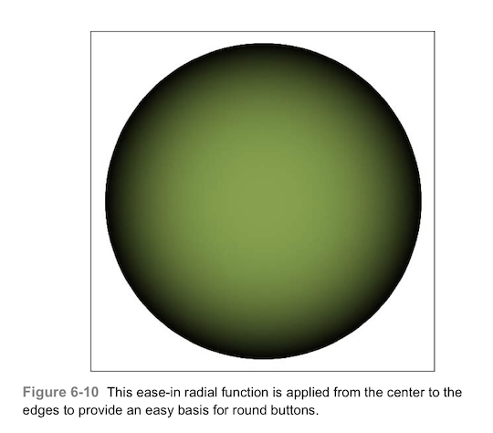
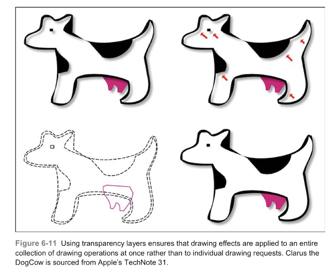
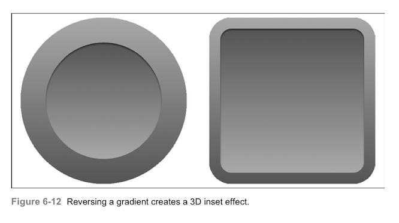
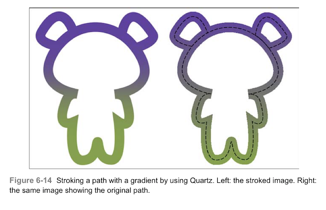
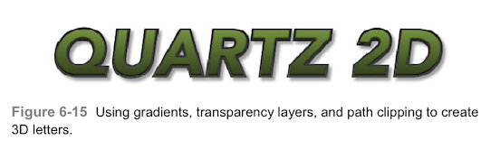
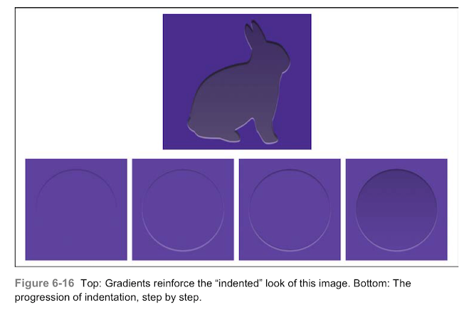
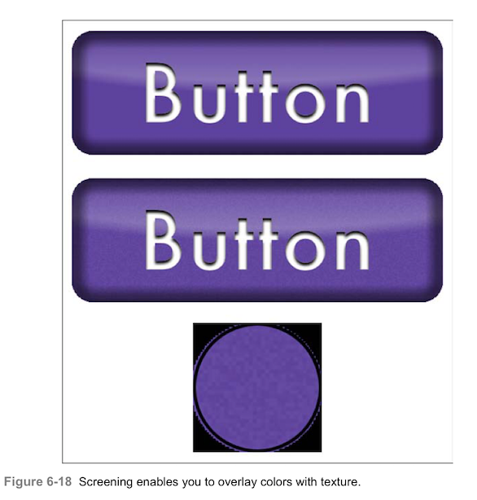
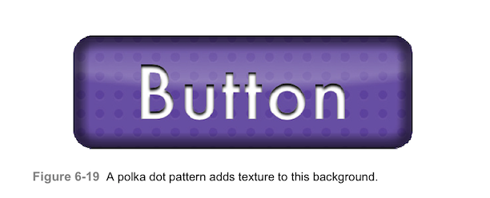
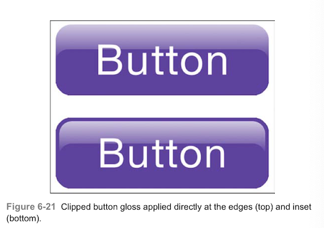

# 绘制渐变

在iOS中，渐变描绘颜色的逐渐改变。用于遮盖绘制，在计算机生成的图形中模拟真实世界的照明，渐变是一个重要的组件，可以产生强大的视觉效果。本章介绍iOS的渐变，并演示如何使用他们来添加活力。

### 渐变
渐变总是包含至少两种颜色。颜色与开始点和结束点向关联，在0到1之间变化。除此之外，梯度可以十分简单，也可以变得非常复杂如果你需要的话。图6-1展示了这个范围。上图展示了可能是最简单的梯度，他从白色的0变为黑色的1。下图显示了由24种不同的色调构成的渐变。这个复杂的渐变从红色到橙色，黄色到绿色等等。


如果您之前接触过梯度渐变，您会知道您可以绘制线性和辐射状的输出。如果没有，图6-2介绍了这两种风格。左边为线性渐变，从底部白色到顶部黑色。线性渐变沿着指定的轴来绘制颜色。
相比下，辐射状的渐变从开始到结束会改变其图形的宽度。在右侧，辐射从白色开始（中间），延伸到附近的黑色。在本例中，半径从中间的0开始，在右边沿的范围结束。随着半径增大，颜色变暗，从而产生这里看到的球体。


你可能还没有意识到，图6-2的两幅图使用的是相同的梯度原——如图6-1上图所示的那样。渐变没有形状，位置或任何几何属性。他们简单地描述了颜色是如何改变的。绘制渐变的方式完全取决于你以及你所使用的核心图像的方法。

### 封装CGGradientRif类
CGGrandientRif是core foundation风格的类，储存了从0.0到1.0范围内任意数量的颜色。你通过传递两个设置颜色和位置的数组来建立渐变，如本例所示：

```
CGGradientRef CGGradientCreateWithColor(CGColorSapceRef space, CFArrayRef colors, const CGFloat locations[])
```
在进一步了解核心图像的实现之前，我们先暂停一下，来了解了解Objective-C的解决方法，这个方法有时候是非常有用的。
总的来说，使用Objective-C封装的渐变要比需要关心内存管理的C语言混合和Core Foundation风格的元素要简单的多。如这里使用的两个数组，因为这里没有UIKit提供简便包装，也没有桥接的基础，我构建了一个Objective-C封装，这就是该解决方案发挥作用的地方。我使用了一点点属性上的诡计，让ARC来管理Core Foundation引用就像一个普通的Cocoa对象。http://llvm.org/ 网站上描述了这一功能。

> GCC在结构体指针中引入了__attribute__((NSObject))，表示“这是一个对象”。这很有用，因为许多低级数据结构被声明为不透明指针，如CFStringRef，CFArrayRef等。

你用这个技巧来创立一个派生类，这里是我为使用Quartz渐变创建的类型定义：

```
typedef __attribute__((NSObject)) CGGradientRef GradientObject;
```

此声明使你在使用ARC内存管理时能够建立Core Foundation驱动的超出桥接范围的类属性类型。这很重要，因为作为一个规则，Quartz并不是什么都不耗费就可以接入UIKit的。使用派生类需要使用ARC风格的strong管理来创建属性：
```
@property (nonatomic, strong) GradientObject storedGradient;
```
当代码6-1中的创建的Gradient实例释放时，在底层的CGGradientRef也被释放了。你不必去创建特殊的dealloc方法来管理Core Foundation的对象。你得到的是一个带有Objective-C接口的渐变类。你可以使用UIColor的数组和NSNumber的数组。

> 警告：正如你在这里看到的，这种属性方法需要明确的类型定义。避免普遍使用具有其他语言的特点。如__typeof。更多详细信息请查阅LLVM的文档。我觉得使用这种方法很舒服很顺手，因为苹果的工程师也向我介绍了它。

```
@interface Gradient ()
@property (nonatomic, strong) GradientObject storedGradient;
@end

@implementation Gradient
- (CGGradientRef) gradient
{
      //Expose the internal GradientObject property
      //as a CGGradientRef to the outside world on demand
      return _storedGradient;
}

//Primary entry point for the class. Construct a gradient
//with the supplied colors and locations
+ (instancetype)gradientWithColors:(NSArray *)colorArray locations:(NSArray *)locationArray
{
     //Establish color space
     CGColorSpaceRef space = CGColorSpaceCreateDeviceRGB();
     if(space == NULL)
     {
         NSLog(@"Error: Unable to create RGB color space");
         return nil;
     }
     
     //Convert NSNumber *locations array to CGFloat *
     CGFloat locations[locationArray.count];
     for(int i=0; i < locationArray.count; i++)
          locations[i] = fminf(fmaxf([locationArray[i] floatValue], 0), 1);
     
     //Convert colors array to (id) CGColorRef
     NSMutableArray *colorRefArray = [NSMutableArray array];
     for(UIColor *color in colorsArray)
         [colorRefArray addObject:(id)color.CGColor];
     
     //Build the internal gradient
     CGGradientRef gradientRef = CGGradientCreateWithColors(space, (__bridge CFArrayRef) colorRefArray, locations);
     CGColorSpaceRelease(space);
     if(gradientRef == NULL)
     {
        NSLog(@"Error:Unable to construct CGGradientRef");
        return nil;
     }
     
     //Build the wrapper, store the gradient, and return
     Gradient *gradient = [[self alloc] init];
     gradient.storedGradient = gradientRef;
     CGGradientRelease(gradientRef);
     return gradient;
}

+ (instancetype)gradientFrom:(UIColor *)color1 to:(UIColor *)color2
{
return [self gradientWithColors:@[color1,color2] locations:@[@(0.0f),@(1.0f)]];
}
@end
```

### 绘制渐变
Quartz提供两种绘制渐变的方法：线性和放射性，CGContextDrawLinearGradient()和CGContextDrawRadialGradient()函数在指定的起点和终点之间绘制渐变。本节中的设置都是使用从紫色到绿色的渐变，以及共同的起点和终点。变化的是绘制到上下文的函数和参数。
##### 绘制线性渐变
图6-3显示了基本的使用线性渐变函数来绘制的方法：
```
void CGContextDrawLinearGradient(CGContextRef context, CGGradientRef gradient, CGPoint startPoint, CGPoint endPoint, CGGradientDrawingOptions options);
```
这个绿色到紫色的渐变是从左上角到右下角绘制的：


最后一个参数是选填的，您可以用它来指定渐变超出其起点和终点属性。使用0（否，图6-3）或kCGGradientDrawsBeforeStartLocation或kCGGradientDrawsAfterEndLocation。图6-4显示了这些选项的设置：


##### 绘制辐射状渐变
辐射状渐变绘制函数比线性函数多了两个参数。这俩参数指定了图像开始和结束时的半径。图6-5显示了以初始半径20最终半径为50绘制的绿色到紫色的渐变。左图没有使用options选项，右图的版本在开始和结束之前和之后继续绘制。下面的圆圈会被绘图矩形的边界裁剪：

```
void CGContextDrawRadialGradient(CGContextRef context, CGGradientRef gradient, CGPoint startCenter, CGFloat startRadius, CGPoint endCenter, CGFloat endRadius, CGGradientDrawingOptions options);
```


代码6-2展示了我用Objective-C封装的线性绘制和辐射性绘制的方法。这个方法构成了代码6-1自定义渐变类的一部分。他们提供了简便的方法在使用中UIKit绘图上下文来绘制嵌入的核心图像渐变。

``` 
//Draw a linear gradient between the two points
- (void) drawFrom:(CGPoint)p1 toPoint:(CGPoint)p2 style:(int)mask
{
     CGContextRef context = UIGraphicsGetCurrentContext();
     if(context == NULL)
     {
         NSLog(@"Error:No context to draw to");
         return;
     }
     CGContextDrawLinearGradient(context, self.gradient, p1, p2, mask);
}

//Draw a radial gradient between the two points
- (void) drawRadialFrom:(CGPoint)p1 toPoint:(CGPoint)p2 radii:(CGPoint)radii style:(int)mask
{
     CGContextRef context = UIGraphicsGetCurrentContext();
     if(context == NULL)
     {
        NSLog(@"Error: No context to draw to");
        return;
     }
     
     CGContextDrawRadialGradient(context, self.gradient, p1, radii.x, p2, radii.y, mask);
}
```

### 创建渐变
每个渐变都是由两组值组成的：
* 有序的一组颜色
* 颜色变化发生的位置
例如，你可以定义从红色到绿色到蓝色的渐变，分别在0.0,0.5,1.0,沿着渐变的方向，渐变会在这些点之间进行插值。大约在0.33位置颜色，红色到绿色大约占了整个渐变的百分之66。或者，例如，想象一个简单的黑色到白色的渐变，中间灰色显示在开始和结束之间的位置。
你可以提供任意颜色的颜色和位置的序列。只要这些颜色在RGB或灰色的色域中（不能使用图案颜色绘制渐变）。位置序列介于0.0和1.0之间。如果您提供的值超出该范围，则创建函数返回NULL。
最常用的渐变时从白到黑，从白到透明，或者黑色到透明。因为使用了颜色的不同alpha等级。下面是一个方便的宏：
```
#define WHITE_LEVEL(_amt_, _alpha_) [UIColor colorWithWhite:(_amt_) alpha:(_alpha_)]
```
此宏返回一个指定的白色程度和透明级别的灰度颜色。白色程度从0（黑色）到1（白色），alpha从0（透明）到1（透明）。
许多开发者使用颜色之间的默认插值来设置渐变，如代码6-1所示。本例创建一个从透明到黑色的渐变，并从百分之70的点绘制到百分之100覆盖在下面的绿色上。您可以在图6-6左上图看到绘制的结果。对比6-6中的其他图，你会发现“渐变缓冲”这个东西。

```
Gradient *gradient = [Gradient gradientFrom:WHITE_LEVEL(0, 0) to:WHITE_LEVEL(0, 1)];

//Calculate the points
CGPoint p1 = RectGetPointAtPercents(path.bounds, 0.7, 0.5);
CGPOint p2 = RectGetPointAtPercents(path.bounds, 1.0, 0.5);

//Draw a green background
[path fill:greenColor];

//Draw the gradient across the green background
[path addClip];
[gradient drawFrom:p1 toPoint:p2];
```


##### 缓冲
缓冲函数会改变阴影变化的速率。更具你选择的方法，他们提供了更加柔和的渐变效果。我最喜欢“加速进入”（EaseIn）和“加入进入加速退出”（EaseInOut）这两种柔和的效果，如图6-6中的右上和左下图一样。如你所见，这两种方法避免了突然的结束变化。这些严格的变化是由感知带产生的，也叫虚幻马赫带（注：名词illusory mach bands，我随便翻译的，不要纠结。）。马赫带是物理学家恩特斯马赫首先注意到的一种光学错觉，由大脑处理模式自然造成的，当边界出现稍微不同的灰色阴影时就会出现这种现象。他们出现在计算图像中因为绘制会在算法告诉他该停止的地方结束。在图6-6的左上图和右下图中，你可以在渐变的绘制区域看到这种效果。通过快入快出的绘图，可以在底层的颜色和渐变色之间有一个过渡叠加效果，而不会出现终止带。
图6-7显示了图6-6中渐变的缓冲方法。一组分别是：线性（左上角），快入（右上角），快入快出（左下角），快出（右下角）。缓冲效果使用方法的开始（in）或结束（out）来建立更多渐进的变化。这些方法在很多绘图和动画算法中都会用到。


代码6-3定义了一个Gradient类方法，该方法从函数中构建渐变应用。你传递输入百分比（时间轴）的块，返回一个应用于开始和结束颜色的值（数量轴）。该方法插入颜色，并将值添加到渐变当中去。
这三个标准渐变缓冲方法使用两个参数：经过的时间和指数。你传递的指数决定了缓冲的类型，对于标准三次缓冲，第二个参数需要传入3，二次缓冲则传入2，传入1则为线性无缓冲。
你可以在插值块中应用你喜欢的任何函数。如下，使用输入输出三次缓冲曲线构建渐变：
```
Gradient *gradient = [Gradient gradientUsingInterpolationBlock:^(CGFloat percent){
     return EaseInOut(percent, 3);
     } between:WHITE_LEVEL(0, 0) and:WHITE_LEVEL(0,1)];
```

```
typedef CGFloat(^InterpolationBlock)(CGFloat percent);

//Build a custom gradient using the supplied block to
//interpolate between the start and end colors
+(instancetype)gradientUsingInterpolationBlock:(InterpolationBlack)block between:(UIColor *)c1 and:(UIColor *)c2
{
      if(!block)
      {
         NSlog(@"Error: No interpolation block");
         return nil;
      }
      
      NSMutableArray *colors = [NSMutableArray array];
      NSMutableArray *locations = [NSMutableArray array];
      int numberOfSamples = 24;
      for(int i = 0; i <= numberOfSamples; i++)
      {
         CGFloat amt = (CGFloat) i / (CGFloat) numberOfSamples;
         CGFloat percentage = fmin(fmax(0.0, block(amt)), 1.0);
         [colors addObject:InterpolateBetweenColors(c1, c2, percentage)];
         [locations addObject:@(amt)];
      }
      return [Gradient gradientWithColors:colors locations:locations];
}

//Return an interpolated color
UIColor *InterpolateBetweenColor(UIColor *c1,UIColor *c2, CGFloat amt)
{
    CGFloat r1, g1, b1, a1;
    CGFloat r2, g2, b2, a2;
    
    if(CGColorGetNumberOfComponents(c1.CGColor) == 4)
    {
        [c1 getRed:&r1 green:&g1 blue:&b1 alpha:&a1];
    }
    else
    {
        [c1 getWhite:&r2 alpha:&a2];
        g1 = r1; b1 = r1;
    }
    
    if(CGColorGetNumberOfComponents(c2.CGColor) == 4)
       [c2 getRed:&r2 green:&g2 blue:&b2 alpha:&a2];
    else
    {
       [c2 getWhite:&r2 alpha:&a2];
       g2 = r2; b2 = r2;
    }
    
    CGFloat r = (r2 * amt) + (r1 * (1.0 - amt));
    CGFloat g = (g2 * amt) + (g1 * (1.0 - amt));
    CGFloat b = (b2 * amt) + (b1 * (1.0 - amt));
    CGFloat a = (a2 * amt) + (a1 * (1.0 - amt));
    return [UIColor colorWithRed:r green:g blue:b alpha:a];
}


#pragma mark - Easing Functions

//Ease only the beginning
CGFloat EaseIn(CGFloat currentTime, int factor)
{
    return powf(currentTime, factor);
}

//Ease only the end
CGFloat EaseOut(CGFloat currentTime, int factor)
{
    return 1 - powf((1 - currentTime), factor);
}

//Ease both beginning and end
CGFloat EaseInOut(CGFloat currentTime, int factor)
{
    currentTime = currentTime * 2.0;
    if(currentTime < 1)
       return (0.5 * pow(currentTime, factor));
    currentTime -= 2.0;
    if(factor % 2)
       return 0.5 * (pow(currentTime,factor) + 2.0);
       return 0.5 * (2.0 - pow(currentTime,factor));
}
```

### 添加边缘效果
放射性渐变可以让你画出有趣的圆形边缘效果。如图6-8，这个一个正弦渐变，而且，他只画在圆的边缘，路径的中间部分保持不变。


代码6-2使用非直觉的方法来实现了这一效果，暂时了一种有趣的渐变应用，正弦函数被压缩到渐变的最后百分之25处。因为渐变是从中心向外绘制的，所以会仅在边缘参数阴影效果。

```
InterpolationBlock block = ^CGFloat (CGFloat percent)
{
     CGFloat skippingPercnet = 0.75;
     if(percent < skippingPercent) return 0;
     CGFloat scaled = (percent - skippingPercent) * (1 / (1 - skippingPercent));
     return sinf(scaled * M_PI);
};

Gradient *gradient = [Gradient gradientUsingInterpolationBlock:block between:WHITE_LEVEL(0, 0)  and:WHITE_LEVEL(0, 1)];

CGContextDrawRadialGradient(UIGraphicsGetCurrentContext(), gradient.gradient, center, 0, center, dx, 0);
```
这样就可以像图6-9那样实现只在边缘应用缓冲效果了。插值块仅在某一个百分比过去之后才会调用缓冲方法——本例中，是径向的百分之五十：

```
InterpolationBlock block = ^CGFloat(CGFloat percent)
{
     CGFloat skippingPercent = 0.5;
     if (percent < skippingPercent) return 0;
     CGFloat scaled = (percent - skippingPercent) *(1 / (1 - skippingPercent));
     return EaseIn(scaled, 3);
}
```
图6-9右侧的图展示了延迟缓冲的效果。上升开始与0.5之后，如你所见，上升的较为缓慢，到0.75开始才真正的开始变慢。


##### 基本渐变背景
比方说，你正在找一个不错的圆形按钮特效。基础的如6-2所示的辐射状效果也许对于你来说过于圆形了。而图6-9的延迟效果也可能过于平了。事实上，缓冲功能提供了非常好的按钮基础，如图6-10所示。



代码片段如下：
```
InterpolationBlock block = ^CGFloat (CGFloat percent)
{
    return EaseIn(percent, 3);
};
```
在本章稍后，你会看到这种方法被再次使用，用于在按钮上建立一个“发光”的中心。

### 状态和透明层
再继续深入了解渐变之前，我们需要往后退一步，介绍一个重要的Quartz绘制功能。此功能在本章的例子中会出现，需要着重解释解释。
如果你使用过Photoshop（或类似的图像合成和编辑的软件），你可能非常熟悉图层。图层将图像封装为不同的独立容器。堆砌这些图层可以构造出复杂的图形。然后应用图层，为每一层添加阴影，高光和其他的装饰效果。重要的是，这些效果只使用一次就可以应用懂啊所有层中，而不管他们是否独立在层的上下文中进行的绘图操作。
Quartz提供了类似的功能，成为透明层，这些层是您能够将多个绘制操作组合到单个缓冲区中，图6-11展示的是，为什么会希望在应用中使用图层。



此图被渲染到启用阴影的上下文中。在上方的图片中，阴影出现在绘图的所有区域之上，包括“内部”的DogCow。这是因为图片是使用Bezier填充创作出来了：
* 第一个操作填充了粉红色的奶狗的乳房。
* 第二步，填充图中的白色背景
* 第三步，画上了背景上的斑点，眼睛和轮廓
左下角的图像显示了用于这些绘制认为的贝塞尔曲线的轮廓。当这个路径作为三次操作执行时，上下文会对每个操作使用阴影。要创建一个如图6-11的右下角图所示的单个复合图形时，您需要使用Quartz透明图层来代替。阴影仅会出现在复合图形的边缘，而不是每个元件的边缘。独立于绘图上下文，透明图层将绘图请求分组到不同的缓冲区中。开启一个层（通过调用CGContextBeginTransparenceLayer()），缓冲区会初始化一个完全透明的背景。阴影被禁用，且全局的alpha值设置为1。只有在完成绘制后（通过调用CGContextEndTransparencyLayer（））图层的内容才会呈现给父视图。
##### 透明度块
和大多数其他的Quartz和UIKit绘图请求一样，图层声明很快会变得凌乱：难以理解，难以阅读，难以维护。思考一下代码6-3展示了图6-11中创建最终DogCow的代码。传递给PushLayerDraw的块确保阴影是为整个图层进行绘制的。
```
SetShadow(shadowColor, CGSizeMake(4, 4), 4);
PushLayerDraw(^{
  [udder fill:pinkColor];
  [interior fill:whiteColor];
  [baseMoof fill:blackColor];
});
```
代码6-4展示了PushLayerDraw函数。他在一个透明层内执行了一个绘图块操作。这张总方法方便您对基于图层渲染的易用块进行分组。
```
typedef void (^DrawingStateBlock) ();

void PushLayerDraw(DrawingStateBlock block)
{
    if(!block) return;//Nothing to do
    
    CGContextRef context = UIGraphicsGetCurrentContext();
    if (context == NULL)
    {
        NSLog(@"Error:No context to draw to");
        return;
    }
    
    CGContextBeginTransparencyLayer(context, NULL);
    block();
    CGContextEndTransparencyLayer(context);
}
```
透明层的优点是显而易见的：他可以使你的绘图操作成为一个整体。缺点是， 可能存在内存堵塞由于需要额外的绘图缓冲区。您可以通过使用图层前裁剪上下文来缓解这个问题。如果你知道的话，你的小组只会在开始层之前，只绘制到上下文的某一部分并添加裁剪。这迫使图层仅绘制在剪裁区域，从而减少缓冲区大小和相关的内存开销。
然而，阴影需要特别注意。阴影需要在透明层结束时马上进行绘制。根据经验，您可能会希望在阴影区域加上模糊，所以偏移为（2，4）的阴影加上4的模糊度，在剪辑区域至少要为（6， 8）。

##### 状态块
无论何时使用到临时剪辑或是基于上下文特定状态的操作，都可以通过使用块来完成，这会让事情变得更加简单。如代码6-5所示，类似于代码6-4所示，PushDraw（）使用一个块来保存和恢复上下文的状态。
```
void PushDraw(DrawingStateBlock block)
{
     if(!block) return; //Nothing to do
     
     CGContextRef context = UIGraphicsGetCurrentContext);
     if(context == NULL)
     {
        NSLog(@"Error: No context to draw to");
        return;
     }
     CGContextSaveGState(context);
     block();
     CGContextRestoreGState(context);
}
```
示例6-4使用代码6-4和6-5的函数来显示以创建6-11中的最终图像。他施行剪切和阴影，并将三条贝塞尔曲线绘制成一组。执行块后，上下文返回完全适应它的预拉伸效果。剪切和阴影的状态都不会改变。
```
CGRect clipRect = CGRectInset(destinationRect, -8, -8);
PushDraw(^{
    //Clip path to bounds union with shadow allowance
    //to improve drawing performance
    [[UIBezierPath bezierPathWithRect:clipRect] addClip];
    
    //Set shadow
    SetShadow(shadowColor, CGSizeMake(4, 4), 4);
    
    //Draw as group
    PushLayerDraw(^{
       [udder fill:pinkColor];
       [interior fill:whiteColor];
       [baseMoof fill:blackColor];
       });
});
```

### 反转渐变
渐变模拟自然光。当倒置时，会形成一个视觉的空洞，这个区域是物理世界中缩紧以捕捉倒置的光图案的区域。首先渐变，然后插入，你会看到产生另一种效果。



示例6-2在左侧显示了构建循环示例的代码。他构建了一个浅灰色到深灰色的渐变，首先以较大的形状从上到下绘制，然后反转其方向，使用较小的形状在另一个方向上再次绘制。
代码6-5在绘制轻微的黑色内部阴影时添加了一个修饰（参考第五章）在较小形状的顶部。这个阴影强调了两者之间的区别，当然这个效果时可选的。

```
UIBezierPath *outerPath = [UIBezierPath bezierPathWithOvalInRect:outerRect];
UIBezierPath *innerPath = [UIBezierPath bezierPathWithOvalInRect:innerRect];

Gradient *gradient = [Gradient gradientFrom:WHITE_LEVEL(0.66, 1) to:WHITE_LEVEL(0.33, 1)];

PushDraw(^{
    [outerPath addClip];
    [gradient drawTopToBottom:outerRect];
});

PushDraw(^{
    [innerPath addClip];
    [gradient drawBottomToTop:innerRect];    
});

DrawInnerShadow(innerPath, WHITE_LEVEL(0.0, 0.5f), CGSizeMake(0, 2), 2);
```

### 混合线性和放射的渐变
没理由你不能把线性渐变和放射效果渐变混合起来。例如，代码片段6-6中在6-5点基础上绘制蓝色放射渐变。这会产生令人赏心悦目的发光按钮效果，如图6-13所示：


```
CGRect insetRect = CGRectInset(innerRect, 2, 2);
UIBezierPath *bluePath = [UIBezierPath bezierPathWithOvalInRect:insetRect];

//Produce an ease-in-out gradient, as in Listing 6-5
Gradient *blueGradient = [Gradient easeInOutGradientBetween:skyColor add:darkSkyColor];

//Draw the radial gradient
CGPoint center = RectGetCenter(insetRect);
CGPoint topright = RectGetTopRight(insetRect);
CGFloat width =  PointDistanceFromPoint(center, topright);

PushDraw(^{
   [bluePath addClip];
   CGContextDrawRadialGradient(UIGraphicsGetCurrentContext(),
       blueGradinet.gradient, center, 0, center,width, 0);
})
```
### 在路径边沿绘制渐变

经常有人问我，如何在路径的边沿进行绘制。经常被用于测试贝塞尔曲线上的触摸，但有时，开发者会想知道，如何仅在边缘绘制特殊效果。有一个奇怪的小的核心图像的函数，叫做CGPathCreateCopyByThrokingPath()。它构建了一个具有指定宽度的路径，形成在给定的贝塞尔曲线边沿的周围。
代码6-6使用这个函数在正常的笔画区域周围裁剪路径。你需要提供宽度；他构建并裁减边沿路径。一旦裁剪，你就可以在其中进行渐变的绘制。效果如图6-14所示，左图中，路径被填充渐变。右图中，还在原始路径上额外增加了虚线路径。



```
- (void) clipToStroke:(NSInteger)width
{
    CGPathRef pathRef = CGPathCreateCopyByStrokingPath(self.CGPath, NULL, width, kCGLineCapButt, kCGLineJoinMiter, 4);
    UIBezierPath *clipPath = [UIBezierPath bezierPathWithCGPath:pathRef];
    CGPathRelease(pathRef);
    [clip addClip];
}
```
### 绘制3D字母
代码6-7合并了你正在阅读的构建3D字母效果的方法，如图6-15所示。到目前为止，在本章，您已经阅读了关于透明层，渐变和裁剪路径边沿。单独来说，每一个都可以或无趣或丰满。但综合起来的话，你可以看到他们产生引人注目的结果。



这幅由字母组成，字母由亮到暗渐变。路径被截断，渐变从下到下绘制。接下来，修剪到边缘的路径会添加一个反向路径，每一个字母周围从暗到亮渐变修剪。和透明层一起确保每个字母周围都创建一个阴影，投射到右下角。
代码6-7还在图中添加了一个内部阴影（见第五章），给了文本每个字母额外的一点形状。这会参数一个额外的高度在每个字母底部，与灰色渐变的轮廓相比。
```
#define COMPLAIN_AND_BAIL(_COMPLAINT_, _ARG_) \
     {NSLog(_COMPLAINT_, _ARG_); return;}

//Brightness scaling
UIColor *ScaleColorBrightness(UIColor *color, CGFloat amount)
{
    if(!color) return [UIColor blackColor];
    
    CGFloat h, s, v, a;
    [Color getHue:&h saturation:&s brightness:&v alpha:&a];
    CGFloat v1 = fmaxf(fminf(v * amount, 1), 0);
    return [UIColor colorWithHue:h saturation:s brightness:v1 alpha:a];
}

void DrawStrokedShadowedShape(UIBezierPath *path,UIColor *baseColor, CGRect dest)
{
    CGContextRef context = UIGraphicsGetCurrentContext();
    if(!context)
       COMPLAIN_AND_BAIL(@"No context to draw to", nil);
    
 PushDraw(^{
    CGContextSetShadow(context, CGSizeMake(4, 4), 4);
    
    PushLayerDraw(^{
         //Draw letter gradient (to half brightness)
         PushDraw(^{
             Gradient *innerGradinet = [Gradinet gradientFrom:baseColor to:ScaleColorBrightness(baseColor, 0.5)];
             [path addClip];
             [innerGradinet drawTopToBottom:path.bounds];
        });
            
        //Add the inner shadow with darker color
        PushDraw(^{
             CGContextSetBlendMode(context, kCGBlendModeMultiply);
             DrawInnerShadow(path, ScaleColorBrightness(baseColor, 0.3), CGSizeMake(0, -2), 2);
        });    
        
        //Stroke with reversed gray gradient
        PushDraw(^{
             [path clipToStroke:6];
             [path.inverse addClip];
             
             Gradient *grayGradient = [Gradient gradientFrom:WHITE_LEVEL(0.0, 1) to:WHITE_LEVEL(0.5, 1)];
             [grayGradient drawTopToBottom:dest];
        });
    });
 }); 
}
```
### 创建缩进图形
代码6-8对渐变饮用了不同的扭变，如图6-16所示。这个功能使用暗到亮的渐变来产生缩进效果。一对儿阴影——顶部黑色内部阴影和底部的白色阴影——增加了这种错觉。结合渐变和斜面，它会欺骗你的眼睛，让你感觉看到了一个“切口”的形状。



```
void DrawIndentedPath(UIBezierPath *path, UIColor *primary, CGRect rect)
{
    CGContextRef context = UIGraphicsGetCurrentContext();
    if(!context) COMPLAIN_AND_BAIL(@"No context to draw to", nil);
    
    //Draw the black inner shadow at the top
    PushDraw(^{
       CGContextSetBlendMode(UIGraphicsGetCurrentContext(), kCGBlendModeMultiply);
       DrawInnerShadow(path, WHITE_LEVEL(0, 0.4), CGSizeMake(0, 2), 1);
    });
    
    //Draw the while shadow at the bottom
    DrawShadow(path, WHITE_LEVEL(1, 0.5), CGSizeMake(0, 2), 1);
    
    //Create a bevel effect
    BevelPath(path, WHITE_LEVEL(0, 0.4), 2, 0);
    
    //Draw a gradient from light (bottom) to dark (top)
    PushDraw(^{
        [path addClip];
        CGContextSetAlpha(UIGraphicsGetCurrentContext(), 0.3);
        
        UIColor *secondary = ScaleColorBrightness(primary, 0.3);
        Gradient *gradient = [Gradient gradientFrom:primary to:secondary];
        [gradient drawBottomToTop:path.bounds];
    });
}
```
### 结合渐变与纹理
纹理拓展了对象的着色方式，提供一些视觉效果上的着色细节。
以图6-17为例，在这些图像中，kCGBlendModeColor Quartz混合模式使您能够在背景图像上绘制渐变。此模式从目标上下文中提取图像纹理（亮度值），同时保留渐变颜色的色调和饱和度。


上部分的两幅图显示了从亮（顶部）到略暗的紫色渐变（在底部，亮度降低了百分之25）。最上的图显示了原图像（右）和渐变叠加图（左）。底部图像应用了彩虹梯度。

代码6-9显示了用于创建这些图像的DrawGradineteverTexture（）方法。

```
void DrawGradientOverTexture(UIBezierPath *path, UIImage *texture, Gradient *gradient, CGFloat alpha)
{
     if(!path) COMPLAIN_AND_BAIL(@"Path cannot be nil", nil);
     if(!text) COMPLAIN_AND_BAIL(@"Texture cannot be nil", nil);
     if(!gradient) COMPLAIN_AND_BAIL(@"Gradient cannot be nil", nil);
     CGContextRef context = UIGraphicsGetCurrentContext();
     if(context == NULL) COMPLAIN_AND_BAIL(@"No context to draw into", nil);
     
     CGRect rect = path.bounds;
     PushDraw(^{
          CGContextSetAlpha(context, alpha);
          [path addClip];
          PushLayerDraw(^{
              [texture drawInRect:rect];
              CGContextSetBlendMode(context, kCGBlendModeColor);
              [gradient drawTopToBottom:rect];
          });
     });
}
```

### 添加噪声纹理
图6-17所示的，是使用kCGBlendModeColor混合模式来为纹理添加色调。为此，需要使用kCGBlendModeScreen混合模式。图6-18显示了这种情况。在顶部，你会看到一个纯紫色创建的普通填充。中间的图像应用了混合噪声模式，引入了微妙的纹理。底部图像缩放到最终的纹理中，以突出显示潜在的变化。
这种基于噪声的基础在AppStore中现在非常的流行，使用纹理化的界面颜色。尽管iOS7被誉为“扁平”UI，但在许多领域都是用了微妙的纹理在它的原始app中，比如笔记和纹理。但你可能需要十分仔细的观察才能看到这个粒度，但确实是存在的。噪声和其他纹理提供了更令人满意的背景。



当然，屏幕混合不限于噪音。图6-19显示了混合点图案变成了填充的颜色



代码6-10提供了两种贝塞尔曲线的方法，是你能够填充路径。第一个使用一个指定的混合模式的颜色。如图6-19所示。第二个填充带有颜色的路径，然后以噪音模式进行筛选，如图6-18所示，一个简单的噪音颜色生成器。

> 注意：如果你对噪音的需求比较严格，请访问如下网站http://webstaff.itn.liu.se/~stegu/TNM022-2005/perlinnoiselinks/perlin-noise-math-faq.html。他提供了产生相干噪声内容的方法（即平滑变化的）。

```
//Apply color using the specified blend mode
- (void) fill:(UIColor *)fillColor
{
    CGContextRef context = UIGraphicsGetCurrentContext();
    if(context == NULL) COMPLAIN_AND_BAIL(@"No context to draw into", nil);
    
    PushDraw(^{
        CGContextSetBlendMode(context, blendMode);
        [self fill:fillColor];
    });
}

//Screen noise into the fill
- (void) fillWithNoise:(UIColor *)fillColor
{
   CGContextRef context = UIGraphicsGetCurrentContext();
   if(context == NULL) COMPLAIN_AND_BAIL(@"No context to draw into", nil);
   
   [self fill:fillColor];
   [self fill:[NoiseColor() colorWithAlphaComponent:0.05f] withMode:kCGBlendModeScreen];
}

//Generate a noise pattern color
UIColor *NoiseColor()
{
   static UIImage *noise = nil;
   if(noise)
      return [UIColor colorWithPatternImage:noise];
   
   srandom(time(0));
   
   CGSize size = CGSizeMake(128, 128);
   UIGraphicsBeginImageContextWithOptions(size, NO, 0.0);
   for(int j = 0; j < size.height; j++)
      for(int i = 0; i< size.height; j++)
      {
         UIBezierPath *path = [UIBezierPath bezierPathWithRect:CGRectMake(i, j, 1, 1)];
         CGFloat level = ((double) random() / (double) LONG_MAX);
         [path fill:[UIColor colorWithWhite:level alpha:1]];
      }
    noise = UIGraphicsGetImageFromCurrentImageContext();
    UIGraphicsEndImageContext();
    
    return [UIColor colorWithPatternImage:noise];
}
```

### 按钮光泽基础
许多iOS开发人员将继续使用渐变来给按钮添加假的光泽，尽管iOS7已经来到了一个勇敢全新的扁平化时代。他们明白使用自定义按钮但不废除深度和区别的原则（注：？？？）。光泽创造了一种3D的感觉，可以应用于多种试图，而不光仅仅是按钮。他们在非系统创建的界面中发挥着重要的作用。如果你的应用主要基于苹果系统的控件，那就别继续使用3D效果了吧——使用无边框按钮和白色边对边设计吧。如果是自定义界面，你将在本节读到的一些技术会创造出一些丰富的效果替代方案。
简单的玻璃效果由一个沿着按钮一半绘制的线性渐变和其后跟着的一个断开的颜色序列，并继续绘制剩余的距离。图6-20显示了几种不同颜色的光泽效果的样式。


有很多方法都可以创建这种高光渐变，所有方法都是几乎类似的主题。代码6-11是收到很早之前的一个Matt Gallagher所写的帖子的启发（http://www.cocoawithlove.com/)。我这里列出的代码可能有些混乱，但是这不是他的原因，而且输出的结果都是创意非凡的结果都是他的创意。

```
+ (instancetype) linearGloss:(UIColor *)color
{
      CGFloat r, g, b, a;
      [color getRed:&r green:&g blue:&b alpha:&a];
      
      //Calculate top gloss as half the core color luminosity
      CGFloat l = (0.299f * r + 0.587f *g + 0.114f *b);
      CGFloat gloss = pow(1, 0.2) * 0.5;
      
      //Retrieve color values for the bottom gradient
      CGFloat h, s, v;
      [color getHue:&h saturation:&s brightness:&v alpha:NULL];
      s = fminf(s, 0.2f);
      
      //Rotate the color wheel by 0.6 PI. Dark colors
      //move toward magenta, light ones toward yellow
      CGFloat rhue = ((h< 0.95) && (h > 0.7)) ? 0.67 : 0.17;
      CGFloat phi = rHue * M_PI * 2;
      CGFloat theta = h * M_PI;
      
      //Interpolate distance to the reference color
      CGFloat dTheta = (theta - phi);
      while (dTheta < 0) dTheta += M_PI_2;
      while (dTheta > 2 * M_PI) dTheta -= M_PI_2;
      CGFloat factor = 0.7 + 0.3 * cosf(dTheta);
      
      //Build highlight colors by interpolating between
      //the source color and the reference color
      UIColor *c1 = [UIColor colorWithHue:h * factor + (1 - factor) * rHue saturations:s brightness:v *factor + (1 - factor) alpha:gloss];
      UIColor *c2 = [c1 colorWithAlphaComponent:0];
      
      //Build and return the final gradient
      NSArray *colors = @[WHITE_LEVEL(1, gloss), WHITE_LEVEL(1, 0.2), c2, c1];
      NSArray *locations = @[@(0.0), @(0.5), @(0.5), @(1)];
      return [Gradient gradientWithColors:colors locations:locations];
}

```
##### 修剪光泽
代码6-12提供了另一种常见的按钮光泽，在这种方法中（见图6-21），偏移路径轮廓，然后切掉一部分渐变叠加。结果是，覆盖的内容急剧转变。



绘图和裁剪都在透明层中进行，这种方法确保了只有预定的覆盖层保留下来，而他的光照投射到原始的绘图上下文中。该方法在透明层完成之前，会清除多余的材料。

```
void DrawButtonGloss(UIBezierPath *path)
{
     if(!path) COMPLAIN_AND_BAIL(@"Path cannot be nil", nil);
     CGContextRef context = UIGraphicsGetCurrentContext();
     if(context == NULL) COMPLAIN_AND_BAIL(@"No context to draw into",nil);
     
     //Create a simple white to clear gradient
     Gradient *gradient = [Gradient grandientFrom:WHITE_LEVEL(1, 1) to:WHITE_LEVEL(1, 0)];
     
     //Copy and offset the path by 35% vertically
     UIBezierPath *offset = [UIBezierPath bezierPath];
     [offset appendPath:path];
     CGRect bounding = path.calculatedBounds;
     OffsetPath(offset, CGSizeMake(0, bounding.size.height * 0.35));
     
     //Draw from just over the path to its middle
     CGPoint p1 = RectGetPointAtPercents(bounding, 0.5, -0.2);
     CGPoint p2 = RectGetPointAtPercents(bounding, 0.5, 0.5);
     
     PushLayerDraw(^{
         PushDraw(^{
             //Draw the overlay inside the path bounds
             [path addClip];
             [gradient drawFrom:p1 toPoint:p2];
         });
         
         PushDraw({
             //Add then clear away the offset area
             [offset addClip];
             CGContextClearRect(context, bounding);
         });
     });
}
```

### 添加底部光
底部光会产生一种环境光反射回图像的错觉。图5-22显示了第五章的内外光例子添加和未添加底部光时的效果。


不想第五种中的那种光泽，这个例子使用了一个至上而下的渐变。代码6-13创建了一个裁剪路径的函数，并且自上而下绘制渐变。您可以指定绘制的百分比。图6-22为百分之20白色沿着外圆角矩形路径向上延伸百分之40来构建底部发光的效果。

```
void DrawBottomGlow(UIBezierPath *path, UIColor *color, CGFloat percent)
{
     if(!path) COMPLAIN_AND_BAIL(@"Path cannot be nil", nil);
     if(!color) COMPLAIN_AND_BAIL(@"Color cannot be nil", nil);
     CGContextRef context = UIGraphicsGetCurrentContext();
     if(context == NULL) COMPLAIN_AND_BAIL(@"No context to draw into", nil);
     
     CGRect rect = path.calculatedBounds;
     CGPoint h1 = RectGetPointAtPercents(rect, 0.5f, 1.0f);
     CGPoint h2 = RectGetPointAtPercents(rect, 0.5f, 1.0f - percent);
     
     Gradient *gradient = [Gradient easeInOutGradientBetween:color and:[color colorWithAlphaComponent:0.0f]];
     
     PushDraw(^{
         [paht addClip];
         [gradinet drawFrom:h1 toPoint:h2];
     });
}
```


### 创建椭圆渐变轮廓
通过椭圆路径渐变覆盖提供了另一种光效和深度效果的方法。这和你在6-11中读到的按钮特效类似。图2-23显示了这种光效的例子。


底层算法其实很简单，如代码6-14所示：绘制一个与原路径等高的椭圆，向两边拓展他的宽度。然后向上移动，通常从顶部到边缘的0.45。绘制之前，将上下文裁剪到原始路径和椭圆的交点。用两个addClip操作来完成请求。然后，以绘制从透明到白色的渐变来完成特效。

```
void DrawIconTopLight(UIBezierPath *path, CGFloat p)
{
    if(!path) COMPLAIN_AND_BAIL(@"Path cannot be nil", nil);
    CGContextRef context = UIGraphicsGetCurrentContext();
    if(context == NULL) COMPLAIN_AND_BAIL(@"No context to draw into", nil);
    
    //Establish an ellipse and move it up to cover just
    //p percent of the parent path
    CGFloat percent = 1.0f - p;
    CGRect rect = path.bounds;
    CGRect offset = rect;
    offset.origin.y -= percent * offset.size.height;
    offset = CGRectInset(offset, -offset.size.width * 0.3f, 0);
    
    //Build an oval path
    UIBezierPath *ovalPath = [UIBezierPath bezierPathWithOvalInRect:offset];
    Gradient *gradient = [Gradient gradientFrom:WHITE_LEVEL(1, 0.0) to:WHITE_LEVEL(1, 0.5)];
    
    PushDraw(^{
        [path addClip];
        [ovalPath addClip];
        
        //Draw gradient
        CGPoint p1 = Rect
    });
}
```

### 总结
本章介绍了渐变，展示了很多强大的方法来处理iOS绘图任务。下面是一些相关需要注意的地方：
* 渐变为界面对象添加了一个“伪维度”。他们使你能够模拟光照和距离效果。你会在很多Photoshop的教程中发现，如何将3D效果构建到2D绘图中。我们鼓励你去看看这些方法，并试着用Quartz和UIKit来完成吧。
* 本章使用线性和放射性渐变，有到有阴影，有的没有。始终需要注意平衡计算开销和视觉开销，来创建好看的特效。
* iOS7不要求您一定采用“扁平设计”在你的UI里。当然，如果你的app主要围绕系统提供的控件，尝试将您的app与苹果的设计风格结合起来。如果不是的话，用您的想象力来导航，创建多彩的app吧～（注：最后一句有点太浮夸了。。。）
