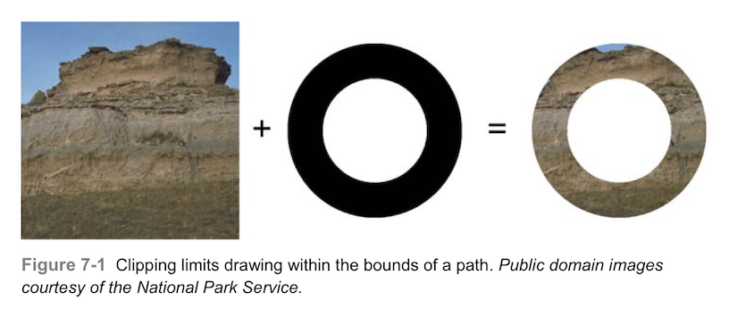
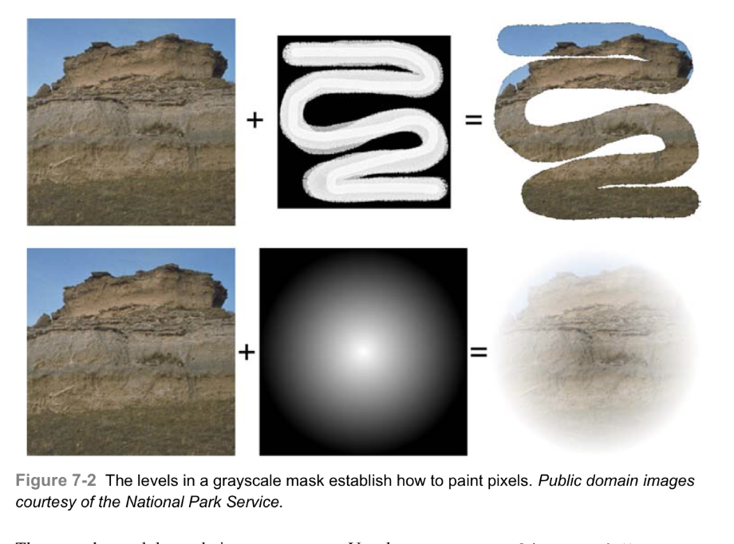
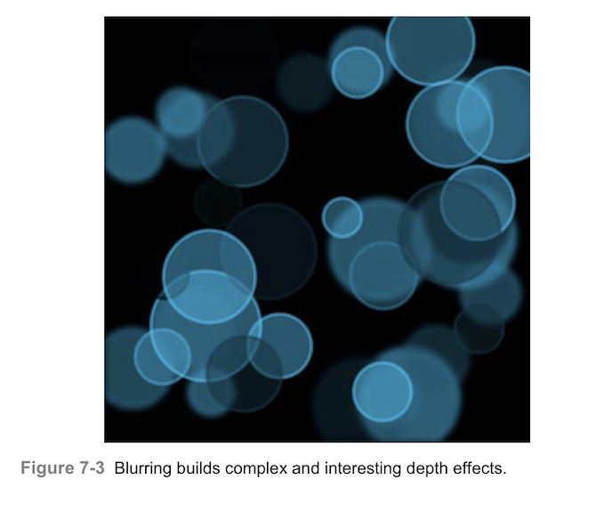
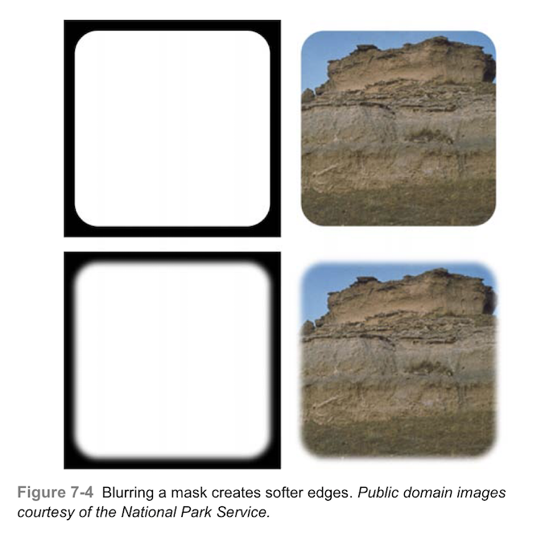
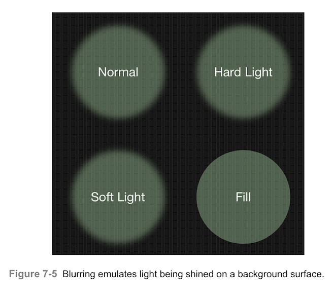
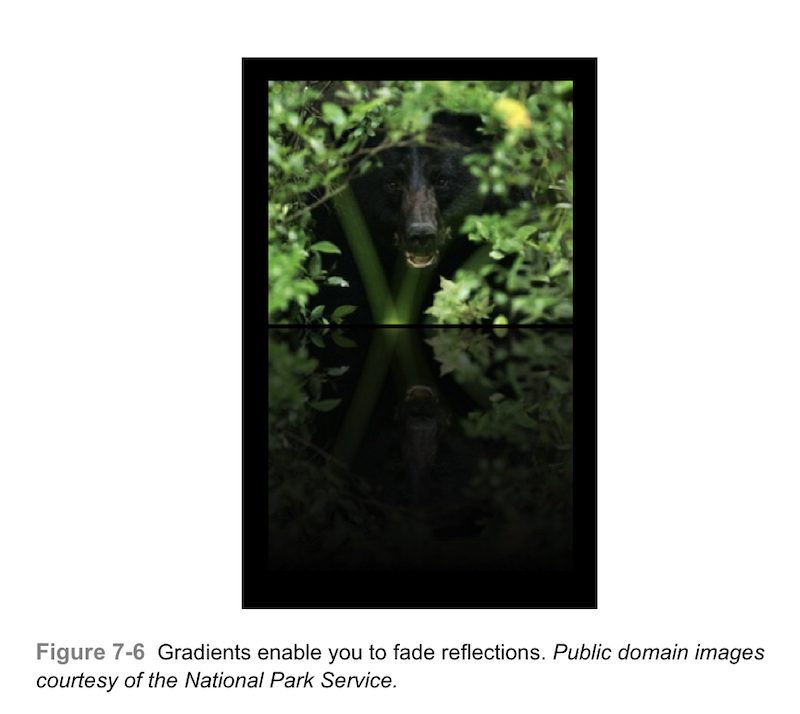
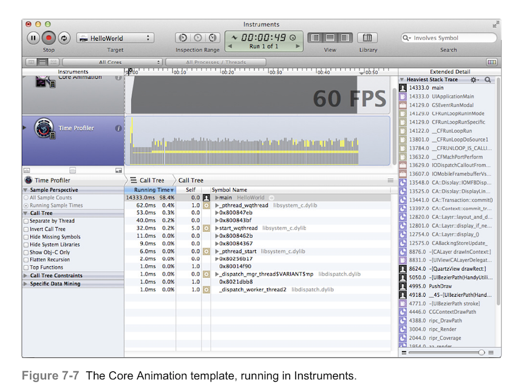
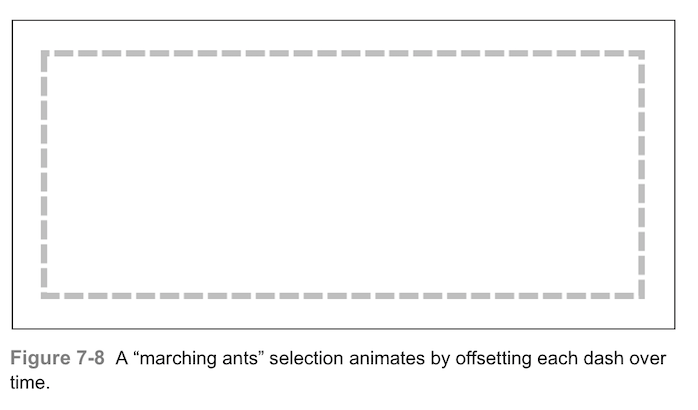

# 遮罩，模糊和动画

遮罩，模糊和动画是日常开发中经常会用到的东西。这些技术可以帮助你添加柔软的边界，景深效果，且可以随时间变化进行更新。本章介绍一些这些技术在iOS中的解决方案。

### 用块在图像中进行绘制
第六章介绍了自定义PushDraw()和PushLayerDraw()方法，他们将Quartz绘图和Objective-C结合起来，用于图形状态的管理和透明层。代码7-1同样使用了这个想法，介绍了一个返回图像的新函数。它使用同样的绘图状态块类型来传递一系列绘图块内操作，将他们写入新的图像绘制上下文。
虽然我最初构建这个函数是为了创建蒙版图像（如代码7-2所示），但我发现在很多情况下都可以使用它。例如，在构建图像视图的上下文时，在构建合成子视图时，在构建颜色选择器时，等等，都可以使用。在本章中，代码7-1将作为一个支持的角色，为你将阅读到的许多认为提供一个很好的起点。

```
UIImage *DrawIntoImage(CGSize size, DrawingStateBlock block)
{
     UIGraphicsBeginImageContextWithOptions(size, NO, 0.0);
     if(block) block();
     UIImage *image = UIGraphicsGetImageFromCurrentImageContext();
     UIGraphicsEndImageContext();
     return image;
}

```
### 简单的遮罩
如您在前些章所见到的，裁剪允许你在某个路径区域内部进行绘制。图7-1展示了一个简单的遮罩裁剪的例子。在本例中，仅路径的部分绘制到了图像上下文中。



你可以使用Quartz或UIKit方法来实现这一效果。比如说，你也许使用CGContextClip（）来裁剪以处理上下文，或者使用addClip方法来处理UIBezierPath实例。我使用addClip（）来创建图7-1。
代码7-1展示了创建图片的代码。他创建了路径，实现了裁剪，然后在上下文中绘制出图像。

```
//create the clipping path
UIBezierPath *path = [UIBezierPath bezierPathWithOvalInRect:inset];
UIBezierPath *inner = [UIBezierPath bezierPathWithOvalInRect:RectInsetByPercent(inset, 0.4)];

//The even-odd rule is essential here to establish
//the "inside" of the donut
path.usesEvenOddFillRule = YES;
[path appendPath:inner];

//Apply the clip
[path addClip];

//Draw the image
UIImage *agate = [UIImage imageNamed:@"agate.jpg"];
[agate drawInRect:targetRect];
```
### 复杂的遮罩
图7-2中展示的遮罩效果远比基础的路径裁剪要复杂的多。每个灰度遮罩不仅表示了每个像素可以或不可以被绘制的位置，还确定了像素被绘制的程度。由于遮罩元素的范围从百到黑，他们的灰度级别描述了最终绘制时的程度。



这些遮罩通过更新上下文状态来工作，使用CGContextClipToMask()函数将您提供的遮罩映射到当前上下文中的矩形：

```
void CGContextClipToMask(
    CGContextRef c,
    CGRect rect,
    CGImageRef mask
);
```
对于复杂的绘图，请在GState的块中操作遮罩。你可以保存和恢复上下文的GState以临时应用遮罩。这可以让你恢复上下文到未使用遮罩的状态，以便于进一步的操作，如本例：

```
PushDraw({
    ApplyMaskToContext(mask);//See Listing 7-2
    [image drawInRect:targetRect];
});
```
一个上下文的遮罩可以确定哪些像素点需要绘制，以及绘制的程度。遮罩中的黑色像素完全被遮挡，没有数据可以通过。白色像素允许传递的所有数据通过。介于纯白和纯黑的灰度决定了相应的绘制alpha值透明度。例如，中等灰度对应与百分之50的alpha值。要是用黑白遮罩，遮罩数据必须要有一个灰度数据源（这里有一个很简单的方法，将在本章稍后介绍）。
代码7-2展示了如何将灰度遮罩应用于当前上下文。该函数先把遮罩转换为没有alpha的灰度颜色空间（参见第三章）。计算上下文尺寸，以便遮罩在整个上下文中覆盖拉伸（参见第一章）。
为了应用遮罩，需要在Quartz的坐标系中，否则遮罩会上下颠倒。该函数翻转上下文，然后添加遮罩，再然后将上下文反转回UIKit坐标系以便于进一步的绘制。这“翻转-应用-反转”的过程，从上到下应用遮罩，就如同真实的画画一样。
如果你想找一些遮罩相关的创意，很简单，在网络中搜索“Photoshop masks”，将会返回大量的预见构建好的黑白遮罩，可以直接到iOS应用中使用。使用之前需要看看个人许可条款，不过你会发现很多遮罩都是公用的了。

```
void ApplyMaskToContext(UIImage *mask)
{
    if(!mask)
        COMPLAIN_AND_BAIL(@"Mask image cannot be nil", nil);
    CGContextRef context = UIGraphicsGetCurrentContext();
    if(context == NULL) COMPLAIN_AND_BAIL(@"No context to apply mask to", nil);
    
    //Ensure that mask is grayscale
    UIImage *gray = GrayscaleVersionOfImage(mask);
    
    //Determine the context size
    CGSize size = CGSizeMake(CGBitmapContextGetWidth(context), CGBitmapContextGetHeight(context));
    CGFloat scale = [UIScreen mainScreen].scale;
    CGSize contextSize = CGSizeMake(size.width / scale, size.height / scale);
    
    //Update the CState for masking
    FlipContextVertically(contextSize);
    CGContextVertically(contextSize)l
    CGContextClipToMask(context, SizeMakeRect(contextSize), gray.CGImage);
    FlipContextVertically(contextSize);
}
```
### 模糊
模糊是在计算量很大的情况下非常必要的绘画工具。它能够软化边界来创建遮罩和特效以达到一种伪深度的感觉。图7-3就是一个样例。被称为“bokeh”，指的是这种散焦元素的美感。模糊模仿了摄影镜头捕捉景深以创建多维展示的方式。



虽然模糊是许多绘图算法的一部分，并且在iOS7的UI中运用广泛，但他的实现并不在核心图形货UIKit的API当中。截止本书编写为止，苹果没有发布定制的iOS7模糊API。苹果工程师推荐使用Core Image和Accelerate来为三方开发解决这一问题。代码7-3使用核心图形的方法，这是最初与iOS6一起推出的，这个实现非常简单，只需要几句代码即可。
“可接受”是一个相对的术语。我们鼓励在开发绘制时去考虑GUI是否会过载。（记住这一点：绘图是线程安全的。）随着代码的写入，模糊操作是非常昂贵的。“Core Image”和“Accelerate”往往以相同的开销允许在设备上。Core Image是比较易读的。除了性能检测工具，您还可以在其中使用简单的计时检测代码。绘制前储存当前的日期，并检查绘制后经过的时间间隔。以下是一个例子：
```
   NSDate *date = [NSDate date];
   //Perform drawing task here
   NSLog(@"Elapsed time:%f",[[NSDate date] timeIntervalSinceDate:date]);
```
请记住，大多数绘图都是线程安全的。尽可能不要在主线程使用模糊代码。储存绘制结果到内存或沙盒中以便重复使用。
> 注意：高斯模糊的输出结果在所有部分都比以合适的模糊度进行模糊的图像要大。代码中的Crop模糊保存了原始尺寸
```
UIImage *GaussianBlurImage(UIImage *image, NSInteger radius)
{
     if(!image) COMPLAIN_AND_BAIL_NIL(@"Mask cannot be nil", nil);
     
     //Create Core Image blur filter
     CIFilter *blurFilter = [CIFilter filterWithName:@"CIGaussianBlur"];
     [blurFilter setValue:@(radius) forKey:@"inputRadius"];
     
     //Pass the source image as the input
     [blurFilter setValue:[CIImage imageWithCGImage:image.CGImage forKey:@"inputImage"]];
     
     CIFilter *crop = [CIFilter filterWithName:@"CICrop"];
     [crop setDefaults];
     [crop setValue:blurFilter.outputImage forKey:@"inputImage"];
     
     //Apply crop
     CGFloat scale = [[UIScreen mainScreen] scale];
     CGFloat w = image.size.width * scale;
     CGFloat h = image.size.height * scale;
     CIVector *v = [CIVector vectorWithX:0 Y:0 Z:w W:h];
     [crop setValue:v forKey:@"inputRectangle"];
     
     CGImageRef cgImageRef = [[CIContext contextWithOptions:nil] createCGImage:crop.outputImage fromRect:crop.outputImage.extent];
     
     //Render the cropped, blurred results
     UIGraphicsBeginImageContextWithOptions(image.size, NO, 0.0);
     
     //Flip for Quartz drawing
     FlipContextVertically(image.size);
     
     //Draw the image
     CGContextDrawImage(UIGraphicsGetCurrentContext(), SizeMakeRect(image.size), cgImageRef);
     
     //Retrieve the final image
     UIImage *blurred = UIGraphicsGetImageFromCurrentImageContext();
     UIGraphicsEndImageContext();
     
     return blurred;
}
```

##### 模糊绘图块
代码7-4再一次返回一个OC的块来封装一系列的绘图操作。在本例中，解决方案会模糊绘图操作，并将其绘制在上下文中。
为此，函数必须模拟一个透明层，而不能直接使用透明层，因为无法拦截材料，模糊，然后直接指向上下文。作为代替，该函数在一个新的图像中进行块绘制，使用DrawIntoImage()（代码7-1所示），进行模糊操作（如代码7-3），然后将结果绘制在当前上下文中。你可以在图7-3中看到代码7-4的结果。这张图的随机圆由两个绘图请求组成，第一个使用模糊块完成，而第二个不使用：
```
DrawAndBlur(4, ^{[self drawRandomCircles:20 withHue:targetColor into: targetRect];});
[self drawRandomCircles:20 withHue:targetColor into:targetRect];
```

```
//Return the current context size
CGSize GetUIKitContextSize()
{
     CGContextRef context = UIGraphicsGetCurrentContext();
     if (context == NULL) return CGSizeZero;
     
     CGSize size = CGSizeMake(CGBitmapContextGetWidth(context),CGBitmapContextGetHeight(context));
     CGFloat scale = [UIScreen mainScreen].scale;
     return CGSizeMake(size.width / scale, size.height / scale);
}

//Draw blurred block
void DrawAndBlur(CGFLoat radius, DrawingStateBlock block)
{
      if(!block) return;//Nothing to do
      
      CGContextRef context = UIGraphicsGetCurrentContext();
      if(context == NULL) COMPLAIN_AND_BAIL(@"No context to draw into", nil);
      
      //Draw and blur the image
      UIImage *baseImage = DrawIntoImage(GetUIKitContextSize(), block);
      UIImage *blurred = GaussianBlurImage(baseIamge, radius);
      
      //Draw the results
      [blurred drawAtPoint:CGPointZero];
}

```
##### 模糊遮罩
当你模糊遮罩时，会时边缘变得更加柔和。图7-4显示了一个圆角矩形路径和一个模糊过的圆角矩形路径（代码7-2）。在上方图片中，路径被填充但是没有模糊。下方图像，使用DrawAndBlur()请求软化填充路径的边缘。柔和的边缘使图像能够在屏幕上平滑地融合。这项技术也被称为羽化，在羽化中，边缘遮罩被软化以在绘制图形和背景之间创建平滑的效果。



```
UIBezierPath *path = [UIBezierPath bezierPathWithRoundedRect:inset cornerRadius:32];

UIImage *mask = DrawIntoImage(targetRect.size, ^{
     FillRect(targetRect, [UIColor blackColor]);
     DrawAndBlur(8, ^{[path fill:[UIColor whiteColro]];});//blurred
     //[path fill:[UIColor whiteColor]]; //non-blurred
});
     
ApplyMaskToContext(mask);
[agate drawInRect:targetRect];
```
##### 模糊聚光灯
将“光”绘制到上下文中是模糊的另一个常见用例。你在其中的目标是照亮像素，选择性的添加颜色，混合光线而不模糊已经绘制到上下文的部分。图7-5显示了几种不同的样式，如你所见，他们的差别非常微妙。



图7-5中的所有四个例子都是由一个圆形的路径组成，路径中充满了一种半透明的绿色光。除了右下角图形外，每个样本都应用了如下的模糊代码：
```
path = [UIBezierPath bezierPathWithOvalInRect:rect];
PushDraw(^{
    CGContextSetBlendMode(UIGraphicsGetCurrentContext(),blendMode);
    DrawAndBlur(8, ^{[path fill:spotlightColor];});
});
```
左上角使用普通混合模式，右上角使用强光模式，左下角使用弱光模式。这里有几件事情需要注意：
* 右上角的kCGBlendModeHardLight产生了一种细微变化的光线，将最简单的高光添加到原始背景上。
* 左下角的kCGBlendModeSoftLight是漫反射最强的，具有更亮的高光显示。
* 左上角的kCGBlendModeNormal 介于两者之间，光场的中心实际上与右下角的样本向匹配——没有模糊，也是使用普通的混合模式。

### 绘制倒影
当绘制倒影时，你需要绘制一个逐渐消失的倒置图像。图7-6展示了这种常见的技术。我添加了一个微小的垂直间距，以突出显示原始图像和反射图像的开始位置。大多数绘制反射的图像都使用这个间隙来模拟原图像与其下方反射表面之间的高程差。



代码7-5展示了构建这个反转镜像的函数。有几个事情需要注意：
* 上下文在反射开始的点垂直反转。这使得反射能够从底部开始，在灌木附近反向绘制，并越过熊的头。
* 与之前的遮罩的例子不同，代码7-5使用矩形参数来限制遮罩和图像的绘制。这使得你可以把反射在更大的背景下绘制成矩形。
* CGContextClipToMake()函数与在代码7-2相比略有不同。这个函数不是将灰度图像遮罩传递给第三个参数，而是传递带有alpha通道的普通RGB图像。当以这种方式使用时，图像充当alpha遮罩。图像的alpha水平决定了裁剪区域的哪些部分收到影响。在这个例子中，绘制的反转图像从上到下逐渐消失。

```
//Draw an image into the target rectangle
//inverted and masked to a gradient
void DrawGradientMaskedReflection(UIImage *image, CGRect rect)
{
    CGContextRef context = UIGraphicsGetCurrenContext();
    if(context == NULL)
       COMPLAIN_AND_BAIL(@"No context to draw into", nil);
    
    //Build gradient
    UIImage *gradient = GradientImage(rect.size, WHITELEVEL(1.0, 0.5), WHITELEVEL(1.0, 0.0));
    
    PushDraw(^{
        //Flip the context vertically with respect
        //to the origin of the target rectangle
        CGContextTranslateCTM(context, 0, rect.origin.y);
        FlipContextVertically(rect.size);
        CGContextTranslateCTM(context, 0, -rect.origin.y);
        
        //Add clipping and draw
        CGContextClipToMask(context, rect, gradient.CGImage);
        [image drawInRect:rect];
    });
}
```

虽然倒影提供了一个有趣的上下文剪切的例子，但是这一特征并不需要总是在应用程序中实现，这是因为CAReplicatorLayer类和图层蒙版也能实现这一效果，此外，他们还提供实时更新的功能——因此，如果视图内容辩护啊，反射也会发生变化。虽然这些这些都使用Quartz也能完成，但总是会出现一些原因让你不这么做。倒影提供了一个很好的规则示范。
当你专注于图像而不是视图时，你应该用Quartz绘制反射。倒影通常构成绘图序列的一部分，而不是最终的产品。

### 为绘图创建DisplayLink

视图可能需要随着时间的推移更改其内容。他们可能从一个图像过度到另一个，或提供一系列的更新来制定应用的状态。动画通过一个特殊的计时类来完成绘制。
CADisplayLink类为视图动画提供了一个计时器对象。他设置了一个更新时钟与显示的刷新率同步。这允许你在时刻上重新绘制视图。你可以通过这个时钟来创建Quart为基础的动画效果，比如说移动的蚂蚁，或者以Core Image为基础来转换界面。DisplayLink是QuartzCore框架的一部分。创建这些计时器然后和Run loop关联。
虽然您可以使用NSTimer来实现类似的效果，但是DisplayLink可以让你不用去猜测理想的刷新间隔。此外，DisplayLink提供了更好的功能保证计时器的准确性（他会准时生效）。苹果公司在文档中写道：

> 计时器触发的实际时间可能在约定触发之后。

代码片段7-3展示了如何创建DisplayLink，你需要使用一个常见的模式（NSRunLoopCommonModes）来得到最小的延迟。在本例中，target是一个视图，selector是setNeedsDisplay，一个系统提供的UIView方法。出发时，该target-selector会告诉系统把整个视图的边界标记为脏的。然后在下一个绘制周期中请求drawRect：重绘。DrawRect：方法使用Quartz和iOS绘图API手动在自定义视图中进行绘制。
```
CADisplayLink *link = [CADisplayLink displayLinkWithTarget:view selector:@selector(setNeedsDisplay)];
[link addToRunLoop:[NSRunLoop mainRunLoop] forMode:NSRunLoopCommonModes];
```

DisplayLink的frame interval属性是控制其刷新率的。通常默认为1。值为1时，每次触发连接计时器时，Displaylink都会通知target。这会使得更新与显示器的刷新率相匹配。若要调整，需修改Displaylink的整形属性frameInterval。数值越高，刷新速度越慢。设置为2，更新为刷新率的一半，以此类推：
```
link.frameInterval = 2;
```
假设一切运行良好，良好的系统以每秒60帧的速度运行（fps）。你可以使用Instruments的核心动画分析器来测试刷新率（详见图7-7），同时在运行的刷新间隔为1的app。这样你可以了解运行动画为你的应用带来了多少负担。如果刷新率降低到12fps或3fps或更低，你需要好好反思反思你是如何完成绘画任务的。



> Instruments在确保应用高效运行方面起着关键的作用。该实用程序对内存使用情况进行采样并进行监控。这使您能够识别和定位应用程序中的问题区域，是的在发布前应用可以高效运行。Instruments提供基于时间的图形性能图，显示应用程序在什么位置使用的资源最多。Instrument是围绕由Sun Microsystems开发的开源的DTrance包构建的。在Xcode5中，Debug Navigator使你能够当应用运行时跟踪CPU和内存的负载。

当你完成显示循环后，使displaylink失效（使用invalidate）。这会将其从runloop中删除，并且取消target/action操作的关联。
```
[link invalidate];
```
或者，你可以把link的paused属性设置为YES，暂停display link，直到他需要再次被启用。

### 创建移动的蚂蚁

你刚刚阅读到的display link技术也适用于定期更新绘图。你可以使用这种方法用于多种动画效果。比如说，图7-8显示了一种常见的“移动的蚂蚁”样式。在这个界面中，浅灰色的线条在矩形周围运动。该效果是由Bill Atkinson为MacPaint设计的一种老式的Macintosh line风格，他是以蚂蚁排成一行的想法命名的。这样可以让用户很容易就看到区域的边缘。



代码片段7-4展示了DrawRect：绘制移动的蚂蚁效果的实现。他计算与现实时间向关联的线段的偏移，然后应用于路径。尽管图7-8使用的是矩形，但是你可以把它运用在任何形状的路径上。
该方法是为了提供一个清晰，轻量的接口。这可以让你外观设置和GUI分割开，您可以轻松的选择隐藏或移除视图。
这里使用的是12点-3点的长线段短空隙。更重要是，它使用系统的时间，而不是任何特定计时器来建立的动画偏移。这确保了displaylink中的任何故障（尤其是高开销所引起的故障）不会影响每次刷新时的位置，动画将以您的制定的速度运行。
这里同时存在两个计时因素。首先是刷新率，它控制多久请求一次drawRect：方法来得到视觉更新。第二个控制模式偏移，它指定了线段的移动成程度，并独立于系统时间进行计算。
为了制作动画，代码7-4计算一个相位。这是UIBezierPath类（更确切的说，是底层的Quartz CGPath）用来表示虚线的偏移。相位可以是正的（逆时针方向移动）或负的（顺时针方向移动），并指定要开始绘制图案的深度，本例为15点长，每隔15点，线段就会回到原来的位置。
为了计算偏移，该方法使用了一个secondsPerFrame。代码7-4每四分之三秒循环一次。你可以调整以降低或增加图案的速度。

