# 绘制文本
在本书的前几章，你已经看过一些处理字符串的内容，只是这些内容并不是那些章节的重点。
在本章，你会发现字符串远不止如此，在绘图上下文中，选择一个点来绘制文本或将字符串转换为贝塞尔曲线。本章将深入讲解这些内容，涵盖：绘制，测量，布局。

### 绘制字符串
在iOS中，使用label和text view来显示字符串，然而，当你的文本作为一个更大的布局或绘图的一部分时，这时候就需要直接对字符串进行绘制了。这张做可以解锁一个更广泛多样和强大的文本布局工具，使你能够将字符串元素添加到上下文中。
在光谱的最简单的一端，你可以通过发送字符串绘制请求来完成文本绘制。DrawAtPoint：withAttributes：方法可以将任何字符串绘制在当前的上下文中。代码8-1演示了这种方法，指定了字体和颜色。

```
NSString *string = @"Hello World";
UIFont *font = [UIFont fontWithName:@"Futura" size:36.0f];

//Starting in iOS 7, all string drawing uses attributes
NSDictionary *attributes = @{NSFontAttributeName:Font, NSForegroundColorAttributeName:[UIColor grayColor]};

//Draw the string
[string drawAtPoint:drawingPoint withAttributes:attributes];
```
系统使用UIKit几何（从上到下）绘制字符串。图8-1显示了代码8-1的输出：用灰色绘制的大字母文本


##### Point vs Rect 方法
字符串绘制提供两种API调用：点和矩阵。两者都适用于NSString和NSAttributedString类。经验是：
* 像代码8-1提供的点方法，绘制一行——不管任何你定义的换行属性。渲染区域的宽度被视为无限大。
* rect版本的绘制，必须绘制在你指定的边界内。任何超出边界的部分都会被裁剪。

### iOS7的变化
代码8-1中所使用的DrawAtPoint：withAttributes：方法属于iOS7的新方法。较早的字符串绘制方法，如drawAtPoint:withFont:，已被弃用（如图8-2）。新的技术，如布局管理器，动态文本等，在这个领域带来了一场革命。但是正如你将看到的，并非所有的方法都可以直接绘制上下文。


##### 动态文本
动态文本是一种自动调整字体家族来填充用户界面角色的技术。例如，“headline”字体在屏幕上介绍材料部分。对于有视力障碍的用户，该字体可能比同一视力良好的“headline”大得多。当用户调整尺寸偏好时，字体角色也会改变——同时改变大小和整体重量以保证文本来可读范围内简单缩放。
这些新功能并不能与UIKit绘图相匹配。绘图创建的是静态图像。用于绘制每个上下文的尺寸会影响字体相对于设备的总尺寸。当绘图上下文与屏幕并非完美契合时，字体可能会被拉伸，压扁，或者有别于理想的尺寸。
此外，绘制元素不能自动更新为动态文本通知。当用户调整文本设置时，都会生成这些通知。如果元素需要适应动态文本，避免绘制他们。而是使用label或textview来代替。
当你要制作pdf，应用艺术或其他图像输出素材时，避免使用动态文本。使用特定的字体和尺寸。这就是本章在实例中应用精确页面和尺寸的原因。

##### Text Kit
Text Kit是iOS7另一个令人兴奋的发展，它允许使用Core Text风格的文本样式排版。Core Text是苹果基于C语言的从代码中创建灵活而强大的排版的解决方案。Text Kit，在CoreText的顶部创建，将该功能拓展到了UIKit视图中。
你也可以使用Text Kit来绘制UIKit的上下文。如图8-3所示，当你想做一些有挑战性的尝试时，比如在某个形状中绘制或者竖着绘制在预设的UITextView目标上，目标可能会出问题。TextKit依旧非常新，年轻，有些地方可能会有bug。


本章讨论Core Text解决方案而不是Text Kit。尽管他是以C语言为基础的API，Core Text依然是复杂文本很有效切且可靠的解决方案。

### 文本属性

iOS设置的大部分内容都是理解属性。属性是应用于特定范围内的文本的特征的集合，如字体选择或者文本颜色。属性文本，如其名所示，为选中的子字符串添加特征。每个属性字符串包含了应用于该字符串的原文本和特定的范围属性。为了明了属性是如何工作和组合的。这里展示了图8-4，它显示了字符串前景颜色和阴影属性。


##### 创建属性字符串
当创建具有排版特征的文本时，您需要使用NSAttributedString类，更多的时候，使用它的表亲NSMuatableAttributedString，可变版本往往更灵活，允许单独分层属性，而不必一次添加所有特征。
要创建一个不可更改的属性字符串，你可以用一个文本和属性字典来初始化，代码8-2绘制了你在图8-1中看到的同样的灰色Hello World。但这次它使用的是属性字符串，而不是NSString实例。drawAtPoint：方法从字符串中获得所有的信息，如字体颜色，字体。

```
//Create an attributes dictionary
NSMutableDictionary *attributes = [NSMutableDictionary dictionary];

//Set the font
attributes[NSFontAttributeName] = [UIFont fontWithName:@"futura" size:36.0f];

//Set the foreground color
attributes[NSForegroundColorAttributeName] = [UIColor grayColor];

//Build an attributed string with the dictionary
attributedString = [[NSAttributedString alloc] initWithString:@"Hello World" attributes:attributes];

//Draw the attributed string
[attributedString drawAtPoint:drawingPoint];
```

##### 可变属性字符串
可变的属性字符串能让你单独添加每个属性到整个字符串中（如代码8-3所示）或某一个子范围（如图8-4所示）。使用addAttribute：value：range：请求定义属性，范围和值。
其他的方法可以满足你通过字典来设置属性，就像不可变方法那样的（setAttributes:range:），或删除属性（removeAttributes：range）。也可以插入和附加属性字符串（insertAttributedString：atIndex：和 appendAttributedString：）来创建复杂的实例。
最后，代码8-3绘制了和图8-1同样的灰色的“hello world”输出，使用和8-2一样的drawAtPoint：入口。

```
//Build mutable attributed string
attributedString = [[NSMutableAttributedString alloc] initWithString:@"Hello World"];

//Set the range for adding attributes
NSRange r = NSMakeRange(0, attributedString.length);

//Set font
[attributedString addAttribute:NSFontAttributeName value:[UIFont fontWithName:@"Futura" size:36.0f] range:r];

//Set the Color
[attributedString addAttribute:NSForegroundColorAttributeName value:[UIColor grayColor] range:r];

//Draw the attributed string
[attributedString drawAtPoint: inset.origin];
```

### 属性种类
iOS排版属性定义了文本在上下文中的绘制和样式。接下来的几节列举了你可能会用到的属性和他们的赋值。

##### 字体Fonts

> Attribute: NSFontAttributeName

申请一个UIFont对象来设置文本的字体。代码8-2和8-3中把该属性设置为36大小的“Futura”属性。图8-5展示了多种字体（Chalkboard，Helvetica，Times New Roman）。


##### 文本颜色

> Attributes: NSForegroundColorAttributeName 和 NSBackgroundColorAttributeName

UIColor对象设置文本的颜色和文本的背景色。图8-6显示了在紫色背景上用绿色前景色绘制的文本。


> Attribute:NSStrokeColorAttributeName

用一个UIColor指定stroke的颜色。但在很多区域还是和前景色相同，当你在指定画笔宽度属性后才会生效。仅当使用负数笔画宽度时，才会与前景色有区别。下一节会讲到。

##### 笔画样式

> Attribute:NSStrokeWidthAttributeName

设置一个NSNumber对象储存一个定义线宽的浮点值，作为字体点尺寸的百分比。比如图8-7，你可以看到分别为线宽（1，4，8）的实现。


负数会同时描边（使用stroke color）和填充（使用foreground color）文本，正数会创建一个“空心”的样式，仅在字符图像的边缘进行描画。


##### 删除线

> Attribute: NSStrikethoughStyleAttributeName

此关键字定义了项目是否使用删除线。使用0表示不使用删除线，1表示使用。

> Attribute:NSStrikethroughColorAttributeName

为该属性赋值一个颜色，以指定删除线的颜色。

删除线是一种排印惯例，在文本中添加水平直线，表示材料已经被编辑掉了。图8-9显示了删除线，突出显示了iOS7中指定删除线颜色的新属性。


##### 下划线

> Attribute: NSUnderlineStyleAttributeName

iOS7引入了各种新的下划线样式。包括单线，双线，粗线，虚线，点线，逐字线。你可以使用一个NSNumber来确定下划线的样式选项。
属性字符串的下划线属性（NSUnderlineStyleAttributeName）提供四个基础的风格。分别是NSUnderlineStyleNone（0，基础的没有下划线），NSUnderlineStyleSingle（1），NSUnderlineStyleThick（2），NSUnderlineStyleDouble（9）。如图8-10所示。


除了基本的样式以外，您可能还会想添加其他的下划线样式。你还可以选择以下几种，实心（默认情况，NSUnderlinePatternDot），点（NSUnderlinePatternDot），线段（NSUnderlinePatternDash），线段-点（NSUnderlinePatternDashDot），以及线段-点-点（NSUnderlinePatternDashDotDot）。将这些选项与之前提到的基础选项一起使用，如下：

```
attributes[NSUnderlineStyleAttributeName] = @(NSUnderlineStyleThick|NSUnderlinePatternDash);
```

图8-11显示了这些模式使用后的样子，他们都是和单个下划线样式一起使用的。


最后一个选项是NSUnderlineByWord，当你输入它为属性选项时，他会分别为每个单词加入下划线。如图8-12所示。


> Attribute:NSUnderlineColorAttributeName

传入一个颜色实例，为下划线设置颜色，如图8-13所示。


##### 阴影

> Attribute:NSShadowAttributeName

传入一个NSShadow对象，这个类可以设置阴影的颜色，偏移和模糊半径，参考图8-14，阴影的设置和在上下文中设置是一样的。你需要提供阴影的大小，模糊半径，阴影颜色的UIColor：

```
NSShadow *shadow = [[NSShadow alloc] init];
shadow.shadowBlurRadius = 2.0f;
shadow.shadowOffset = CGSizeMake(2.0f, 2.0f);
shadow.shadowColor = [UIColor grayColor];
attributes[NSShadowAttributeName] = shadow;
```


> 注意：在OS X上，使用NSShadow实例，将其应用在上下文中，该功能呢尚未迁移到iOS中。

##### 基线

> Attribute： NSBaselineOffsetAttributeName

该属性需要设置一个NSNumber，添加与普通文本之间的偏移位置，如图8-15所示，可以将其用于一些需要垂直放置的元素，比如说上标和下标。

```
[string addAttribute:NSBaselineOffsetAttributeName value:@(20) range:NSMakeRange(6, 5)];
```
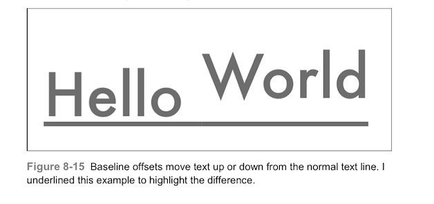

##### 文本特效

> Attribute: NSTextEffectAttributeName

通过预设的NSString来设置特效。
iOS7引入了一种新的文本属性，将其应用于字体。他只有一个选项，“letterpress”效果（NSTextEffectLetterpressStyle）。这个属性创建了一个轻微3D的文本效果，如图8-16所示：

```
attributes[NSTextEffectAttributeName] = NSTextEffectLettterPrestyle;
```
这个图使用黑色背景来展示两个例子之间的区别。浅色背景下，凹凸特效可能很难识别出来。上图没有添加特效，下图添加了。其他的文本特效可能会在之后的iOS更新中添加。

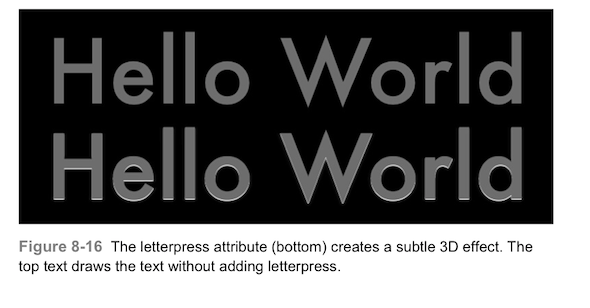

##### 倾斜和膨胀。

> Attribute: NSObliqueneseAttributeName

设置一个@(-1.0)到@(1.0)的NSNumber值。
iOS7新增了NSObliquenessAttributeName属性，以添加倾斜的文本。您可以选择从-1到1的斜率。图8-17显示了一个未倾斜和两个倾斜的文本例子。

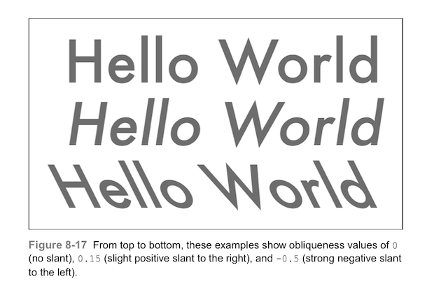

> Attribute:NSExpansionAttributeName

设置一个大于@(0.0)的NSNumber值。
该属性也是iOS7引入的新属性，可以在水平方向上拉伸文本，如图8-18所示，为膨胀后的结果。

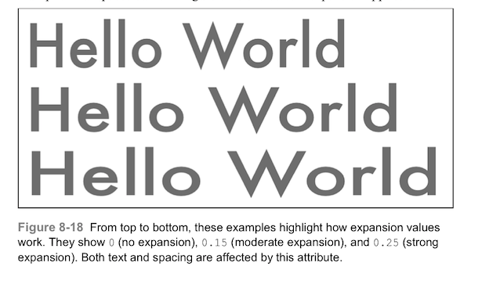

##### 连字和字距微调

> Attribute: NSLigatureAttributeName

该属性可以设置为0或1（默认），分别表示“不使用连字”和“使用连字”。
连字是指单个字形（字符图片）可以绑定来一起的方式，例如“f”和“i”，如图8-19所示，启用后，iOS会将单独的字母替换为特定序列的单一组合图像。常见为一个字母延伸到另一个字母所在的空间中。常见的英文连字包括fi，fj，fl，ff，ffi和ffl。具体实现根据字体的不同也有区别。

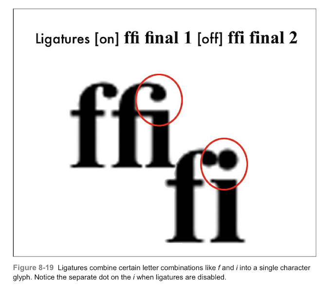

> Attribute: NSKernAttirbuteName

该属性可以设置为0或1（默认），分别表示“禁用字距微调”和“启用字距微调”
字距微调允许人工调整字母间的距离，是他们自然重叠，例如，将大写的A放到大写的V旁边时，图8-20，显示了微调的效果。

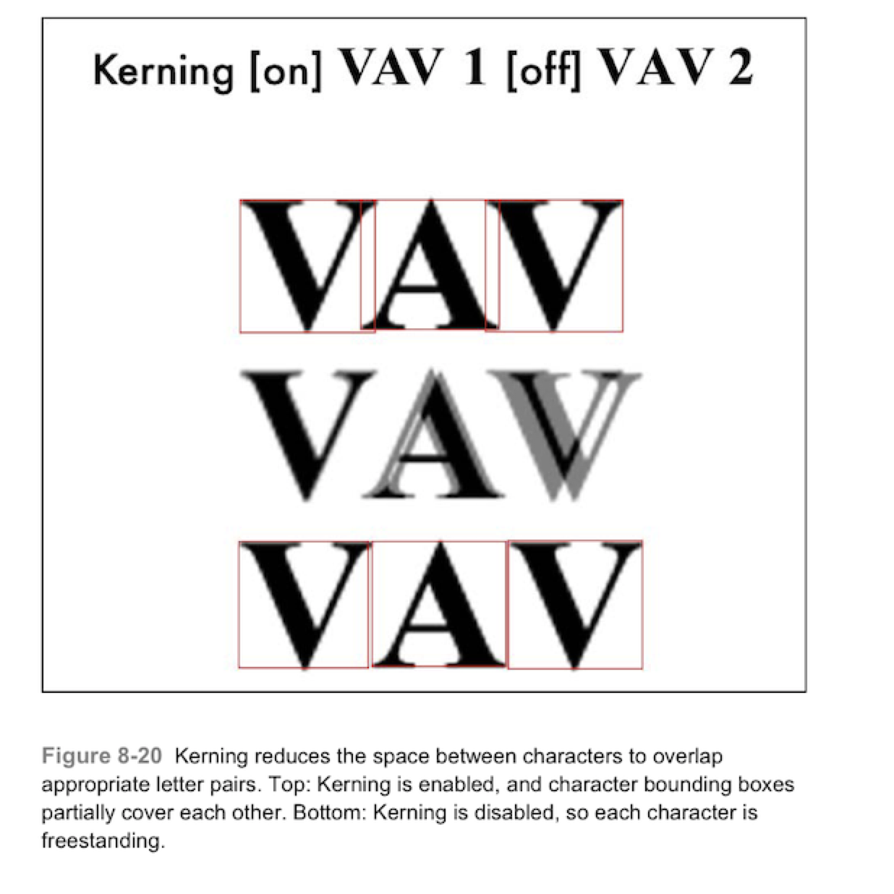

##### 段落样式

> Attribute: NSParagraphStyleAttributeName

NSParagraphStyle对象用于指定许多有关段落的设置，比如对齐，换行方式，缩紧等。
段落样式储存在自身的NSParagraphStyle类中，您可以使用类NSMutableParagraphStyle来设置样式细节。代码8-4创建了一个超大尺寸段落分割和慷慨的第一行缩进，如图8-21所示。

```
NSMutableParagraphStyle *paragraphStyle = [[NSMutableParagraphStyle alloc] init];
paragraphStyle.alignment = NSTextAlignmentLeft;
paragraphStyle.lineBreakMode = NSLineBreakByWordWrapping;
paragraphStyle.firstLineHeadIndent = 36.f;
paragraphStyle.lineSpacing = 8.0f;
paragraphStyle.paragraphSpacing = 24.f;//Big!
[attributedString addAttribute:NSParagraphStyleAttributeName value:paragraphStyle range:r];
```

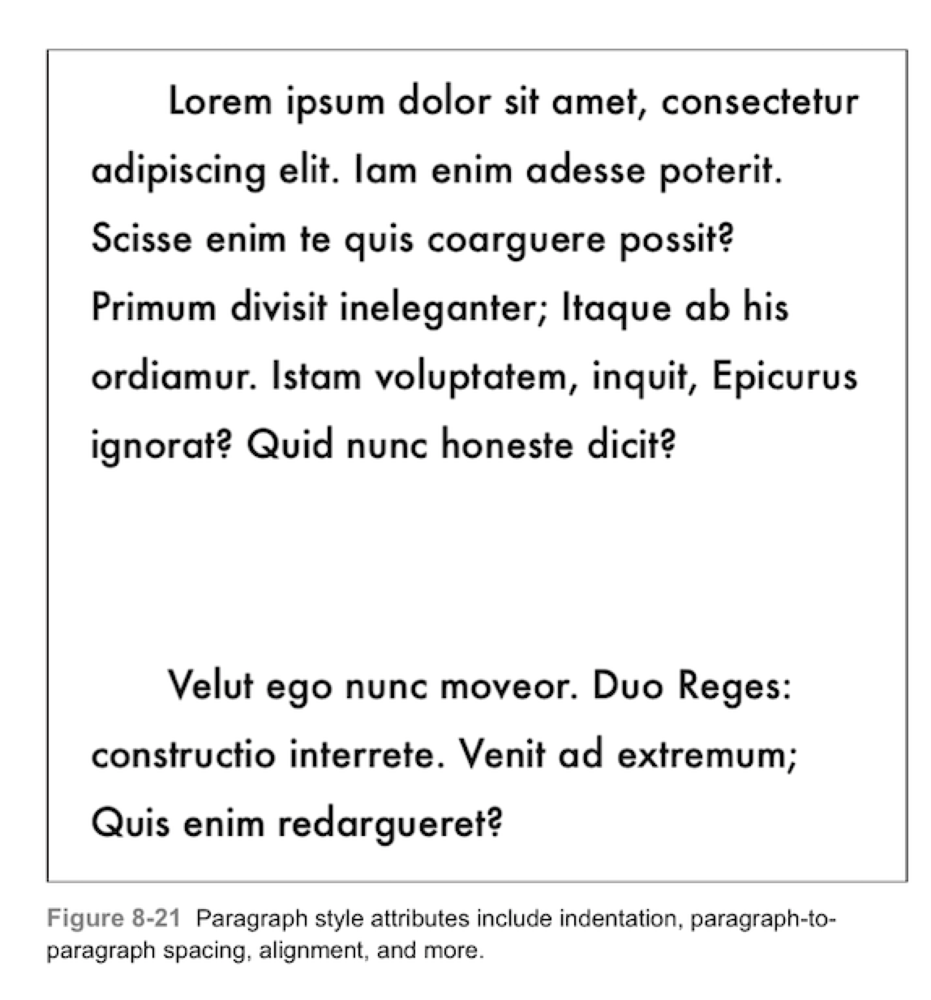

大多数的这些值都会值点距，如行距和段落距离。如果你够仔细，你可以逐段设置这些基础功能。样式对象是assign而不是copy。确保为每个对象分配不同的样式段落对象。如果不这样的话，就会之前的我一样发现一些问题，你可能会创建一个属性化的结果，所有段落都指向同一个对象，一个更新了，所有的都更新了。

##### 段落样式的属性

下方列举了段落样式属性，将这些应用于属性化的字符串，以设定如何绘制iOS文本上下文。：

* aligment —— 段落对其方式，NSTextAlignment值。一边来说，有left，right，center和justifiede；
* firstLineHeadIndent —— 每段第一行的缩进。需要提供一个非负的值。代码8-4使用36点进行首行缩进。
* headIndent —— leading边沿的缩进——即，从左到右的语言中的左边，如英语，从右到左的语言中的右边，如阿拉伯语和希伯来语。通常处理引用块和其他缩进材料，该属性可以让您移离文本容器。
* tailIndent ——与头部缩进相反，文本绘制容器尾部边沿的缩进。和其他的缩进一样，使用非负的浮点值。
* maximumLineHeight 和 minimumLineHeight —— 最大和最小行高。
* lineHeightMultiple —— 根据苹果的文档，“自然行高会在该属性行高倍数被定义之后才会使用maximumLineHeight和mimimumLineHeight”
* lineSpacing —— 段落行间的空间，以点为单位。
* paragraphSpacing —— 一段和下一段之间的额外空间，以点为单位，在8-4中，被设置为24。
* paragraphSpacingBefore —— 在绘制开始的第一段之前的额外距离。
* lineBreakMode —— 该属性可以指定换行的方式，wrapping或truncation或clipping，包括word wrapping（整个单词换行），character wrapping（单词中间可能断开），clipping，head truncation（比如，“···lo world”），tail truncation（比如，“hello wor···”），middle truncation（比如，“hel···orld”）。
* hyphenationFactor —— 断字因子，苹果文档里说，“连字符会出现在（不使用连字符断开）文本的宽度与行尾宽度所占比例小于断字因子时。当段落断字因子为0.0时，布局管理里使用断字因子代替。当两者都是0.0时，断字被禁用”（注：？？？）
* baseWritingDirection——当设置自然方向时，段落默认为——不论在与当前语言相关的区域设置了什么值——从左到右或者从右到左。

### 使用Core Text进行绘制。
iOS 7的Text Kit在高端文本排版技术方面与传统的Core Text结合提供了很有用的路径。Text Kit提供了一个Objective-C为基础的类和协议为UITextView提供排版功能。Core Text，相反，使用C语言API。这两种排版都可以直接绘制在上下文中。如图8-3所示，Text Kit并不是十分完备，因此，本章使用Core Text而不是Text Kit。
在Core Text中，文本可以绘制在任何形状的贝塞尔曲线中。

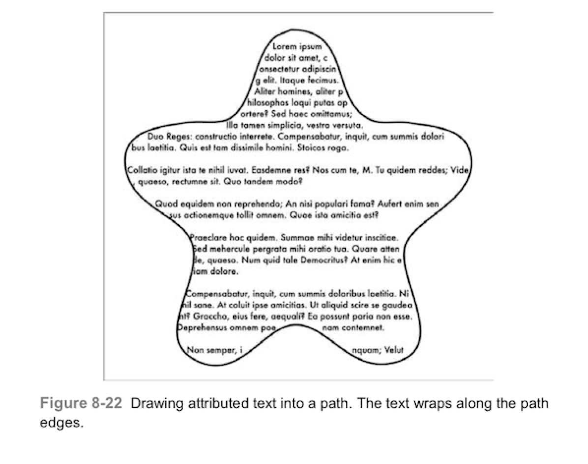

图8-22使用的是character wrapping，所以部分单词被分为了几行，但是布局中并没有缺少一个字符或者单词，所有的文本都会绘制在边界内，包围成特定形状。
当然，通常情况下，你不会吧文字画成这样奇怪的形状，我们这样做是想要演示代码8-1中的函数。对他输入一个路径和属性字符串，他把字符串绘如路径中，由Core Text提供，创建一个绘制文本的容器（“frame”）。
Core Text框架提供了强大的文本布局和字体管理功能集。适用于处理文本领域的应用程序。Core text包括以下工具，如frame setter帮助你定义绘制复杂的字符串布局在几何目标中。这些布局也适用段落风格，如alignment对齐，tab stops制表位，line spacing行距，和其他通过attributed string创建的属性。
多亏了Core Text框架，所有绘图都可以在Quartz空间中进行，CGPath你还必须定义在Quartz的坐标系中，这就是为什么我选择了一个如8-11这样不是垂直对称的图。代码8-1使用以下方式处理绘制问题，复制所有路径，然后镜像副本。如果没有这一步，你最终会得到8-23所示的结果，文本依然是顶部到地步，而路径却在Quartz的坐标系中。

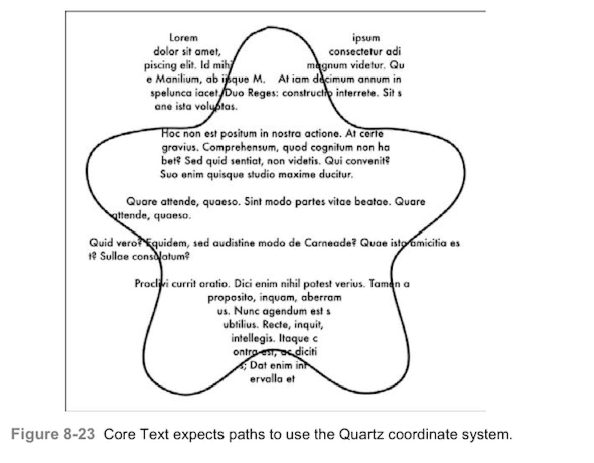

```
void DrawAttributedStringInBezierPath(UIBezierPath *path,NSAttributedString *attributedString)
{
     CGContextRef context = UIGraphicsGetCurrentContext();
     if(context == NULL) COMPLAIN_AND_BAIL(@"No context to draw into", nil);
     
     //Mirror a copy of the path
     UIBezierPath *copy = [path safeCopy];
     MirrorPathVerticallyInContext(copy);
     
     //Build a framesetter and extract a frame destination
     CTFramesetterRef framesetter = CTFramesetterCreateWithAttributedString((__bridge CFAttributedStringRef) attributedString);
     CTFrameRef theFrame = CTFramesetterCreateFrame(framesetter, CFRangeMake(0,attributedString.length), copy.CGPath, NULL);
     
     //Draw into the frame
     PushDraw(^{
         CGContextSetTextMatrix(context, CGAffineTransformIdentity);
         FlipContextVertically(GetUIKitContextSize());
         CTFrameDraw(theFrame, UIGraphicsGetCurrentContext());
    });
    
    CFRelease(theFrame);
    CFRelease(framesetter);
}

//Flip the path vertically with respect to the context
void MirrorPathVerticallyInContext(UIBezierPath *path)
{
     CGContextRef context = UIGraphicsGetCurrentContext();
     if(context == NULL) COMPLAIN_AND_BAIL(@"No context to draw into", nil);
     
     CGSize size = GetUIKitContextSize();
     CGRect contextRect = SizeMakeRect(size);
     CGPoint center = RectGetCenter(contextRect);
     
     //Flip path with respect to the context size
     CGAffineTransform t = CGAffineTransformIdentity;
     t = CGAffineTransformTranslate(t, center.x, center.y);
     t = CGAffineTransformScale(t, 1, -1);
     t = CGAffineTransformTranslate(t, -center.x, -center.y);
     [path applyTransform:t];
}

```

### 文本矩阵
文本矩阵定义了每个字符的变换，而不是这个那个上下文呢。他们被储存在每个上下文的GState中。当UIKit和Core Text结合绘制文本时，确保重制核心文本中的矩阵。
代码8-1在PashDraw（）块中进行文本调用。让我们来看看如何执行更新。以下调用会重置所有上下文中的文本转换：

```
CGContextSetTextMatrix(context, CGAffineTransformIdentity);
```
要理解为什么必须执行次步骤，请参考图8-24，此图中的文本绘制了两次——首先使用UIKit属性字符串绘制，然后使用Core Text。Core Text绘制的文本输出都是颠倒显示的。每个字母都是独立垂直倒影的。

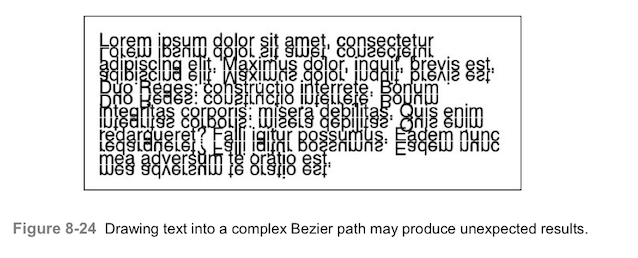

会出现这种奇怪的效果是因为UIKit字符串绘制改变了上下文的文本矩阵。你可以在代码8-5中看到具体是怎么发生的。

```
UIGraphicsBeginImageContextWithOptions(size, NO, 0.0);
CGAffineTransform t;

//Retrieve the initial text matrix
t = CGContextGetTextMatrix(UIGraphicsGetCurrentContext());

NSLog(@"Before: %f",atan2f(t.c, t.d));

//Draw the string
[string drawInRect:targetRect];

//Retrieve the changed text matrix
t = CGContextGetTextMatrix(UIGraphicsGetCurrentContext());
NSLog(@"After:%f", atan2f(t.c, t.d));

UIGraphicsEndImageContext();
```
你可能希望两个日志都不报循环。然而，实际上却会产生。得到的180度旋转的结果解释了如下的输出：

```
2013-05-10 09:38:06.434 HelloWorld[49888:c07] Before: 0.00000
2013-05-10 09:38:06.438 HelloWorld[49888:c07] After: 3.141593
```
不幸的是，你不能使用通过保存和恢复上下文来解决这一问题，据苹果称，“注意：文本矩阵不是图像状态的一部分——保存或恢复怼文本矩阵没有影响，文本矩阵是当前图像上下文的属性，而不是当前字体的属性。”
作为代替，当你切换到Core Text文本绘图时，显示重置文本矩阵，如下所示：

```
CGContextSetTextMatrix(context, CGAffineTransformIdentity);
```

### 绘制列
图8-25展示了Core Text中的一个基本问题，这涉及到Core text列绘制。当布局列时，文本应该在每列的边缘换行而不是边缘的中间。例如，在右边的顶部列中，单词sitting应该出现在第一列的第二行。然而，他被放在了第二列的右边，文本在列间流动，然后向下流动，而不是全部沿着一列想在，然后沿着下一列向下。

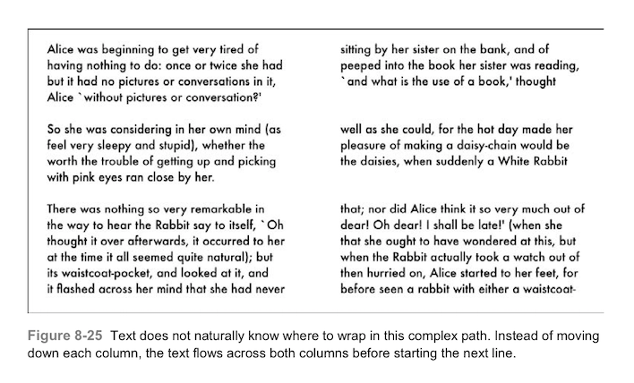

问题的核心是文本帧设置器处理整个Bezier路径（如图8-26）为一个单一的形状。他的两个垂直矩阵旨在显示独立的文本列。然而，真实情况，Core Text探测器只使用一个测试构建他的框架。他确定路径内的点和路径外的点。省略了所有其他考虑的事项，Core Text和iOS一般来说都没有列的概念。所以默认技术不支持我们对列的期望——逐列布局。

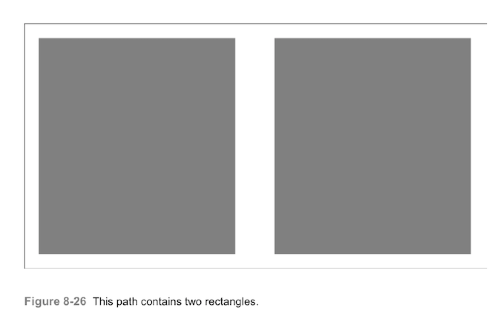

图8-27显示了我想要这个布局做什么。这里，sitting得到了想要的换行。本文从第一列往下，然后继续到第二列。这种布局将两列视为单个数据流。文本从一列移动到下一列。

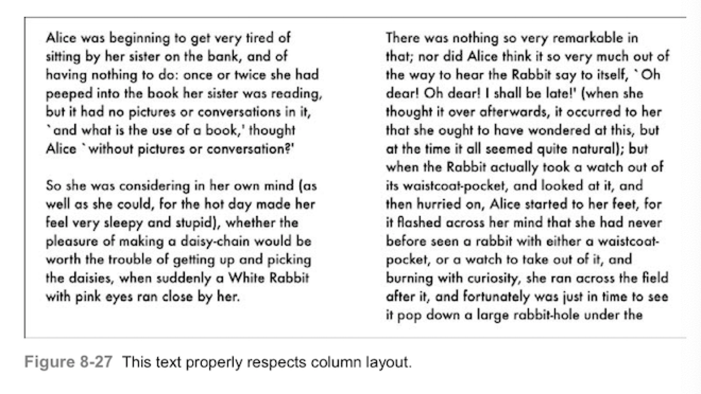

比较图8-25和8-27的视觉风格。图8-27看起来更像是“文本”——有一系列结构良好的简短段落。图8-25显示了很多间隔线，且右侧的文本较少。他的布局不如图8-27看起来那么吸引人。
我通过调用代码8-1中的DrawAttributedStringInBezierPath（）生成了图8-25中那样“之前的”图像。从图8-25的错误布局到图8-27的正确布局，实际上只需要很少的函数来调整。如代码8-2所示。
新函数称为DrawAttributedStringIntoSubpath（）。他在一个子路径上工作——并用属性字符串来更新到上下文无法绘制的字符串上。为此，他查询Core Text字符串可见范围，该函数计算属性化字符串剩余的部分——即不可见的部分——并将其分配给其余参数。
代码中的第二个函数是DrawAttributedStringInBeziersSubPaths（）。这个接口便利路径的子路径，在每个阶段检索“剩余”字符串并将其应用于绘图的下一个阶段。当函数完成绘制子路径时，或者剩余长度降为0时，函数返回。
```
void DrawAttributedStringIntoSubpath(UIBezierPath *path, NSAttributedString *attributedString, NSAttributedString **remainder)
{
    CGContextRef context = UIGraphicsGetCurrentContext();
    if(context == NULL)
       COMPLAIN_AND_BAIL(@"No context to draw into", nil);
    
    //Handle vertical mirroring
    UIBezierPath *copy = [path safeCopy];
    MirrorPathVerticallyInContext(copy);
    
    //Establish the framesetter and retrieve the frame
    CTFramesetterRef framesetter = CTFramesetterCreateWithAttributedString((__bridge CFAttributedStringRef) attributedString);
    CTFrameRef theFrame = CTFramesetterCreateFrame(framesetter, CFRangeMake(0, attributedString.length), copy.CGPath, NULL);
    
    //If the remainder can be dereferenced, calculate
    //the remaining attributed string
    if(remainder)
    {
        CTRange range = CTFrameGetVisibleStringRange(theFrame);
        NSInteger extent = attributedString.length - startLocation;
        NSAttributedString  *substring = [attributedString attributedSubstringFromRange:NSMakeRange(startLocation, extent)];
        *remainder = substring;
     }
     
     //Perform the drawing in Quartz coordinates
     PushDraw(^{
         FlipContextVertically(GetUIKitContextSize());(
         CTFrameDraw(theFrame, UIGraphicsGetCurrentContext());
     });
     
     //Clean up the Core Text objects
     CFRelease(theFrame);
     CFRelease(framesetter);
}


void DrawAttributedStringInBezierSubpaths(UIBezierPath *path, NSAttributedString *attributedString)
{
    NSAttributedString *string;
    NSAttributedString *remainder = attributedString;
    
    //Iterate through subpaths, drawing the
    //attributed string into each section
    for(UIBezierPath *subpath in path.subpaths)
    {
        string = remainder;
        DrawAttributedStringIntoSubpath(subpath, string, &remainder);
        if(remainder.length == 0) return;
    }
}
```
