# 绘制文本
在本书的前几章，你已经看过一些处理字符串的内容，只是这些内容并不是那些章节的重点。
在本章，你会发现字符串远不止如此，在绘图上下文中，选择一个点来绘制文本或将字符串转换为贝塞尔曲线。本章将深入讲解这些内容，涵盖：绘制，测量，布局。

### 绘制字符串
在iOS中，使用label和text view来显示字符串，然而，当你的文本作为一个更大的布局或绘图的一部分时，这时候就需要直接对字符串进行绘制了。这张做可以解锁一个更广泛多样和强大的文本布局工具，使你能够将字符串元素添加到上下文中。
在光谱的最简单的一端，你可以通过发送字符串绘制请求来完成文本绘制。DrawAtPoint：withAttributes：方法可以将任何字符串绘制在当前的上下文中。代码8-1演示了这种方法，指定了字体和颜色。

```
NSString *string = @"Hello World";
UIFont *font = [UIFont fontWithName:@"Futura" size:36.0f];

//Starting in iOS 7, all string drawing uses attributes
NSDictionary *attributes = @{NSFontAttributeName:Font, NSForegroundColorAttributeName:[UIColor grayColor]};

//Draw the string
[string drawAtPoint:drawingPoint withAttributes:attributes];
```
系统使用UIKit几何（从上到下）绘制字符串。图8-1显示了代码8-1的输出：用灰色绘制的大字母文本

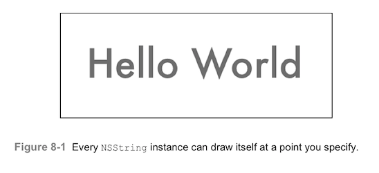

##### Point vs Rect 方法
字符串绘制提供两种API调用：点和矩阵。两者都适用于NSString和NSAttributedString类。经验是：
* 像代码8-1提供的点方法，绘制一行——不管任何你定义的换行属性。渲染区域的宽度被视为无限大。
* rect版本的绘制，必须绘制在你指定的边界内。任何超出边界的部分都会被裁剪。

### iOS7的变化
代码8-1中所使用的DrawAtPoint：withAttributes：方法属于iOS7的新方法。较早的字符串绘制方法，如drawAtPoint:withFont:，已被弃用（如图8-2）。新的技术，如布局管理器，动态文本等，在这个领域带来了一场革命。但是正如你将看到的，并非所有的方法都可以直接绘制上下文。

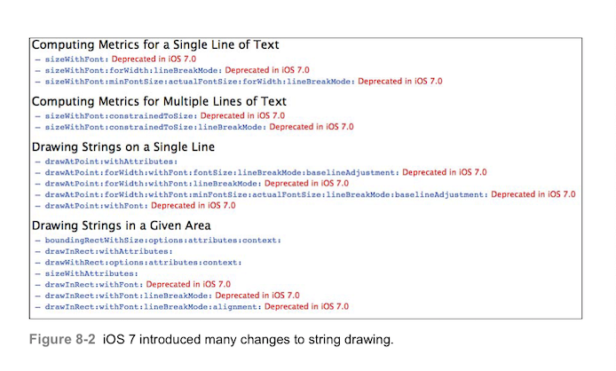

##### 动态文本
动态文本是一种自动调整字体家族来填充用户界面角色的技术。例如，“headline”字体在屏幕上介绍材料部分。对于有视力障碍的用户，该字体可能比同一视力良好的“headline”大得多。当用户调整尺寸偏好时，字体角色也会改变——同时改变大小和整体重量以保证文本来可读范围内简单缩放。
这些新功能并不能与UIKit绘图相匹配。绘图创建的是静态图像。用于绘制每个上下文的尺寸会影响字体相对于设备的总尺寸。当绘图上下文与屏幕并非完美契合时，字体可能会被拉伸，压扁，或者有别于理想的尺寸。
此外，绘制元素不能自动更新为动态文本通知。当用户调整文本设置时，都会生成这些通知。如果元素需要适应动态文本，避免绘制他们。而是使用label或textview来代替。
当你要制作pdf，应用艺术或其他图像输出素材时，避免使用动态文本。使用特定的字体和尺寸。这就是本章在实例中应用精确页面和尺寸的原因。

##### Text Kit
Text Kit是iOS7另一个令人兴奋的发展，它允许使用Core Text风格的文本样式排版。Core Text是苹果基于C语言的从代码中创建灵活而强大的排版的解决方案。Text Kit，在CoreText的顶部创建，将该功能拓展到了UIKit视图中。
你也可以使用Text Kit来绘制UIKit的上下文。如图8-3所示，当你想做一些有挑战性的尝试时，比如在某个形状中绘制或者竖着绘制在预设的UITextView目标上，目标可能会出问题。TextKit依旧非常新，年轻，有些地方可能会有bug。

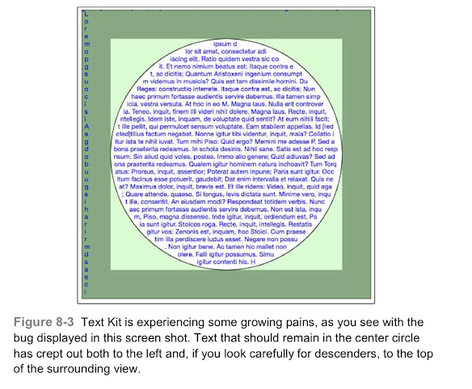

本章讨论Core Text解决方案而不是Text Kit。尽管他是以C语言为基础的API，Core Text依然是复杂文本很有效切且可靠的解决方案。

### 文本属性

iOS设置的大部分内容都是理解属性。属性是应用于特定范围内的文本的特征的集合，如字体选择或者文本颜色。属性文本，如其名所示，为选中的子字符串添加特征。每个属性字符串包含了应用于该字符串的原文本和特定的范围属性。为了明了属性是如何工作和组合的。这里展示了图8-4，它显示了字符串前景颜色和阴影属性。

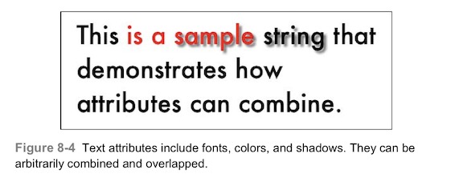

##### 创建属性字符串
当创建具有排版特征的文本时，您需要使用NSAttributedString类，更多的时候，使用它的表亲NSMuatableAttributedString，可变版本往往更灵活，允许单独分层属性，而不必一次添加所有特征。
要创建一个不可更改的属性字符串，你可以用一个文本和属性字典来初始化，代码8-2绘制了你在图8-1中看到的同样的灰色Hello World。但这次它使用的是属性字符串，而不是NSString实例。drawAtPoint：方法从字符串中获得所有的信息，如字体颜色，字体。

```
//Create an attributes dictionary
NSMutableDictionary *attributes = [NSMutableDictionary dictionary];

//Set the font
attributes[NSFontAttributeName] = [UIFont fontWithName:@"futura" size:36.0f];

//Set the foreground color
attributes[NSForegroundColorAttributeName] = [UIColor grayColor];

//Build an attributed string with the dictionary
attributedString = [[NSAttributedString alloc] initWithString:@"Hello World" attributes:attributes];

//Draw the attributed string
[attributedString drawAtPoint:drawingPoint];
```

##### 可变属性字符串
可变的属性字符串能让你单独添加每个属性到整个字符串中（如代码8-3所示）或某一个子范围（如图8-4所示）。使用addAttribute：value：range：请求定义属性，范围和值。
其他的方法可以满足你通过字典来设置属性，就像不可变方法那样的（setAttributes:range:），或删除属性（removeAttributes：range）。也可以插入和附加属性字符串（insertAttributedString：atIndex：和 appendAttributedString：）来创建复杂的实例。
最后，代码8-3绘制了和图8-1同样的灰色的“hello world”输出，使用和8-2一样的drawAtPoint：入口。

```
//Build mutable attributed string
attributedString = [[NSMutableAttributedString alloc] initWithString:@"Hello World"];

//Set the range for adding attributes
NSRange r = NSMakeRange(0, attributedString.length);

//Set font
[attributedString addAttribute:NSFontAttributeName value:[UIFont fontWithName:@"Futura" size:36.0f] range:r];

//Set the Color
[attributedString addAttribute:NSForegroundColorAttributeName value:[UIColor grayColor] range:r];

//Draw the attributed string
[attributedString drawAtPoint: inset.origin];
```

### 属性种类
iOS排版属性定义了文本在上下文中的绘制和样式。接下来的几节列举了你可能会用到的属性和他们的赋值。

##### 字体Fonts

> Attribute: NSFontAttributeName

申请一个UIFont对象来设置文本的字体。代码8-2和8-3中把该属性设置为36大小的“Futura”属性。图8-5展示了多种字体（Chalkboard，Helvetica，Times New Roman）。

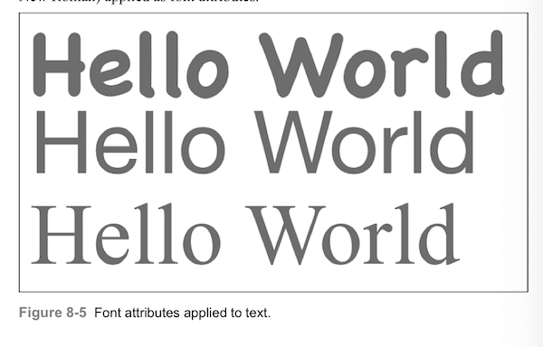

##### 文本颜色

> Attributes: NSForegroundColorAttributeName 和 NSBackgroundColorAttributeName

UIColor对象设置文本的颜色和文本的背景色。图8-6显示了在紫色背景上用绿色前景色绘制的文本。

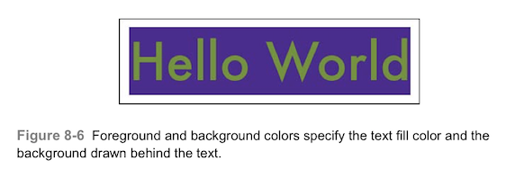

> Attribute:NSStrokeColorAttributeName

用一个UIColor指定stroke的颜色。但在很多区域还是和前景色相同，当你在指定画笔宽度属性后才会生效。仅当使用负数笔画宽度时，才会与前景色有区别。下一节会讲到。

##### 笔画样式

> Attribute:NSStrokeWidthAttributeName

设置一个NSNumber对象储存一个定义线宽的浮点值，作为字体点尺寸的百分比。比如图8-7，你可以看到分别为线宽（1，4，8）的实现。

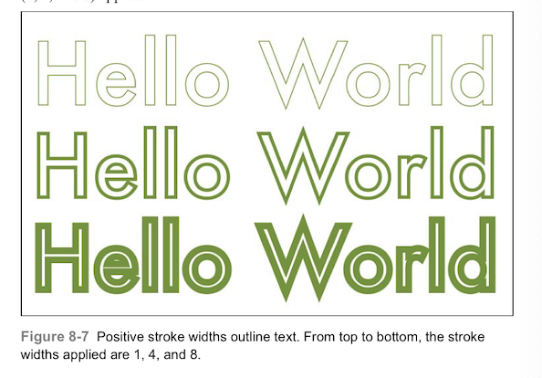

负数会同时描边（使用stroke color）和填充（使用foreground color）文本，正数会创建一个“空心”的样式，仅在字符图像的边缘进行描画。

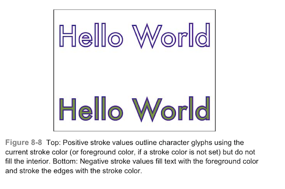

##### 删除线

> Attribute: NSStrikethoughStyleAttributeName

此关键字定义了项目是否使用删除线。使用0表示不使用删除线，1表示使用。

> Attribute:NSStrikethroughColorAttributeName

为该属性赋值一个颜色，以指定删除线的颜色。

删除线是一种排印惯例，在文本中添加水平直线，表示材料已经被编辑掉了。图8-9显示了删除线，突出显示了iOS7中指定删除线颜色的新属性。

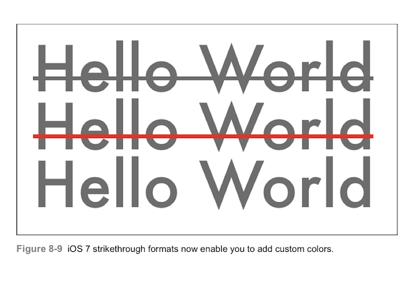

##### 下划线

> Attribute: NSUnderlineStyleAttributeName

iOS7引入了各种新的下划线样式。包括单线，双线，粗线，虚线，点线，逐字线。你可以使用一个NSNumber来确定下划线的样式选项。
属性字符串的下划线属性（NSUnderlineStyleAttributeName）提供四个基础的风格。分别是NSUnderlineStyleNone（0，基础的没有下划线），NSUnderlineStyleSingle（1），NSUnderlineStyleThick（2），NSUnderlineStyleDouble（9）。如图8-10所示。

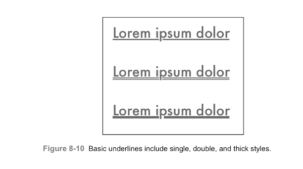

除了基本的样式以外，您可能还会想添加其他的下划线样式。你还可以选择以下几种，实心（默认情况，NSUnderlinePatternDot），点（NSUnderlinePatternDot），线段（NSUnderlinePatternDash），线段-点（NSUnderlinePatternDashDot），以及线段-点-点（NSUnderlinePatternDashDotDot）。将这些选项与之前提到的基础选项一起使用，如下：

```
attributes[NSUnderlineStyleAttributeName] = @(NSUnderlineStyleThick|NSUnderlinePatternDash);
```

图8-11显示了这些模式使用后的样子，他们都是和单个下划线样式一起使用的。

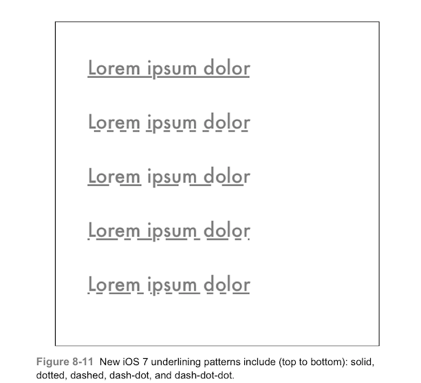

最后一个选项是NSUnderlineByWord，当你输入它为属性选项时，他会分别为每个单词加入下划线。如图8-12所示。

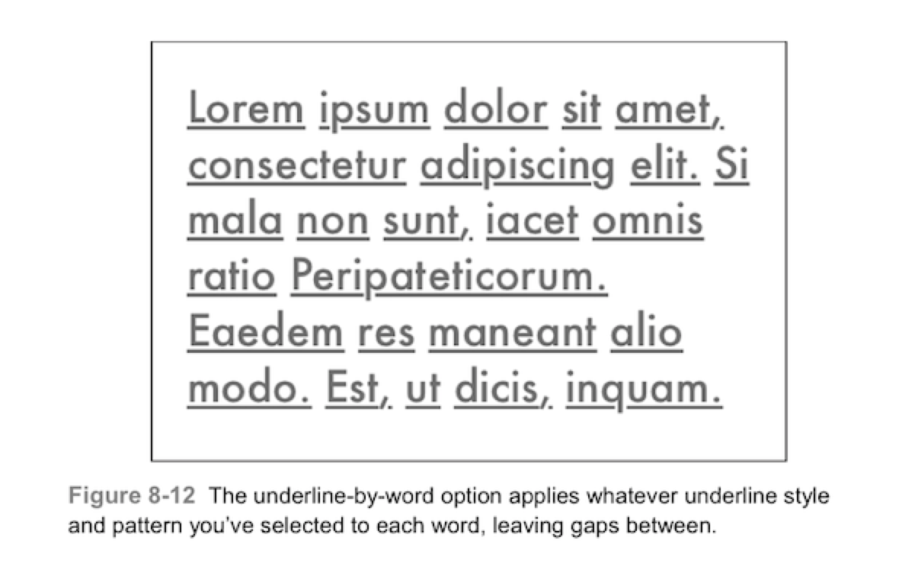

> Attribute:NSUnderlineColorAttributeName

传入一个颜色实例，为下划线设置颜色，如图8-13所示。

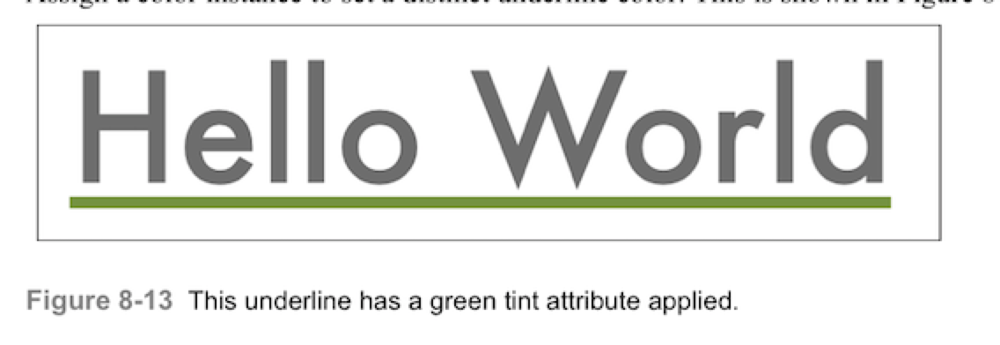

##### 阴影

> Attribute:NSShadowAttributeName

传入一个NSShadow对象，这个类可以设置阴影的颜色，偏移和模糊半径，参考图8-14，阴影的设置和在上下文中设置是一样的。你需要提供阴影的大小，模糊半径，阴影颜色的UIColor：

```
NSShadow *shadow = [[NSShadow alloc] init];
shadow.shadowBlurRadius = 2.0f;
shadow.shadowOffset = CGSizeMake(2.0f, 2.0f);
shadow.shadowColor = [UIColor grayColor];
attributes[NSShadowAttributeName] = shadow;
```

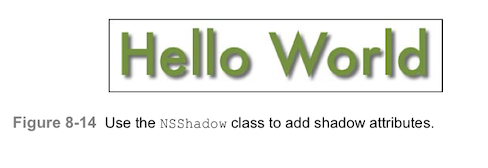

> 注意：在OS X上，使用NSShadow实例，将其应用在上下文中，该功能呢尚未迁移到iOS中。

##### 基线

> Attribute： NSBaselineOffsetAttributeName

该属性需要设置一个NSNumber，添加与普通文本之间的偏移位置，如图8-15所示，
